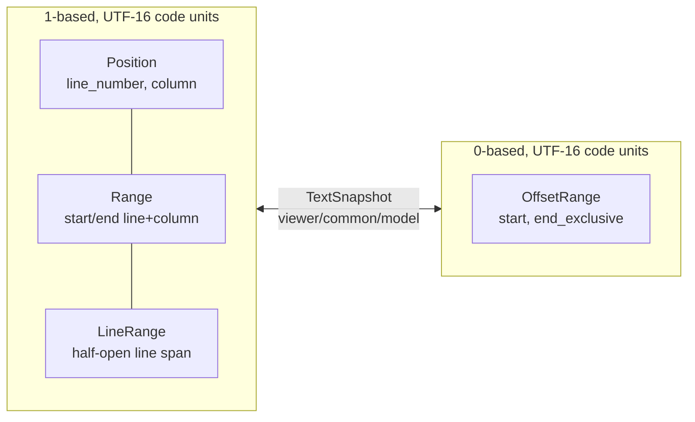

# base/common

Host-neutral primitives at the bottom of the editor dependency graph. Every
other package may depend on this one; this one depends on nothing in the
product.

> The examples below are this package's own black-box tests, so they use the
> in-package alias `@common`. Callers import it as
> `"moonbitlang/editor/base/common" @base_common` and write `@base_common.` in
> their own code.

## What lives here

```d2
direction: right

uri: resource identity {
  grid-columns: 1
  a: Uri / UriError
  b: ExtUri (case policy)
  c: Posix / Win32 / extpath
}
coords: coordinates {
  grid-columns: 1
  d: Position / Range
  e: LineRange / LineRangeSet
  f: OffsetRange
}
life: lifecycle + events {
  grid-columns: 1
  g: Disposable
  h: Emitter
  i: MicrotaskEmitter
}
text: text + characters {
  grid-columns: 1
  j: split_lines / whitespace scan
  k: compare_substring (case folding)
  l: CharacterClassifier / CharacterSet
  m: RTL + full-width probes
}

uri -> coords: "no dependency, one package" {style.stroke-dash: 3}
coords -> life: "" {style.stroke-dash: 3}
life -> text: "" {style.stroke-dash: 3}
```

The four groups are independent; they are one package because every upper tier
needs all four, and splitting them would only add import noise.

## Coordinates

Two coordinate spaces exist, and mixing them is the bug this package is shaped
to prevent.



`Position`, `Range`, and `LineRange` use 1-based UTF-16 line/column coordinates.
`OffsetRange` is a 0-based half-open UTF-16 span. `TextSnapshot` in
`viewer/common/model` owns conversion between those spaces — this package
deliberately offers no conversion, because conversion needs text.

`Position` compares lexicographically by line then column, and `delta`/`with_`
produce new values rather than mutating.

```mbt check
///|
test "positions order by line then column" {
  let a = @common.Position(1, 5)
  let b = @common.Position(2, 1)
  debug_inspect(
    (a.is_before(b), a.compare(b), a.delta(delta_column=3), a.with_(column=1)),
    content=(
      #|(
      #|  true,
      #|  -1,
      #|  { line_number: 1, column: 8 },
      #|  { line_number: 1, column: 1 },
      #|)
    ),
  )
}
```

`Range` distinguishes *containment* from *strict containment* and from
*touching*, which is what decoration and selection code needs at boundaries.

```mbt check
///|
test "range containment, intersection, and touching are distinct" {
  let outer = @common.Range(1, 1, 3, 10)
  let inner = @common.Range(2, 1, 2, 5)
  let touching = @common.Range(3, 10, 4, 1)
  debug_inspect(
    (
      outer.contains_range(inner),
      outer.strict_contains_range(inner),
      outer.are_intersecting(touching),
      outer.are_intersecting_or_touching(touching),
      outer.plus_range(touching).to_string(),
    ),
    content=(
      #|(true, true, false, true, "[1,1 -> 4,1]")
    ),
  )
}
```

`LineRange` is half-open: `end_line_number_exclusive` is one past the last
line, so an empty range is `start == end`. Unlike Monaco, `OffsetRange`
normalizes inverted constructor input instead of throwing.

```mbt check
///|
test "LineRange is half-open and OffsetRange normalizes inverted input" {
  let lines = @common.LineRange(4, 7)
  let inverted = @common.OffsetRange(9, 2)
  debug_inspect(
    (
      lines.length(),
      lines.contains(6),
      lines.contains(7),
      lines.is_empty(),
      inverted,
    ),
    content=(
      #|(3, true, false, false, { start: 2, end_exclusive: 9 })
    ),
  )
}
```

`LineRange::join_many` unions arrays of sorted ranges into a copied, normalized
result without mutating caller arrays.

```mbt check
///|
test "join_many unions sorted range arrays without mutating the inputs" {
  let left : Array[@common.LineRange] = [LineRange(1, 3), LineRange(8, 10)]
  let right = [@common.LineRange(2, 5)]
  let joined = @common.LineRange::join_many([left, right])
  debug_inspect(
    (joined, left.length(), right.length()),
    content=(
      #|(
      #|  [
      #|    { start_line_number: 1, end_line_number_exclusive: 5 },
      #|    { start_line_number: 8, end_line_number_exclusive: 10 },
      #|  ],
      #|  2,
      #|  1,
      #|)
    ),
  )
}
```

## Resource identity

`Uri` stores decoded `scheme`, `authority`, `path`, `query`, and `fragment`;
`parse`, `from`, and `with_` raise `UriError` on invalid input. Use `Uri`, not a
workspace-owned alias or an unparsed string, for resource identity.

```mbt check
///|
test "Uri keeps decoded components and re-encodes on to_string" {
  let uri = @common.Uri::parse("https://example.com/a%20b/c.mbt?q=1#frag")
  debug_inspect(
    (uri.scheme, uri.authority, uri.path, uri.query, uri.fragment),
    content=(
      #|("https", "example.com", "/a b/c.mbt", "q=1", "frag")
    ),
  )
  debug_inspect(
    uri.to_string(),
    content=(
      #|"https://example.com/a%20b/c.mbt?q%3D1#frag"
    ),
  )
}
```

Invalid input raises rather than producing a half-built value.

```mbt check
///|
test "a missing scheme is a UriError, not a silent default" {
  try @common.Uri::from(scheme="", strict=true) |> ignore catch {
    err =>
      debug_inspect(
        err,
        content=(
          #|UriError("[UriError]: Scheme is missing: {scheme: \"\", authority: \"\", path: \"\", query: \"\", fragment: \"\"}")
        ),
      )
  } noraise {
    _ => fail("expected a UriError")
  }
}
```

`uri_to_fs_path` is platform-sensitive, so tests pin the platform with the
`set_is_windows_for_testing` seam rather than depending on the host OS.

```mbt check
///|
test "file URIs render per-platform filesystem paths" {
  @common.set_is_windows_for_testing(value=true)
  let windows = @common.uri_to_fs_path(
    @common.Uri::parse("file:///c:/dir/file.mbt"),
    false,
  )
  @common.set_is_windows_for_testing(value=false)
  let posix = @common.uri_to_fs_path(
    @common.Uri::parse("file:///dir/file.mbt"),
    false,
  )
  @common.set_is_windows_for_testing()
  debug_inspect(
    (windows, posix),
    content=(
      #|("c:\\dir\\file.mbt", "/dir/file.mbt")
    ),
  )
}
```

`ExtUri`, `resources.mbt`, and `uri_to_fs_path` provide resource comparison,
joining, normalization, and filesystem conversion. The three prebuilt policies
differ only in path-case sensitivity: `ext_uri` is case-sensitive,
`ext_uri_ignore_path_case` folds case for every scheme, and
`ext_uri_biased_ignore_path_case` folds case for `file:` only on platforms
whose filesystems are conventionally case-insensitive — it answers like
`ext_uri` on Linux and like `ext_uri_ignore_path_case` on macOS and Windows,
so this example asserts the platform relationship rather than a value that
would change under CI.

```mbt check
///|
test "the ExtUri policies differ only in path-case handling" {
  let lower = @common.Uri::parse("file:///dir/file.mbt")
  let upper = @common.Uri::parse("file:///DIR/FILE.MBT")
  let biased = @common.ext_uri_biased_ignore_path_case.is_equal(
    Some(lower),
    Some(upper),
  )
  debug_inspect(
    (
      @common.ext_uri.is_equal(Some(lower), Some(upper)),
      @common.ext_uri_ignore_path_case.is_equal(Some(lower), Some(upper)),
      biased == !@common.is_linux,
    ),
    content=(
      #|(false, true, true)
    ),
  )
}
```

`relative_path` returns `None` when the two URIs are not on the same
scheme/authority, so a caller cannot accidentally build a cross-resource path.

```mbt check
///|
test "relative_path is None across schemes" {
  let root = @common.Uri::parse("file:///workspace")
  let inside = @common.Uri::parse("file:///workspace/src/main.mbt")
  let elsewhere = @common.Uri::parse("https://example.com/src/main.mbt")
  debug_inspect(
    (
      @common.ext_uri.relative_path(root, inside),
      @common.ext_uri.relative_path(root, elsewhere),
    ),
    content=(
      #|(Some("src/main.mbt"), None)
    ),
  )
}
```

## Paths

`Posix`/`Win32`, `path.mbt`, and `extpath.mbt` provide path operations without
depending on the host filesystem. Platform and process facts have
target-specific JS/fallback implementations, so prefer the explicit `Posix::`
and `Win32::` entry points when the answer must not vary by host.

```mbt check
///|
test "Posix and Win32 normalize the same input differently" {
  let input = "/a/b/../c//d/"
  debug_inspect(
    (
      @common.Posix::normalize(input),
      @common.Win32::normalize(input),
      @common.Posix::join(["/a", "b", "../c"]),
      @common.Posix::relative("/a/b", "/a/c/d"),
      @common.Posix::extname("/a/b/file.mbt.md"),
    ),
    content=(
      #|("/a/c/d/", "\\a\\c\\d\\", "/a/c", "../c/d", ".md")
    ),
  )
}
```

## Lifecycle and events

`Disposable` is idempotent. `Emitter` delivers listeners in registration order
from a snapshot, so a listener that unsubscribes during delivery does not
disturb the in-flight fan-out.

```mbt check
///|
test "emitter delivers in registration order and disposal is idempotent" {
  let seen = []
  let emitter : @common.Emitter[Int] = Emitter()
  let first = emitter.event(value => seen.push(("first", value)))
  emitter.event(value => seen.push(("second", value))) |> ignore
  emitter.fire(1)
  first.dispose()
  first.dispose()
  emitter.fire(2)
  debug_inspect(
    (seen, emitter.has_listeners()),
    content=(
      #|([("first", 1), ("second", 1), ("second", 2)], true)
    ),
  )
}
```

`MicrotaskEmitter` queues events and merges one flush's worth into a single
delivered value. The scheduler is injected rather than hardcoded to
`queueMicrotask`, because this package compiles for js *and* native. **The
default scheduler runs the flush inline**, which degenerates to synchronous
`Emitter` semantics — the queue never holds more than one event, so `merge` has
nothing to combine.

```mbt check
///|
test "the default inline scheduler never batches, so merge is a no-op" {
  let delivered = []
  let emitter : @common.MicrotaskEmitter[Int] = MicrotaskEmitter(merge=batch => {
    batch.fold(init=0, (a, b) => a + b)
  })
  emitter.event(value => delivered.push(value)) |> ignore
  emitter.fire(1)
  emitter.fire(2)
  debug_inspect(
    delivered,
    content=(
      #|[1, 2]
    ),
  )
}
```

Merging appears only once a scheduler actually defers the flush. Browser hosts
inject the real microtask scheduler for exactly this reason; a test can inject a
manual one and drive it explicitly.

```mbt check
///|
test "a deferring scheduler collapses the batch into one value" {
  let delivered = []
  let pending : Array[() -> Unit] = []
  let emitter : @common.MicrotaskEmitter[Int] = MicrotaskEmitter(
    merge=batch => batch.fold(init=0, (a, b) => a + b),
    schedule=run => pending.push(run),
  )
  emitter.event(value => delivered.push(value)) |> ignore
  emitter.fire(1)
  emitter.fire(2)
  emitter.fire(39)
  // Only the queue's first event schedules a flush.
  let scheduled = pending.length()
  for run in pending {
    run()
  }
  debug_inspect(
    (scheduled, delivered),
    content=(
      #|(1, [42])
    ),
  )
}
```

`run_async_tasks_sequentially` is the host-neutral default for a closed task
set. Browser owners may inject a concurrent runner at the call boundary
without coupling shared packages to a particular coroutine runtime.

## Text and characters

String, character-classification, RTL/full-width, and line-splitting helpers are
shared here so higher layers do not duplicate coordinate-sensitive logic.
`split_lines` accepts all three line terminators; the model normalizes to `\n`
before storage, but this helper is used on raw host input.

```mbt check
///|
test "line splitting and whitespace scanning use UTF-16 indices" {
  debug_inspect(
    (
      @common.split_lines("a\r\nb\nc\rd"),
      @common.first_non_whitespace_index("   let x = 1"),
      @common.last_non_whitespace_index("let x = 1   "),
      @common.first_non_whitespace_index("     "),
    ),
    content=(
      #|(["a", "b", "c", "d"], 3, 8, -1)
    ),
  )
}
```

`CharacterClassifier` is a dense ASCII array plus a sparse map, which is how the
word-boundary and bracket scanners stay allocation-free on the hot path.
`CharacterSet` is the boolean specialization.

```mbt check
///|
test "classifier separates ASCII fast path from the sparse map" {
  let classifier = @common.CharacterClassifier(0)
  classifier.set('(', 1)
  classifier.set(0x4E2D, 2)
  let set = @common.CharacterSet()
  set.add('_')
  debug_inspect(
    (
      classifier.get('('),
      classifier.get(0x4E2D),
      classifier.get('a'),
      set.has('_'),
      set.has('-'),
    ),
    content=(
      #|(1, 2, 0, true, false)
    ),
  )
}
```

Surrogate, full-width, and RTL probes take a UTF-16 code unit as `Int`, which is
exactly what `String` indexing yields.

```mbt check
///|
test "character probes operate on UTF-16 code units" {
  let emoji = "😀"
  debug_inspect(
    (
      @common.is_high_surrogate(emoji[0].to_int()),
      @common.is_low_surrogate(emoji[1].to_int()),
      @common.is_full_width_character(0x4E2D),
      @common.contains_rtl("hello"),
      @common.contains_rtl("שלום"),
    ),
    content=(
      #|(true, true, true, false, true)
    ),
  )
}
```

Case-insensitive comparison is explicit and substring-scoped, so callers never
allocate a lowercased copy just to compare a slice.

```mbt check
///|
test "substring comparison avoids allocating a folded copy" {
  debug_inspect(
    (
      @common.equals_ignore_case("MoonBit", "moonbit"),
      @common.starts_with_ignore_case("README.MBT.MD", "readme"),
      @common.compare_substring("abcXX", "abcYY", a_end=3, b_end=3),
    ),
    content=(
      #|(true, true, 0)
    ),
  )
}
```

## Monaco map

The pinned `vscode/` counterparts are the named files under
`src/vs/base/common/`, plus `src/vs/editor/common/core/position.ts`, `range.ts`,
`characterClassifier.ts`, and `core/ranges/{lineRange,offsetRange}.ts`.

## Boundaries and checks

This package must not import product, viewer, DOM, server, workspace, or host-effect
packages. The exhaustive public surface is `pkg.generated.mbti`; focused coverage is

```sh
moon test --target js base/common
moon test --target native base/common
```
