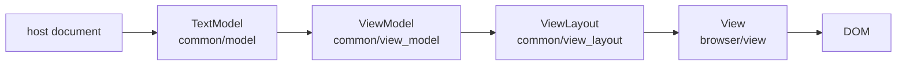

# Architecture

This repository contains a reusable MoonBit readonly viewer and a reference
host/backend:

- `viewer` is the js-only public editor facade and browser surface.
- `internal/shell` is the demo, development, and end-to-end host. It is not an
  external import surface.

For exact APIs use the owning package's `pkg.generated.mbti`; for exact
dependencies use `moon.pkg`. Completed-plan summaries live in
`docs/exec-plans/HISTORY.md`; they are historical evidence, not current
architecture.

Monaco/VS Code is the primary behavioral reference and a source of tested
algorithmic and ownership patterns. It is not a required type, class, package,
or inheritance template: local representation follows MoonBit capabilities,
lifetime boundaries, and dependency direction. CodeMirror is secondary.
`vscode/` and `codemirror/` are pinned research trees only; product code never
imports them and public names remain MoonBit-owned.

## Runtime Shape



The four stages after the host document live in `viewer/common/model`,
`viewer/common/view_model`, `viewer/common/view_layout`, and
`internal/viewer/browser/view`.

`Viewer` keeps cross-domain ordering at the root and delegates private state to
five concrete owners: `EditorConfigurationState`, `ViewerModelSlot`,
`ViewerMount`, `EditorContributions`, and `CursorEventDelivery`.
`ViewerModelSlot.current` is the one nullable `ModelData`; its optional
`ModelBrowserData` pairs a real `View` with its retained mouse handler and
view-scoped render/reveal facts. Public construction seeds
`EditorConfigurationState` synchronously from the host client box before model
attachment. Each `ModelData` then carries one generation-scoped initialization
boundary: the host invokes `Viewer::handle_initialized` after model, view-state,
and option setup, publishing stable visible-token demand outside `attach_model`
and independently of the animation-frame render loop. Repeated calls
re-stabilize the current model's demand instead of consuming one-shot state.

Headless means `ViewerMount::Headless`: there is no caller host, placeholder,
browser `View`, DOM focus state, or root animation frame. A headless Viewer may
still have a model and `ViewModel`, represented only by
`ModelData.browser=None`; on supported construction paths, a mounted model
always has `Some(ModelBrowserData)`. This is distinct from a mounted Viewer with
no model, which owns and paints one complete placeholder pair. Mounting is
one-way; disposal removes Viewer-owned DOM and clears mounted
placeholder/frame/focus state, but retains the caller's host for container
lookup.

The host owns files, transport, persistence, reload policy, shell chrome, and
error presentation. The viewer owns readonly rendering, selection, scrolling,
widgets, language-feature presentation, and editor events.

## Package Tiers

Dependencies point strictly downward through the tiers; no lower tier imports
an upper one:

```d2
direction: right

shell: internal/shell {
  grid-columns: 1
  workbench: browser workbench
  backend: native server
}
facade: viewer facade
inner: internal/viewer {
  grid-columns: 1
  view: browser/view
  contrib: contrib/*
  markdown: markdown
}
common: viewer/common {
  grid-columns: 1
  model: model
  view_model: view_model
  view_layout: view_layout
}
foundations: shared foundations {
  grid-columns: 1
  base: base/*
  language: language
  syntax: syntax
  log: platform/log
}

shell -> facade
facade -> inner
inner -> common
common -> foundations
```

### Shared foundations

- `base/common`: URI/path, positions/ranges, events, and disposables.
- `base/browser`: canonical browser runtime and DOM primitives (including
  untransformed `clientWidth`/`clientHeight` reads), mouse events, global
  pointer-move monitoring, and the one realm-global animation-frame
  coordinator. Its strict-next and current-or-next queues share one native rAF,
  sort by descending priority with stable FIFO ties, and return independently
  cancellable registrations.
- `language`: backend-neutral diagnostic, hover, location, and symbol provider
  contracts.
- `syntax` and `syntax/lang_*`: stateful line-tokenization contracts and
  concrete compile-time lexers.
- `platform/log`: host-neutral logging.

### Viewer common tier

`viewer/common/**` is DOM-free and multi-target:

- `model`: immutable text snapshots, model identity, decorations, and the
  complete model-owned tokenization cluster. Its shared live model state,
  stores, queues, backends, attached-view aggregation, and scheduling machinery
  are package-private.
- `services` and `tokens`: language-id encoding and compact line tokens.
- `editor_api`: the single owner of public cursor/model/scroll event values and
  editor-option enums shared by root, cursor, layout, view-model, and browser
  consumers.
- `agent_feedback_api` and `quick_diff_api`: host-facing DTO/callback handles;
  concrete feature implementations remain contributions below their callers.
- `languages` and `markers`: runtime provider registration and
  diagnostics-to-decoration flow. Their opaque `LanguageHandle`,
  `MarkerServiceHandle`, and `MarkerDecorationsHandle` expose only the reviewed
  Viewer capability floor while hosts retain the concrete registries/stores.
- `core`, `cursor`, `config`: coordinates, selection/cursor state, and editor
  configuration values.
- `view_model`: injected text, wrapping/folding projection, model/view
  conversion, and concrete inline/model decoration resolution.
- `view_layout`: scrolling, viewport, zones, and view-line rendering data.
- `diff`: line diff contracts used by quick diff.
- the root `viewer/common` package is a small compatibility surface for line
  HTML helpers.

Common code never imports browser or contribution packages.

The animation-frame coordinator is one process value for the supported
single-JavaScript-realm product. Monaco's explicit per-window maps and its
cross-editor phased prepare/render batching are not local contracts. Common
ViewModel/layout code stays browser-free and receives scheduling only through
root injection; `base/browser` never imports upward into Viewer packages.

### Viewer browser tier

The root `viewer` facade and public `viewer/browser` contract package are
js-only. Concrete browser runtime packages live below the module-private
`internal/viewer/**` boundary:

- `viewer` is the opaque public facade, the Monaco `CodeEditorWidget` and
  `editor.api.ts` role. Public browser construction is only `Viewer::create`;
  `ViewerOptions`, `ViewerServices`, and `ViewerViewState` expose no public
  layout. Root generated interfaces may reference browser contracts and common
  capability handles, never private view or contribution implementations.
- `viewer/browser` owns canonical editor mouse events, target kinds, DOM
  coordinates, the mutable live ViewZone descriptor/opaque accessor contract, and
  the opaque unmanaged overlay-widget handle.
- `internal/viewer/browser/testing` is a JS-only Viewer-id-keyed
  workbench/browser-test registry. Root publishes callback-backed
  build/render/hover facts downward plus a disabled-by-default scroll
  state/render-phase trace. Observation records are constructed only while the
  matching Viewer has a listener; the package never imports root Viewer and is
  not an external API.
- `internal/viewer/markdown` is the multi-target safe-cmark boundary. It owns
  plaintext fallback, a cmark-independent code-block value, conversion facts,
  the shared editor-token HTML override, and the private synchronous adapter
  that renders exact lowercase `diago` fences through `Milky2018/diago` while
  returning failures and every other code block to the existing fallback;
  `internal/viewer/browser/markdown` adds MoonBit-owned DOM retention,
  URI/media policy, activation listeners, size notification, and per-target
  disposal. Narrow JS bindings provide inert-template parsing, browser URL
  resolution, realm registries, dynamic import, and Mermaid API calls.
  Its diagram-wheel listener rechecks wrapper classes for every event:
  `moonbit-viewer-markdown-diagram-viewport` declines the generic native-scroll
  handoff so ordinary wheel input reaches the editor, while unmarked hover and
  agent-feedback diagrams retain their existing inner-scroll behavior. Its
  opt-in Mermaid lifetime lazily imports the pinned official CDN module. Its
  realm-wide MoonBit runtime caches the API, serializes global configuration
  with rendering, and rejects stale asynchronous DOM commits through
  per-diagram epochs and target ownership. Only the root Markdown-comment
  contribution emits
  the exact lowercase `mermaid` marker and enables this lifetime; hover and
  agent feedback remain ordinary tokenized code consumers. Browser
  contributions consume these packages instead of owning private
  Markdown-to-`innerHTML` pipelines.
- `internal/viewer/browser/config` measures fonts and browser geometry.
- `internal/viewer/browser/controller` owns hit testing, mouse selection, drag
  scrolling, and scrollbar input. Touch inertia uses the shared strict-next
  frame coordinator; its disposable remains owned by the per-model handler.
- `internal/viewer/browser/view` is one package owning the DOM tree,
  render/event ordering, recycler, content/overlay widgets, current-line and
  model decorations, margin, selections, cursor, virtualized lines, zones,
  and the scrollbar view part. Its focused `.mbt` files preserve source-unit
  responsibilities; they are not package or namespace boundaries.
- `viewer/browser/view_parts/*` contains CSS assets at their stable build
  paths. These asset-only directories have no MoonBit package or executable
  ownership.
- `internal/viewer/ui/scrollbar` owns custom scrollbar DOM and pointer
  behavior; its emitted stylesheet remains at
  `viewer/ui/scrollbar/scrollable_element.css`, and its arithmetic lives in
  `viewer/common/view_layout`.

`internal/viewer/browser/view` owns closed event/render handle enums, rendering
contexts, concrete view parts, and their lifecycle wiring. Files in that
directory share private declarations as one compilation unit. Root
`viewer/*.mbt` contains the `Viewer::` composition glue: the internal browser
packages are lower-level dependencies and cannot import the root facade
without reversing the dependency and creating a package cycle.

### Contributions

Concrete contributions live below `internal/viewer/contrib/**`. They depend on
editor common/browser layers; editor common never depends on them.

- `internal/viewer/contrib/hover` is the DOM-free state/computation layer;
  `internal/viewer/contrib/hover/browser` owns its widget and browser
  controller. The emitted hover stylesheet remains at
  `viewer/contrib/hover/hover.css`.
- `internal/viewer/contrib/agent_feedback` owns concrete feedback
  storage/service projection; host DTOs and the callback handle live in
  `viewer/common/agent_feedback_api`, while
  `internal/viewer/contrib/agent_feedback/browser` owns input and bubble
  widgets. Its emitted stylesheet remains at
  `viewer/contrib/agent_feedback/browser/agent_feedback.css`.
- `internal/viewer/contrib/quick_diff/common` owns baseline state and diff
  contracts; its public host handle lives in
  `viewer/common/quick_diff_api`, and
  `internal/viewer/contrib/quick_diff/browser` produces gutter decorations.
  Its emitted stylesheet remains at
  `viewer/contrib/quick_diff/browser/quick_diff.css`.
- `internal/viewer/contrib/folding/browser` currently owns the complete
  js-only folding implementation, including ranges, hidden areas, decorations,
  controller, and the language-neutral outline-body range presentation used by
  explicit host outlines. The root Viewer computes MoonBit function-body
  ranges without importing a concrete syntax package; ordinary provider/user
  folding remains the Monaco behavior port. Its emitted stylesheet remains at
  `viewer/contrib/folding/browser/folding.css`.
- `internal/viewer/contrib/markdown_comments` owns multi-target whole-line
  comment detection, provider/configuration resolution, and normalized block
  ranges. Its browser sibling owns the stable ViewZone DOM pair and coalesced
  visible/offscreen size observer. It also owns one opaque diagram-viewport
  group per rendered target: each successful direct Diago SVG is enhanced
  independently with bounded pan/zoom/fit controls and a resize handle.
  MoonBit structs own each group's controllers, geometry state, listeners,
  observers, queued frame, and disposal. The parent rendered entry guarantees
  exclusive wrapper ownership and disposes the group before renderer
  replacement; no ownership state is written onto caller DOM. Resize gestures
  share a module-private per-document cursor coordinator, while FFI remains
  limited to missing browser bindings such as `ResizeObserver`, document/body
  access, style preservation, and a non-passive wheel listener. Inline
  viewport-height changes report only through a narrow callback. The root
  `viewer` contribution owns reconciliation, renderer and viewport lifetimes,
  zone ids, and the one hidden-area source. Its emitted stylesheet remains at
  `viewer/contrib/markdown_comments/browser/markdown_comments.css`.

The content ViewZones container is presentation-only but not globally hidden
from accessibility. Registration applies `aria-hidden=true` to each caller
node by default; the Markdown contribution removes it from its own zone after
registration so links and the documentation fold control are discoverable,
while unrelated ViewZones and the margin container retain their hidden default.
Removal restores the caller node's original `aria-hidden` presence and value.

The root editor registry has two distinct ownership layers. Its process-wide
contribution-description table contains constructors only; the adjacent command
and keybinding tables likewise contain no per-Viewer state.
`Viewer.contributions` is an `EditorContributions` owner whose `instances` map
is the sole lookup table for that Viewer's six concrete contribution entries;
feature packages do not keep second maps keyed by editor id. Root `Viewer::`
helpers recover typed controllers by matching both the fixed id and central
entry variant, mirroring Monaco's typed view over
`CodeEditorContributions._instances`.

Contribution construction is two-phase: reject a duplicate id before side
effects, construct the bare controller, insert the actual entry, then install
listeners and run initial synchronization. The content-hover entry's
`ContentHoverContributionState` owns its controller, lazy widget and logical
widget view, and timeout/async launch policy across model swaps. During
disposal, the complete map remains installed while entry behavior tears down;
the owner then becomes non-lookuppable, and retained hover browser resources
are released at their later root cleanup slot before the map is cleared.
Declared instantiation modes are retained for source parity, but all modes
currently instantiate eagerly.

The Markdown-comment entry owns Viewer-lifetime model/content subscriptions and
a model-scoped stable-key map. A mounted Viewer replaces normalized comment
lines only in the view projection; headless Viewers keep source visible because
they have no replacement DOM. Model detach disposes renderers and size
observers, removes zones, and clears the contribution's hidden source before
the outgoing browser `View` is destroyed. Same-model flushes rebuild that
source with `force_update=true` because the projected line collection was
recreated even when normalized ranges did not change. Viewer theme changes
rerender retained Mermaid SVGs in place and send accepted size changes through
the existing observer and generation-checked ViewZone height writer.

Each rendered entry retains the full and optional preview shared-Markdown
renderers, its expanded-state ref and toggle lifetime, its diagram-viewport
group, and the existing size observer. Newly mounted item-delimited multi-line
API documentation from a foldable provider registration starts on the
first-line preview; ordinary Markdown and
separator-only or one-line API blocks remain expanded without a control.
The fold state has two affordances sharing one listener lifetime: a
mouse-only chevron on the ViewZone's margin node, aligned with the
code-folding column inside the `aria-hidden` gutter, and an accessible
in-content button revealed by hover or keyboard focus.
A single block spanning the whole model — the workbench's whole-document
Markdown provider for opened `.md` files — additionally opts its zone into a
full-width reading surface with page-like padding; the presentation flag is
geometric and language-neutral.
Same-key body replacement preserves the user's expanded state while disposing
the old toggle and viewport group before the renderers replace their targets
and mount fresh browser lifetimes. Entry
teardown orders toggle, viewport, renderers, and observer disposal before zone
removal. The only diagram-to-ViewZone invalidation chain runs from the
viewport-height callback through
`MarkdownCommentSizeObserver::request_measure` to
`Viewer::apply_markdown_comment_height`; the final step keeps the existing
generation and zone-id checks and remains the sole writer of the live ViewZone
height.

This central ownership rule supersedes the feature-local instance tables from
the earlier ownership-divergence work. The completed migration is summarized in
`docs/exec-plans/HISTORY.md`; full review artifacts remain in Git history.

## Reference Shell

The direct embedding proof is:

```text
internal/shell/examples/embedded_viewer
  -> viewer
  -> viewer/common/{model,languages,editor_api,capability APIs}
```

The full reference app is:

```text
internal/shell/web
  -> internal/shell/workbench
     -> viewer
     -> internal/shell/widgets/file_tree
     -> shell/remote_protocol

server/host/main            (module moonbitlang/editor-server)
  -> server/host
  -> server/server
  -> shell/{remote_protocol,workspace}
  -> language + viewer/common/model
```

The native server is its own `moon.work` member with
`preferred_target = "native"`, so the workspace-root `moon build`,
`moon run server/host/main`, and `moon test server/...` need no target
flags. `shell/workspace` and `shell/remote_protocol` are the shared
host-shell contracts both the browser workbench and the server module import;
they live outside `internal/` because workspace members cannot import another
module's internal packages, and they stay excluded from the published package.

- `workspace` defines host-side source paths, document snapshots, filesystem,
  and tree-provider contracts. Its `DocumentSnapshot` is not the editor model.
- `remote_protocol` is the reference app's versioned WebSocket JSON protocol,
  not LSP.
- `server` validates/caches documents and routes file and language requests.
  Each protocol connection owns one session-local document cache and watch map;
  host/provider services and document-sync delivery remain server-scoped.
- `server_host_native` provides filesystem/watch/HTTP/WebSocket effects and the
  current `moon ide hover`/`moon check` backend.
- `workbench` adapts protocol payloads into `TextModel`, language providers,
  markers, the file tree, theme, and harness events. Its private MoonBit
  Markdown-comment provider adapts exact `///|` item anchors and their following
  `///` documentation into the Viewer's language-neutral provider contract.

## Dependency Rules

`moon check --target all` enforces package cycles and target compatibility.
The remaining rules are intentionally kept visible in `moon.pkg`, generated
interfaces, and code review instead of duplicated in an architecture-lint
script:

- Product code does not import `vscode/` or `codemirror/`.
- Reusable packages do not import the `internal/shell/**` reference host.
- `viewer/common/**` and DOM-free internal contribution packages stay
  multi-target; public `viewer/browser`, internal browser runtime and
  contribution-browser packages, and root `viewer` stay js-only.
- Viewer packages may use `rabbita/dom` and `rabbita/js`, not Rabbita's TEA
  framework packages. The reference shell owns the app framework.
- Browser helper packages do not import the parent `viewer` facade.
- `viewer/common/**` does not import `internal/viewer/**`.
- The root `viewer` package is the external browser facade; embedders use it and
  public `viewer/common/**` contracts rather than private browser/contribution
  implementation packages. The embedded example keeps this surface compiling.
- Concrete `syntax/lang_*` packages are selected by hosts, examples, or tests,
  not by the reusable viewer core.

## Coordinates

- `Position`, `Range`, and `LineRange` use 1-based UTF-16 line/column values.
- `OffsetRange` is a 0-based half-open UTF-16 span.
- `TextSnapshot` owns offset/position conversion.
- Keep conversions at model/view, protocol, and DOM boundaries; do not pass an
  unlabelled integer between coordinate spaces.
