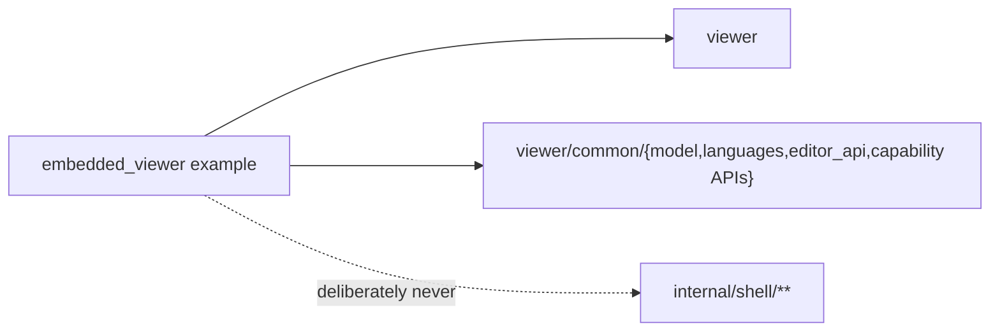

# internal/shell/examples/embedded_viewer

Minimal JS embedding proof for the reusable `viewer`. It uses in-memory files
and an in-memory `WorkspaceTreeProvider`; no workbench, remote protocol, server,
or WebSocket participates.

> The code blocks on this page are `mbt nocheck`. This package is js-only and
> its values need a live DOM, which `moon test` (Node, no DOM) cannot provide.
> Its executable coverage is the Playwright suites under `tests/browser/`; see
> `docs/harness.md` for how to choose a test layer.



This example exists to keep the *external* embedder surface compiling: it
imports only what a third-party host is allowed to import, so a change that
forces embedders through a private package breaks the build here first.

```mbt nocheck
// The whole embedding surface an external host needs.
let viewer = @viewer.Viewer::create(host)
viewer.set_model(Some(@model.TextModel(uri, name, "moonbit", 1, "rev-1", text)))
```

## Flow

- Startup registers the MoonBit tokenizer in the default `Languages` registry.
- `FileTree.on_open` asks the in-memory host for a new
  `viewer/common/model.TextModel`, calls `Viewer::set_model`, then invokes the
  separate `Viewer::handle_initialized` boundary after synchronous model
  setup. That same path accepts Code, `.md`, and `.mbt.md` models; the Viewer
  owns automatic presentation selection, so the embed has no Markdown parser
  or presentation adapter.
- `Viewer::on_did_change_model` captures the attached URI and schedules one
  native animation frame after the Viewer has queued its own DOM flush. The
  callback rechecks the current model URI, drops stale swaps, then drives
  `FileTree::set_active` (`autoReveal`) and the `ready` status.
- Rabbita renders a stable, childless `.viewer-host`; after the first paint the
  host mounts the imperative editor with `Viewer::create`.

This is the standalone-host boundary: the host owns storage, model creation,
selection, and feature registration; the viewer owns its DOM subtree.
`public_api_contract.mbt` is referenced but not executed; it keeps the opaque
options/services facade, common capability handles, root widget/zone factories,
and container/view DOM contracts compiling without importing browser internals.

## Validation

`just dist-front-end` emits `web/dist/embed.{html,mjs}`. The native server serves
`/embed.html`; `tests/browser/smoke/embed.spec.js` covers Code and in-memory
Markdown rendering, lazy expansion, navigation, stale ready callbacks, and the
absence of a WebSocket.
