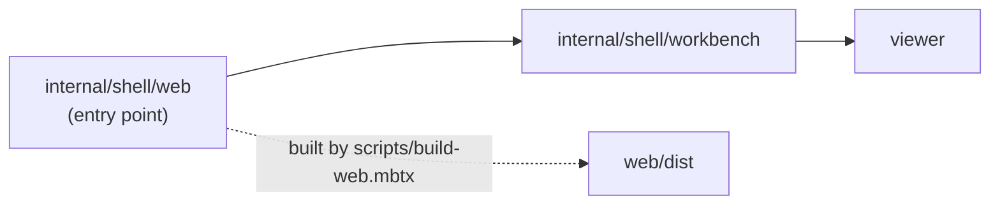

# internal/shell/web

JS main package for the reference workbench. `main` calls
`workbench.start_app`; it exports no API and imports only the workbench package.

> The code blocks on this page are `mbt nocheck`. This package is js-only and
> its values need a live DOM, which `moon test` (Node, no DOM) cannot provide.
> Its executable coverage is the Playwright suites under `tests/browser/`; see
> `docs/harness.md` for how to choose a test layer.



This is the reference app's browser entry point, not an import surface. It is
excluded from the published package.

```sh
just dist-front-end   # production browser assets only
just dev              # build, serve, and print Local/Network URLs
```

Application composition, browser FFI, URL/protocol selection, viewer mounting,
and harness behavior stay in `internal/shell/workbench`. This package must remain
an entrypoint rather than a shared domain layer.

`scripts/build-web.mbtx` bundles it as `web/dist/editor.mjs`, generates the HTML,
and assembles owner-adjacent CSS into `web/dist/style.css`; the native server
serves those assets. Run `just dist-front-end` (or `just build`). Browser harness
contracts are documented in `../../../docs/harness.md`.
