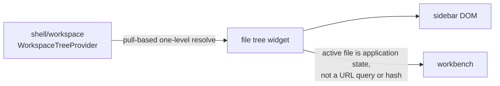

# internal/shell/widgets/file_tree

Explorer-style Rabbita widget for the reference shell. It owns cached
`WorkspaceStat` nodes and expansion/selection state, not document opening.

> The code blocks on this page are `mbt nocheck`. This package is js-only and
> its values need a live DOM, which `moon test` (Node, no DOM) cannot provide.
> Its executable coverage is the Playwright suites under `tests/browser/`; see
> `docs/harness.md` for how to choose a test layer.



```mbt nocheck
// Directories resolve lazily: an unresolved stat carries `children: None`.
tree.expand(directory_uri)      // triggers one resolve
tree.on_select(uri => workbench.open_document(uri))
```

## Contract

- Directories start collapsed. First expansion calls
  `WorkspaceTreeProvider.resolve` for exactly one level; successful children are
  cached and ordered directories-first. Collapse/re-expand reuses the cache.
- A failed resolve leaves an empty `resolve-failed` row; the next
  collapse/re-expand retries.
- `set_active` selects a URI and resolves/expands its ancestor chain
  (`autoReveal`). `refresh` replaces the tree from `provider.root` and reveals
  the current selection again.
- Clicking a file reports its URI through `on_open`; the host owns reads and
  editor selection.

Public API: `FileTree::FileTree(provider, on_open~)`, `view`, `refresh`, and
`set_active` (see `pkg.generated.mbti`). Stable test selectors include
`workspace-item`, `workspace-folder`/`workspace-file`, `is-selected`,
`data-workspace-id`, `data-workspace-kind`, and the ARIA expansion/selection
attributes.

The widget may depend on `workspace` and Rabbita, never on `remote_protocol` or
`viewer`. Run
`moon test internal/shell/widgets/file_tree --target js` and `just check`.
