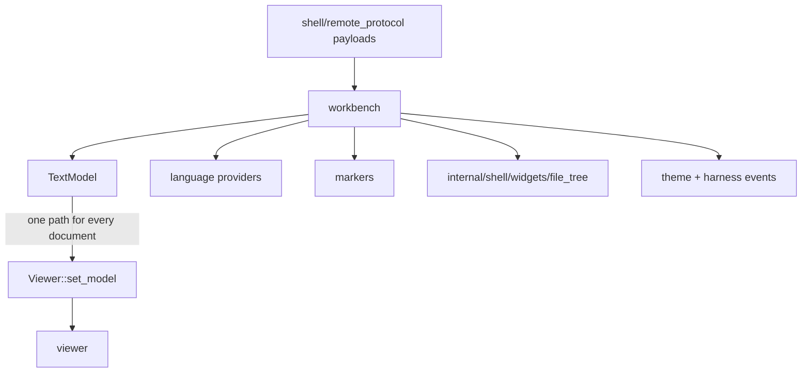
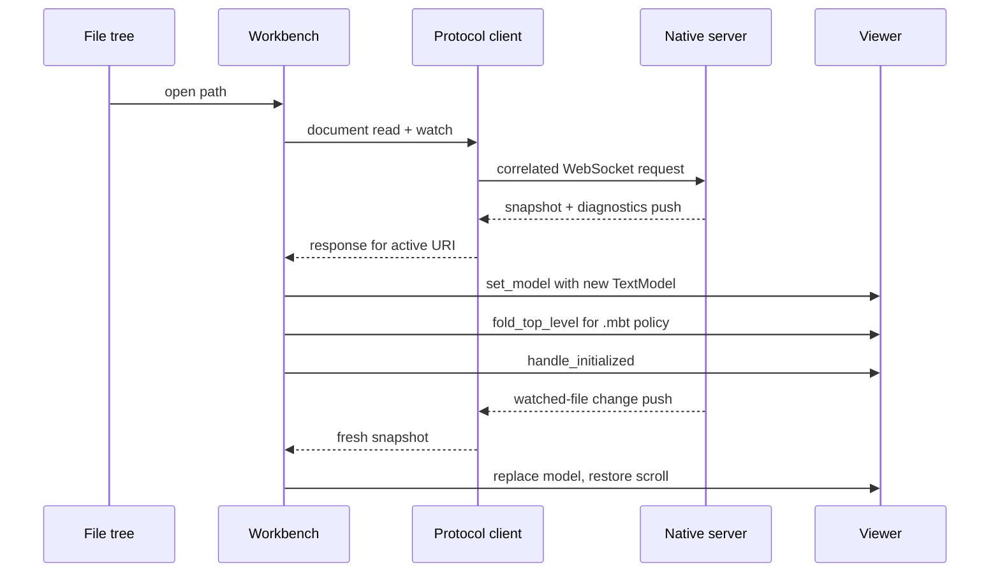

# internal/shell/workbench

Reference browser composition root: a small `vs/workbench`-like shell around the
reusable `viewer`, file tree, remote transport, and browser-test observability.

> The code blocks on this page are `mbt nocheck`. This package is js-only and
> its values need a live DOM, which `moon test` (Node, no DOM) cannot provide.
> Its executable coverage is the Playwright suites under `tests/browser/`; see
> `docs/harness.md` for how to choose a test layer.



Every document is installed through the same `Viewer::set_model` path — `.md`
and `.mbt.md` require no shell-side presentation branch, because the Viewer
selects the presentation from the model.

```mbt nocheck
// The workbench adapts a protocol payload into a caller-owned model and hands
// it over; it never decides between Code and Markdown.
let model = model_from_document(payload)
viewer.set_model(Some(model))

// Remote hover and diagnostics are accepted only for the exact current model
// identity, version, URI, revision, and content generation.
if accepts(payload, current_model_identity) {
  publish_diagnostics(payload)
}
```

## Runtime composition

- `start_app` creates and retains concrete language, marker, feedback,
  quick-diff, and logging backings, derives their narrow handles into an opaque
  `ViewerServices`, installs MoonBit/JSON/JavaScript tokenizers (TypeScript
  reuses JavaScript), remote hover/definition/document-symbol providers, the
  location opener and Peek model resolver, the private MoonBit
  Markdown-comment provider, and agent-feedback persistence; then it calls
  `mount_app`. The MoonBit adapter treats a `///|` marker line — bare, or
  carrying file-header text (`///| Summary …`) — as an item anchor and always
  renders it as a horizontal separator. Marker-line text and immediately
  following `///` lines render as that item's documentation below the
  separator.
- Rabbita owns topbar/sidebar/status/diagnostics/theme state and renders one
  stable, childless `.viewer-host`. After the first paint `Viewer::create`
  mounts the imperative editor into that element.
- `RemoteWorkspaceTreeProvider` maps one-level resolves to protocol requests.
  On connect/reconnect the tree refreshes; a bounded depth-first walk auto-opens
  the first MoonBit file (otherwise the first file). Explorer order is a
  reference-host policy passed to the widget as `rank~`: every level leads with
  its README (any extension), then `pkg.generated.mbti`, then the widget's
  directories-before-files default.
- `RemoteDocumentProvider` maps read/watch/close to protocol packets. Active URI
  and generation guards discard stale async results. Every snapshot becomes a
  new `TextModel`; reloads save/restore viewer scroll state, while user opens
  reset it. Before publishing the stable initialized state, the workbench uses
  the Viewer's explicit `fold_top_level` action for ordinary MoonBit `.mbt`
  models, presenting their declarations as an initial outline. Function folds
  retain every source-formatted signature line plus the opening brace while
  hiding later body lines and the closing brace, and top-level plain `//`
  comment runs (typically copyright headers) collapse to their first line.
  This is a reference-host policy: `.mbt.md` documents, extensionless sources, other languages, and
  external Viewer embedders remain expanded by default.
  Watched-file replacements install a fresh model and therefore reapply the
  policy; subsequent folding interactions on that model remain user-controlled.
- The workbench is presentation-agnostic. `document_to_text_model` preserves
  the snapshot URI, language id, revision, and text, and
  `set_workbench_model` always uses the same `Viewer::set_model` path. The
  Viewer alone selects Code or Markdown, so `.md` and `.mbt.md` add no shell
  parser, projection, or presentation branch. Remote language providers and
  markers continue to target that original model.
  Definition opens carry their target range through the same active-document
  read and reveal it only after the target model is installed.
- The host-neutral location opener accepts `Current` requests for
  `readonly-remote://workspace` resources and rejects unsupported `Side`
  requests. The Peek resolver creates one caller-owned preview `TextModel` per
  URI, returns ref-counted `TextModelReference` leases, and closes/disposes the
  backing only after the final lease and in-flight read retire. Active-document
  teardown defers its remote close while a preview lease still uses that URI.
  Viewer disposal synchronously closes the resolver to new work, marks existing
  resources as closing, and lets their real lease/in-flight counters reach zero
  before retiring models or late remote opens.
- The protocol client correlates in-flight requests by ID and resolves all
  pending requests on connection loss. Provider cancellation removes the
  pending continuation, disposes its token subscription, and retains a
  request-id tombstone so a late response cannot be misrouted as a watch push.
  Connection loss and send failure both resume all remaining requests. Watch
  results and diagnostics are push paths. Remote hover and diagnostics are
  accepted only for the exact registered model identity, version, URI,
  revision, and content generation. Model change, replacement, and disposal
  retire that generation and clear only owner `moon`; diagnostics update the
  workbench-retained `MarkerService` rather than a field recovered from
  `ViewerServices`.
- Public Viewer lifecycle subscriptions update shell state and drive tree
  `autoReveal`. Build/render/hover telemetry comes from the internal
  Viewer-id-keyed `internal/viewer/browser/testing` registry; diagnostic
  telemetry is reread from the retained marker store. Together they emit the
  structured harness events in `../../../docs/harness.md`.
- Agent-feedback state is enabled per opened resource and persisted in
  `localStorage`; this reference host has no agent execution loop.

Opening a document flows one way from the tree through the protocol into a
fresh readonly model:



Opened `.md` and `.mbt.md` documents are not a workbench feature: the Viewer's
own presentation routing renders them as readonly Markdown documents while the
workbench keeps supplying ordinary URI-backed models (see the
presentation-agnostic bullet above).

The MoonBit Markdown provider registration explicitly opts its API-document
results into presentation folding. Multi-line documentation initially shows
only its first source line; the adjacent accessible control expands or
collapses the full rendered Markdown without changing source coordinates or
code-folding state. Generic or third-party providers remain expanded unless
their own registration opts in, regardless of Markdown content.

The only exported functions are `start_app`, `mount_app`, and the harness-facing
`emit_event`; see `pkg.generated.mbti`.

## Boundary and validation

Composition belongs here. Viewer and file tree do not know about each other or
the transport. As an internal workbench-tier consumer this package may retain
feature implementations and use `internal/viewer/browser/testing`; external
embedders remain restricted to root `viewer`, `viewer/browser`, and
`viewer/common/**`. JavaScript FFI is limited to host capabilities, harness
events, storage, and protocol URL lookup.

Run `moon test internal/shell/workbench --target js`, `just check`, and
`just test-browser-smoke`. Use `just test-browser-perf` only for performance
investigation or perf-harness changes.
