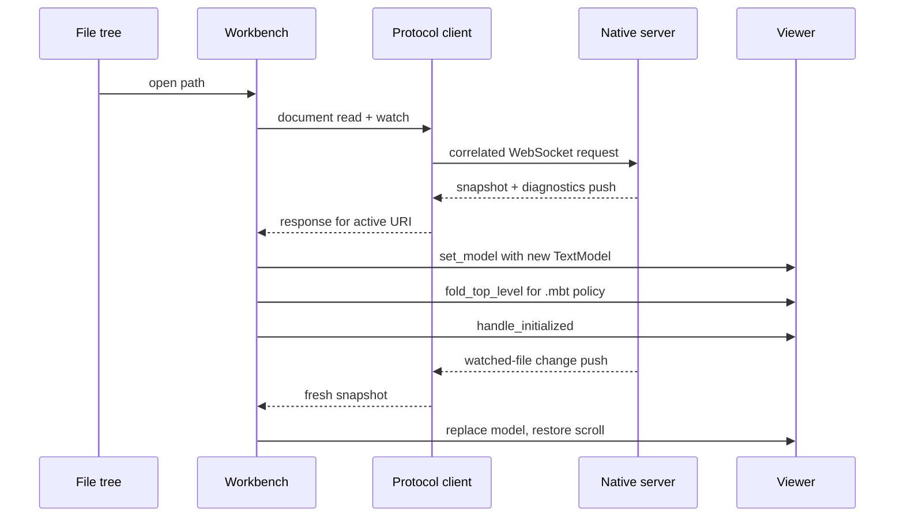

# internal/shell/workbench

Reference browser composition root: a small `vs/workbench`-like shell around the
reusable `viewer`, file tree, remote transport, and browser-test observability.

## Runtime composition

- `start_app` creates and retains concrete language, marker, feedback,
  quick-diff, and logging backings, derives their narrow handles into an opaque
  `ViewerServices`, installs MoonBit/JSON/JavaScript tokenizers (TypeScript
  reuses JavaScript), remote hover/document-symbol providers, the private
  MoonBit Markdown-comment provider, and agent-feedback persistence; then it
  calls `mount_app`. The MoonBit adapter treats an exact `///|` line as an item
  anchor and always renders it as a horizontal separator. Immediately following
  `///` lines render as that item's documentation below the separator.
- Rabbita owns topbar/sidebar/status/diagnostics/theme state and renders one
  stable, childless `.viewer-host`. After the first paint `Viewer::create`
  mounts the imperative editor into that element.
- `RemoteWorkspaceTreeProvider` maps one-level resolves to protocol requests.
  On connect/reconnect the tree refreshes; a bounded depth-first walk auto-opens
  the first MoonBit file (otherwise the first file).
- `RemoteDocumentProvider` maps read/watch/close to protocol packets. Active URI
  and generation guards discard stale async results. Every snapshot becomes a
  new `TextModel`; reloads save/restore viewer scroll state, while user opens
  reset it. Before publishing the stable initialized state, the workbench uses
  the Viewer's explicit `fold_top_level` action for ordinary MoonBit `.mbt`
  models, presenting their declarations as an initial outline. Function folds
  retain every source-formatted signature line plus the opening brace while
  hiding later body lines and the closing brace. This is a reference-host
  policy: `.mbt.md` documents, extensionless sources, other languages, and
  external Viewer embedders remain expanded by default.
  Watched-file replacements install a fresh model and therefore reapply the
  policy; subsequent folding interactions on that model remain user-controlled.
- The workbench is presentation-agnostic. `document_to_text_model` preserves
  the snapshot URI, language id, revision, and text, and
  `set_workbench_model` always uses the same `Viewer::set_model` path. The
  Viewer alone selects Code or Markdown, so `.md` and `.mbt.md` add no shell
  parser, projection, or presentation branch. Remote language providers and
  markers continue to target that original model.
- The protocol client correlates in-flight requests by ID and resolves all
  pending requests on connection loss. Watch results and diagnostics are push
  paths. Remote hover and diagnostics are accepted only for the exact
  registered model identity, version, URI, revision, and content generation.
  Model change, replacement, and disposal retire that generation and clear
  only owner `moon`; diagnostics update the workbench-retained `MarkerService`
  rather than a field recovered from `ViewerServices`.
- Public Viewer lifecycle subscriptions update shell state and drive tree
  `autoReveal`. Build/render/hover telemetry comes from the internal
  Viewer-id-keyed `internal/viewer/browser/testing` registry; diagnostic
  telemetry is reread from the retained marker store. Together they emit the
  structured harness events in `../../../docs/harness.md`.
- Agent-feedback state is enabled per opened resource and persisted in
  `localStorage`; this reference host has no agent execution loop.

Opening a document flows one way from the tree through the protocol into a
fresh readonly model:

Opened `.md` documents render as one whole-file Markdown block through the
same provider seam and rendering pipeline as API documentation — tokenized
code fences, Mermaid, and Diago included. The view projection cannot hide
every model line, so the block spans `[1, line_count)`: a newline-terminated
file leaves only its empty last line as source. One-line and blank documents
keep their plain source view, and `.mbt.md` stays with the MoonBit provider.

The MoonBit Markdown provider registration explicitly opts its API-document
results into presentation folding. Multi-line documentation initially shows
only its first source line; the adjacent accessible control expands or
collapses the full rendered Markdown without changing source coordinates or
code-folding state. Generic or third-party providers remain expanded unless
their own registration opts in, regardless of Markdown content.

The only exported functions are `start_app`, `mount_app`, and the harness-facing
`emit_event`; see `pkg.generated.mbti`.

## Boundary and validation

Composition belongs here. Viewer and file tree do not know about each other or
the transport. As an internal workbench-tier consumer this package may retain
feature implementations and use `internal/viewer/browser/testing`; external
embedders remain restricted to root `viewer`, `viewer/browser`, and
`viewer/common/**`. JavaScript FFI is limited to host capabilities, harness
events, storage, and protocol URL lookup.

Run `moon test internal/shell/workbench --target js`, `just check`, and
`just test-browser-smoke`. Use `just test-browser-perf` only for performance
investigation or perf-harness changes.
