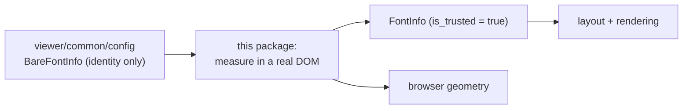

# internal/viewer/browser/config

Browser-only font styling and deterministic character-width measurement.

> The code blocks on this page are `mbt nocheck`. This package is js-only and
> its values need a live DOM, which `moon test` (Node, no DOM) cannot provide.
> Its executable coverage is the Playwright suites under `tests/browser/`; see
> `docs/harness.md` for how to choose a test layer.



`viewer/common/config` decides *whether* two font configurations are the same;
this package is the only one that finds out how wide a character actually is.

```mbt nocheck
///|
fn upgrade_to_measured(bare : @config.BareFontInfo) -> @config.FontInfo {
  // Headless construction produces an explicitly untrusted value.
  let estimated = @config.FontInfo::estimated(bare) // is_trusted = false
  let measured = measure_font_info(bare) // is_trusted = true
  // `FontInfo::equals` ignores is_trusted, so swapping the estimate for the
  // measurement does not by itself force a re-layout.
  if estimated.equals(measured) {
    estimated
  } else {
    measured
  }
}
```

## Measurement contract

- `read_char_widths` creates one hidden DOM corpus, applies the requested bare
  font, measures Regular/Italic/Bold rows using 256 repeated characters, and
  removes the corpus synchronously.
- `font_measurements()` always returns one process-lifetime singleton. The
  viewer has one browser window/document, so Monaco's per-window cache map,
  target-window PixelRatio, and target-window timer owner collapse to the
  current global window.
- The folded cache is an ordered id array plus an id-to-`FontInfo` map keyed by
  `BareFontInfo::get_id`. Overwrite retains position; removal followed by
  re-addition moves the id to the tail; clear resets both stores and always
  fires `on_did_change`.
- A cache miss measures the exact Monaco request corpus. Monospace detection
  accepts only ligatures-off settings and width differences in the inclusive
  `[-0.001, 0.001]` interval. Halfwidth-arrow safety is derived independently.
- A typical halfwidth, fullwidth, space, or maximum-digit measurement at or
  below `2px` is suspicious. All six width outputs (half, full, space, middot,
  word-separator middot, and maximum digit) are floored at exactly `5px`, the
  live pixel ratio is reread, and the cached result is marked untrusted.
- At most one untrusted retry is pending. Its delay is exactly 5000ms; the
  pending flag resets before eviction and notification, and eviction fires only
  when it removed an untrusted value. Trusted values never schedule a retry.

The singleton intentionally has no dispose/cancel owner, and font-info
serialization/restore is absent. Both are bounded by the process-lifetime,
single-window viewer contract rather than hidden local alternatives.

This internal package is JS-only and owns the Rabbita DOM seams. See
`pkg.generated.mbti`; run
`moon test internal/viewer/browser/config --target js`.
