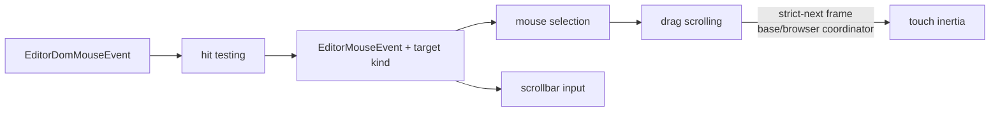

# internal/viewer/browser/controller

The JS-only pointer controller, mirroring Monaco's
`editor/browser/controller/{mouseHandler,mouseTarget,dragScrolling}.ts` plus
the viewer's scrollbar-input glue.

> The code blocks on this page are `mbt nocheck`. This package is js-only and
> its values need a live DOM, which `moon test` (Node, no DOM) cannot provide.
> Its executable coverage is the Playwright suites under `tests/browser/`; see
> `docs/harness.md` for how to choose a test layer.



Touch inertia uses the shared strict-next frame coordinator; its disposable
remains owned by the per-model handler, so a model swap cannot leave an inertia
animation running against a detached view.

```mbt nocheck
// The per-model mouse handler is created and retained by the root Viewer's
// ModelBrowserData, and disposed with it.
let handler = MouseHandler::new(view, view_model, layout)
handler.dispose() // stops inertia, releases pointer capture and listeners
```

## Contract

```text
EditorMouseEventFactory
  -> MouseHandler
  -> MouseTargetFactory / HitTestContext
  -> MouseDispatchData
  -> Viewer dispatch callbacks
```

- `PointerHandlerHelper` is the Monaco-shaped bundle of DOM nodes and closure
  capabilities built by the root `viewer` package. It is the only route back
  to the active ViewModel, layout, measurements, scrolling, event emission,
  and cursor dispatch; this package never imports the root `viewer` package.
- `MouseTargetFactory` classifies fingerprinted editor DOM, caret-API hits,
  margins, widgets, zones, scrollbars, and outside-editor coordinates into the
  `MouseTarget` values owned by `viewer/browser`.
- `MouseHandler` owns browser listeners, click counting, selection drag,
  outside-editor auto-scroll, wheel input, browser-driven reveal recovery, and
  active editor/hover scrollbar drags. Its lines-content touch owner applies
  immediate two-axis pan deltas and Monaco's four-sample, `-0.005 px/ms²`
  inertia through the existing `ViewLayout` scroll truth. Inertia registers on
  `base/browser`'s shared strict-next frame queue and owns the returned
  disposable, so fresh touch, `touchcancel`, and per-View teardown leave no
  runnable item. A tick's resulting Viewer render may join that current frame's
  priority-`100` drain. It emits resolved `MouseTarget` events and
  `MouseDispatchData`; the root Viewer converts the public event boundary to
  model space and changes cursor state.
- `MouseHandler::dispose` is idempotent and is registered in the per-model
  View lifetime. It removes root/scrollbar/desperate-reveal listeners, closes
  the selection and scrollbar global-pointer monitors, ends active slider
  state, and cancels touch inertia and outside-editor drag animation frames.
- Scrollbar thumb movement is gesture-scoped. Pointer capture is attempted on
  the slider and falls back to its owning window; Windows resets to the
  pointerdown scroll position only when orthogonal distance is strictly greater
  than 140 px. The pointerdown `ScrollbarState` mapping remains fixed even if
  geometry changes during the gesture.
- `PointerHandlerLastRenderData` exposes the last cursor geometry needed by
  hit testing. Exact callable types are listed in `pkg.generated.mbti`.

Compared with Monaco, the viewer omits touch tap/context-menu and pen-selection
dispatch, mouse-wheel zoom, context-menu/wheel editor events, text
drag-and-drop, multi-cursor and column-selection gestures, and
textarea/GPU/minimap paths. The local gesture also rejects zero-duration
velocity windows, suppresses the stopped zero-translation callback, handles
`touchcancel`, and cancels per-View; these are intentional safety/lifecycle
extensions. Outside-editor selection drag retains its separate raw-rAF loop
and is not part of the shared smooth/touch scheduling contract.

## Boundary

This internal package may use browser DOM, `internal/viewer/browser/view`,
common view-model/layout, and `internal/viewer/ui/scrollbar` types. It must not
import `viewer`, `internal/shell/**`, or Rabbita TEA/vdom/command packages.
Shared browser mouse event/target values live in `viewer/browser`; the DOM
hit-test algorithm lives here.

## Focused validation

```sh
moon check internal/viewer/browser/controller --target js
moon test internal/viewer/browser/controller --target js -v
```
