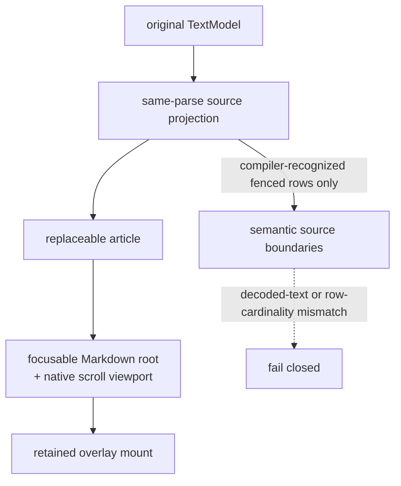

# internal/viewer/browser/markdown_document

JS-only document presentation owned by the Viewer layer. It keeps a focusable
root, a native scroll viewport, a reusable Markdown article target, and a
viewport-fixed overlay mount as separate DOM capabilities.

> The code blocks on this page are `mbt nocheck`. This package is js-only and
> its values need a live DOM, which `moon test` (Node, no DOM) cannot provide.
> Its executable coverage is the Playwright suites under `tests/browser/`; see
> `docs/harness.md` for how to choose a test layer.



The package owns no model, provider, marker store, or request policy. Root and
the hover browser package own those higher-level contracts.

```mbt nocheck
// The root installs this as the Markdown BrowserPresentation.
let document_view = MarkdownDocumentView::new(host, model_source)
document_view.set_source(projection)  // replaces the article, keeps the root
document_view.dispose()
```

Rendering delegates to `internal/viewer/browser/markdown`. The retained
`MarkdownDocumentProjection` is therefore the exact projection produced by the
same cmark parse as the installed HTML. Every source or theme replacement
advances `projection_generation` and records the source model content version.
The single post-render pass stamps source anchors and leaves stable
`data-markdown-code-block="<block_index>"` wrappers for source-aware browser
features. Compiler-recognized `mbt check` fences additionally expose one
source-bearing DOM row per projected code line. Each row retains the exact
`MarkdownCodeLine`, block source range, and rendered element; synthetic
Markdown indentation remains outside the semantic text boundary. Tokenization
runs over the whole fence before it is split into rows, preserving cross-line
tokenizer state. A cardinality or decoded-text mismatch fails closed by
removing the semantic attributes and registry entry.

The semantic DOM registry and its listeners are replacement-scoped: they are
disposed before the article renderer, rebuilt after each successful render,
and drained on view disposal. The package owns no model, provider, marker
store, or source-coordinate policy. Root `viewer` and the hover contribution
own presentation selection, content subscriptions, original-model coordinate
conversion, request freshness, and feature lifetime. The overlay mount is
deliberately outside the replaceable article so hover DOM is retained across a
content refresh and explicitly invalidated by its owner.

Run the focused suite with:

```sh
MOON_WORK=off moon test --target js internal/viewer/browser/markdown_document
```
