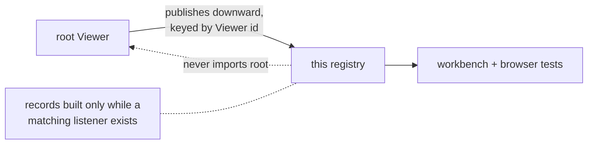

# internal/viewer/browser/testing

This JS-only package is the internal workbench/browser-test bridge for viewer
telemetry and narrowly scoped controls. Entries are keyed by `Viewer::get_id`,
but this package never imports the root `viewer` package: root code registers
callback controls and publishes observations downward, while test-tier callers
subscribe by id.

> The code blocks on this page are `mbt nocheck`. This package is js-only and
> its values need a live DOM, which `moon test` (Node, no DOM) cannot provide.
> Its executable coverage is the Playwright suites under `tests/browser/`; see
> `docs/harness.md` for how to choose a test layer.



Observation records are constructed only while the matching Viewer has a
listener, so an unobserved Viewer pays nothing. The scroll state/render-phase
trace is disabled by default.

```mbt nocheck
// Browser test scenarios subscribe by Viewer id; product code never does.
let subscription = observe_render_facts(viewer_id, fact => report(fact))
subscription.dispose()
```

This is not an external API.

Unregistering a viewer disposes all of its subscriptions. Registration handles
are idempotent and generation-aware, so an old handle cannot remove a later
registration that reuses the same id. Render observations intentionally omit
diagnostic payloads; hosts that need diagnostics read them from their retained
marker service.

The scroll-frame seam preserves raw duplicate observations in order:
`StateCommitted` after an accepted axis change is visible and before its render
is requested, then `RenderStarted` and `RenderFinished` immediately around
`View::render`. Each record carries Viewer id and both scroll axes. Viewer ids
isolate streams; listener disposal, unregister, and registration replacement
end the old stream. The publisher accepts primitives and checks
`Emitter::has_listeners` before constructing a record, so product execution is
disabled by default. Browser tests add the real DOM commit separately with a
`MutationObserver`; an internal render phase is not itself commit evidence.

## Focused validation

```sh
moon check internal/viewer/browser/testing --target js
moon test internal/viewer/browser/testing --target js -v
```
