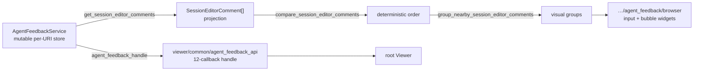

# internal/viewer/contrib/agent_feedback

The DOM-free agent-feedback implementation. It owns the mutable feedback
service, editor-comment projection, deterministic sorting/grouping, navigation,
reply, acceptance, and submission state used by the root Viewer and workbench.



## The store

Feedback is per resource, and adding an item returns the created value with its
allocated id.

```mbt check
///|
test "feedback is stored per resource with an allocated id" {
  let service = @agent_feedback.AgentFeedbackService()
  let uri = @base_common.Uri::parse("file:///src/main.mbt")
  let other = @base_common.Uri::parse("file:///src/other.mbt")
  let created = service.add_feedback(uri, Range(4, 1, 4, 9), "look here")
  debug_inspect(
    (
      created.text,
      created.kind,
      created.state,
      service.get_feedback(uri).length(),
      service.get_feedback(other).length(),
    ),
    content=(
      #|("look here", UserReview, Accepted, 1, 0)
    ),
  )
}
```

Acceptance, replies, and submission are state transitions on an existing item
rather than separate collections.

```mbt check
///|
test "accept, reply, and submit move the same item through its states" {
  let service = @agent_feedback.AgentFeedbackService()
  let uri = @base_common.Uri::parse("file:///src/main.mbt")
  let item = service.add_feedback(uri, Range(1, 1, 1, 4), "note")
  service.accept_feedback(uri, item.id)
  let accepted = service.get_feedback(uri)[0].state
  service.add_reply(uri, item.id, "acknowledged")
  let replies = service.get_feedback(uri)[0].replies
  service.mark_feedback_submitted(uri)
  debug_inspect(
    (accepted, replies, service.get_feedback(uri)[0].state),
    content=(
      #|(Accepted, ["acknowledged"], Submitted)
    ),
  )
}
```

Clearing a resource removes its items without touching other resources.

```mbt check
///|
test "clearing one resource leaves the others intact" {
  let service = @agent_feedback.AgentFeedbackService()
  let first = @base_common.Uri::parse("file:///a.mbt")
  let second = @base_common.Uri::parse("file:///b.mbt")
  service.add_feedback(first, Range(1, 1, 1, 2), "a") |> ignore
  service.add_feedback(second, Range(1, 1, 1, 2), "b") |> ignore
  service.clear_feedback(first)
  debug_inspect(
    (
      service.get_feedback(first).length(),
      service.get_feedback(second).length(),
    ),
    content=(
      #|(0, 1)
    ),
  )
}
```

## The editor-comment projection

`get_session_editor_comments` projects host DTOs into the value the editor
renders. `compare_session_editor_comments` gives that list a deterministic
order — by position, so two comments never swap places between renders.

```mbt check
///|
fn feedback_at(
  line : Int,
  text : String,
) -> @agent_feedback_api.AgentFeedback raise {
  {
    id: "fb-\{line}",
    text,
    resource: @base_common.Uri::parse("file:///src/main.mbt"),
    range: Range(line, 1, line, 4),
    kind: UserReview,
    replies: [],
    state: Created,
  }
}

///|
test "the projection is ordered deterministically by position" {
  let projected = @agent_feedback.get_session_editor_comments([
    feedback_at(30, "third"),
    feedback_at(10, "first"),
    feedback_at(20, "second"),
  ])
  let ordered = projected.copy()
  ordered.sort_by(@agent_feedback.compare_session_editor_comments)
  debug_inspect(
    ordered.map(comment => (comment.range.start_line_number, comment.text)),
    content=(
      #|[(10, "first"), (20, "second"), (30, "third")]
    ),
  )
}
```

`group_nearby_session_editor_comments` collapses comments that sit within a line
threshold of each other into one visual group, so adjacent notes render as a
stack rather than as overlapping bubbles.

```mbt check
///|
test "nearby comments group and distant ones do not" {
  let projected = @agent_feedback.get_session_editor_comments([
    feedback_at(10, "a"),
    feedback_at(11, "b"),
    feedback_at(40, "c"),
  ])
  projected.sort_by(@agent_feedback.compare_session_editor_comments)
  debug_inspect(
    @agent_feedback.group_nearby_session_editor_comments(projected).map(group => {
      group.map(comment => comment.text)
    }),
    content=(
      #|[["a", "b"], ["c"]]
    ),
  )
}
```

`get_accepted_agent_feedback_comment_count` is the counter a submission summary
renders; it counts only accepted agent-review comments.

```mbt check
///|
test "the accepted count is a filtered projection, not a stored total" {
  let projected = @agent_feedback.get_session_editor_comments([
    feedback_at(10, "a"),
    feedback_at(20, "b"),
  ])
  debug_inspect(
    @agent_feedback.get_accepted_agent_feedback_comment_count(projected),
    content=(
      #|0
    ),
  )
}
```

## Boundaries and checks

Public host DTOs and callback handles remain in
`viewer/common/agent_feedback_api`; this package is an internal implementation
owner and must not become a dependency of embedded clients. Browser widgets
live in `internal/viewer/contrib/agent_feedback/browser`.

Exact callable types are in `pkg.generated.mbti`. Run the focused suite on
both supported targets with:

```sh
moon test internal/viewer/contrib/agent_feedback --target js
moon test internal/viewer/contrib/agent_feedback --target native
```
