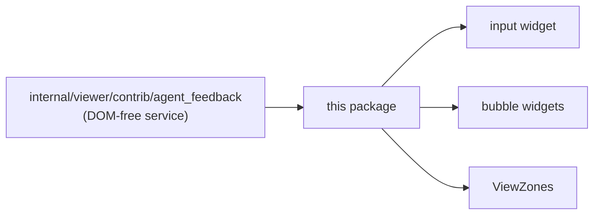

# internal/viewer/contrib/agent_feedback/browser

The JS-only agent-feedback editor widgets and contribution state. It owns the
inline feedback input, grouped comment widgets, DOM event wiring, measurement,
layout state, and the per-target lifetimes for Markdown rendered by
`internal/viewer/browser/markdown`.

> The code blocks on this page are `mbt nocheck`. This package is js-only and
> its values need a live DOM, which `moon test` (Node, no DOM) cannot provide.
> Its executable coverage is the Playwright suites under `tests/browser/`; see
> `docs/harness.md` for how to choose a test layer.



```mbt nocheck
// Widgets read projected SessionEditorComment values; they never hold their own
// copy of feedback state.
let bubbles = render_feedback_bubbles(grouped_comments)
viewer.change_view_zones(accessor => mount_bubbles(accessor, bubbles))
```

Each comment body and indexed reply owns one shared-renderer disposable. A
widget releases every target before rebuilding its body and during teardown;
entering edit mode releases only that comment body's target, so sibling
comments and replies remain live. Agent feedback supplies no action handler,
base URI, remote-image permission, or size callback.

This package depends on the DOM-free implementation in
`internal/viewer/contrib/agent_feedback`; public host values remain in
`viewer/common/agent_feedback_api`. The emitted stylesheet remains at the
stable asset path
`viewer/contrib/agent_feedback/browser/agent_feedback.css`.

Exact callable types are in `pkg.generated.mbti`. Check this JS-only package
with:

```sh
moon check internal/viewer/contrib/agent_feedback/browser --target js
moon test internal/viewer/contrib/agent_feedback/browser --target js
```
