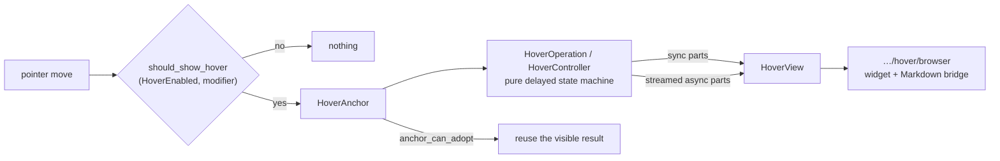

# internal/viewer/contrib/hover

The DOM-free content-hover model, ported from Monaco's
`editor/contrib/hover/browser/` so its state, participants, reconciliation,
timing, and rendering can be tested on JS and native targets.



## Trigger policy

Whether a hover may appear at all is a pure decision over the configured
`HoverEnabled` mode and the modifier keys currently held. `OnKeyboardModifier`
is the interesting one, and its rule is easy to get backwards: the hover trigger
is the modifier the multi-cursor setting does **not** use. With multi-cursor on
Alt, hover triggers on Ctrl/Meta; with multi-cursor on Ctrl or Meta, hover
triggers on Alt. The two features therefore never contend for the same key.

```mbt check
///|
test "the keyboard-modifier mode borrows the multi-cursor modifier" {
  // These enums are read-only: values come from the configuration strings.
  let on = @hover.HoverEnabled::from_config("on")
  let off = @hover.HoverEnabled::from_config("off")
  let on_modifier = @hover.HoverEnabled::from_config("onKeyboardModifier")
  let alt_modifier = @hover.MultiCursorModifier::from_config("alt", mac=false)
  let ctrl_modifier = @hover.MultiCursorModifier::from_config(
    "ctrlCmd",
    mac=false,
  )
  let none = @hover.EventModifiers::none()
  let alt : @hover.EventModifiers = { ctrl: false, meta: false, alt: true }
  let ctrl : @hover.EventModifiers = { ctrl: true, meta: false, alt: false }
  debug_inspect(
    (
      // always on / always off ignore modifiers entirely
      @hover.should_show_hover(on, alt_modifier, none),
      @hover.should_show_hover(off, alt_modifier, alt),
      // on-modifier: no modifier held never triggers
      @hover.should_show_hover(on_modifier, alt_modifier, none),
      // multi-cursor is Alt, so Alt is taken and does NOT trigger hover...
      @hover.should_show_hover(on_modifier, alt_modifier, alt),
      // ...while Ctrl, which multi-cursor does not use, does
      @hover.should_show_hover(on_modifier, alt_modifier, ctrl),
      // and with multi-cursor on Ctrl the roles swap
      @hover.should_show_hover(on_modifier, ctrl_modifier, ctrl),
      @hover.should_show_hover(on_modifier, ctrl_modifier, alt),
    ),
    content=(
      #|(true, false, false, false, true, false, true)
    ),
  )
}
```

Both option values are parsed from their configuration strings. `"ctrlCmd"`
resolves to Meta on macOS and Ctrl elsewhere — and by the complement rule above,
either way the *hover* trigger becomes Alt.

```mbt check
///|
test "config strings resolve, including the macOS ctrlCmd split" {
  debug_inspect(
    (
      ["on", "off", "onKeyboardModifier", "nonsense"].map(raw => {
        @hover.should_show_hover(
          @hover.HoverEnabled::from_config(raw),
          @hover.MultiCursorModifier::from_config("alt", mac=false),
          { ctrl: false, meta: false, alt: true },
        )
      }),
      // On macOS "ctrlCmd" is Meta, so Meta is taken and Alt triggers hover.
      @hover.should_show_hover(
        @hover.HoverEnabled::from_config("onKeyboardModifier"),
        @hover.MultiCursorModifier::from_config("ctrlCmd", mac=true),
        { ctrl: false, meta: true, alt: false },
      ),
      @hover.should_show_hover(
        @hover.HoverEnabled::from_config("onKeyboardModifier"),
        @hover.MultiCursorModifier::from_config("ctrlCmd", mac=true),
        { ctrl: false, meta: false, alt: true },
      ),
      // Elsewhere it is Ctrl, and Alt still triggers hover.
      @hover.should_show_hover(
        @hover.HoverEnabled::from_config("onKeyboardModifier"),
        @hover.MultiCursorModifier::from_config("ctrlCmd", mac=false),
        { ctrl: false, meta: false, alt: true },
      ),
    ),
    content=(
      #|([true, false, false, true], false, true, true)
    ),
  )
}
```

## Anchors and adoption

`HoverAnchor` models range and injected-text foreign-element anchors. The
adoption helpers decide whether an already visible hover survives a pointer
move, which is what stops the widget from flickering as the pointer travels
inside the same word.

```mbt check
///|
fn range_anchor(start_column : Int, end_column : Int) -> @hover.HoverAnchor {
  HoverRangeAnchor(
    priority=0,
    range=Range(1, start_column, 1, end_column),
    initial_mouse_pos_x=None,
    initial_mouse_pos_y=None,
  )
}

///|
test "an anchor adopts a move that stays inside its range" {
  let shown = range_anchor(5, 12)
  let inside = range_anchor(6, 11)
  let elsewhere = range_anchor(40, 44)
  debug_inspect(
    (
      @hover.hover_anchor_equals(shown, shown),
      @hover.hover_anchor_equals(shown, inside),
      @hover.hover_anchor_can_adopt(shown, inside),
      @hover.hover_anchor_can_adopt(shown, elsewhere),
      shown.range(),
      shown.supports_marker_hover(),
    ),
    content=(
      #|(
      #|  true,
      #|  false,
      #|  true,
      #|  true,
      #|  {
      #|    start_line_number: 1,
      #|    start_column: 5,
      #|    end_line_number: 1,
      #|    end_column: 12,
      #|  },
      #|  false,
      #|)
    ),
  )
}
```

## Geometry helpers

The widget needs to know when the pointer has genuinely left it, allowing for a
tolerance band. Those predicates are pure arithmetic and live here rather than
in the browser package.

```mbt check
///|
test "pointer-versus-widget geometry is pure arithmetic" {
  // The two argument orders differ: `mouse_within_element` takes the box first
  // and the point last, while `compute_distance_from_point_to_rectangle` takes
  // the point first. Both describe a 100x40 box at (10, 20).
  debug_inspect(
    (
      // well inside; far outside; and inside the box but within the
      // hit-padding inset, which counts as outside
      @hover.mouse_within_element(10.0, 20.0, 100.0, 40.0, 60.0, 40.0),
      @hover.mouse_within_element(10.0, 20.0, 100.0, 40.0, 500.0, 40.0),
      @hover.mouse_within_element(10.0, 20.0, 100.0, 40.0, 11.0, 40.0),
      // distance is 0 anywhere inside, and grows once outside
      @hover.compute_distance_from_point_to_rectangle(
        60.0, 40.0, 10.0, 20.0, 100.0, 40.0,
      ),
      @hover.compute_distance_from_point_to_rectangle(
        130.0, 40.0, 10.0, 20.0, 100.0, 40.0,
      ),
    ),
    content=(
      #|(true, false, false, 0, 20)
    ),
  )
}
```

## Keeping or rescheduling

Whether a visible hover survives, and whether a pending computation is
rescheduled, are separate pure decisions — which is what lets the browser host
own the timers without owning the policy.

```mbt check
///|
test "keep and reschedule are separate pure decisions" {
  debug_inspect(
    (
      [
        @hover.should_keep_current_hover(true, true, true),
        @hover.should_keep_current_hover(false, true, true),
        @hover.should_keep_current_hover(true, false, true),
      ],
      @hover.should_keep_hover_widget_visible(true),
      @hover.should_keep_hover_widget_visible(false),
      [
        @hover.should_reschedule_hover(true, true, 1),
        @hover.should_reschedule_hover(false, true, 1),
        @hover.should_reschedule_hover(true, false, 0),
      ],
    ),
    content=(
      #|([true, true, true], true, false, [true, false, false])
    ),
  )
}
```

## Contract

- `HoverAnchor` models range and injected-text foreign-element anchors.
  Foreign anchors carry an explicit editor-scoped participant-owner identity;
  equality/adoption/filter helpers decide whether a visible result survives a
  pointer move without conflating rebuilt participants or separate Viewers.
- `HoverOperation` and `HoverController` are the pure delayed-operation state
  machine. Typed start modes/sources preserve the source branches;
  `HoverRequestStamp` combines stable model identity, internal content
  version, monotonic generation, and caller token. Sync and streamed async
  parts are merged into `HoverView`/`HoverWidgetView`; content invalidation can
  cancel pending work while preserving an already shown view. The browser/root
  host owns clearable timers and executes the requested computations.
- `HoverParticipantHandle` is a value-level adapter with required ordinal and
  synchronous computation plus independently optional anchor suggestion,
  asynchronous computation, and loading-message callbacks.
  `HoverParticipantRegistry` builds participants from
  `HoverParticipantServices`; the process-wide registry currently installs
  marker and language-Markdown participants.
- `ContentHoverComputer` runs those participants. Marker tooltips are
  synchronous; registered language hover providers are asynchronous. The
  caller token/freshness predicate guard both sides of each await, and an
  injected task runner lets the browser merge participant results in completion
  order without a multi-target runtime dependency. The browser sibling reuses
  this computer for semantic Markdown rows while keeping the original
  `TextModel` as provider identity; projected fence text is never a synthetic
  model.
- `render_hover_code_block` preserves hover's synchronous compatibility
  surface while delegating fenced/active-language selection and editor-token
  HTML to `internal/viewer/markdown`'s shared override. This package neither
  imports cmark types nor creates DOM nodes.

## Browser and Viewer ownership

`internal/viewer/contrib/hover/browser` owns everything whose contract carries
DOM or a browser `MouseTarget`: candidate discovery, editor-event reduction,
the `ContentHoverController` implementation, geometry, and the persistent
`ContentHoverWidget`. The feature package has no process-global per-editor
controller map. The root `viewer` package constructs the concrete controller
into its sole per-Viewer contribution registry, recovers it through a private
typed central accessor, routes events/timers/provider work, owns hover
decorations, and mounts/synchronizes the widget. Controller reset and disposal
operate on that stored payload directly. The same controller survives model
removal, replacement, and reattachment while its model-scoped timers, request,
and decoration state reset. The widget exposes a generic `ContentWidgetHandle`
and mounts in the overflowing layer.

Compared with Monaco, there are no resize sashes, hover status bar,
accessibility view, color picker, code-action participant, or context-key/DI
framework. Exact APIs are in `pkg.generated.mbti`; browser-only APIs are in
`browser/pkg.generated.mbti`.

## Boundary

This package is multi-target and imports no Rabbita or browser/view package.
It may depend on base/language/log/syntax, the DOM-free shared Markdown core,
and DOM-free viewer common packages, but never on the root Viewer or shell.

Run the focused suite on both supported targets with:

```sh
moon test internal/viewer/contrib/hover --target js
moon test internal/viewer/contrib/hover --target native
```
