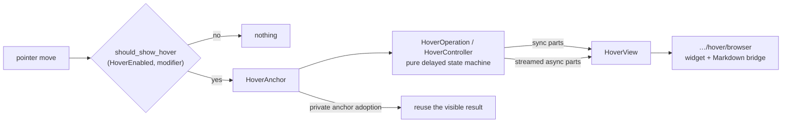

# internal/viewer/contrib/hover

The DOM-free content-hover model, ported from Monaco's
`editor/contrib/hover/browser/` so its state, participants, reconciliation,
timing, and rendering can be tested on JS and native targets.



## Trigger policy

Whether a hover may appear at all is a pure decision over the configured
`HoverEnabled` mode and the modifier keys currently held. `OnKeyboardModifier`
is the interesting one, and its rule is easy to get backwards: the hover trigger
is the modifier the multi-cursor setting does **not** use. With multi-cursor on
Alt, hover triggers on Ctrl/Meta; with multi-cursor on Ctrl or Meta, hover
triggers on Alt. The two features therefore never contend for the same key.

`HoverEnabled` and `MultiCursorModifier` are opaque outside this package. Their
string parsers and the modifier-selection helper are package-private because
the root Viewer currently consumes only the package's resolved settings.
Executable coverage for the parser and complement rule lives in
`hover_interaction_wbtest.mbt`.

Internally, both option values are parsed from their configuration strings.
`"ctrlCmd"` resolves to Meta on macOS and Ctrl elsewhere — and by the
complement rule above, either way the *hover* trigger becomes Alt.

## Anchors and adoption

`HoverAnchor` is the public value passed across the browser boundary; callers
may inspect its priority. Range extraction, marker support, equality, and
adoption are package-private decisions used by the controller. They decide
whether an already visible hover survives a pointer move, which stops the
widget from flickering as the pointer travels inside the same word. This
behavior is covered directly inside the owning package; the executable cases
live in
`hover_anchor_wbtest.mbt` and `hover_reconciliation_wbtest.mbt`.

## Geometry helpers

The public `mouse_within_element` predicate decides whether a pointer is inside
the hover's padded hit area. It remains compile-checked here because the root
Viewer calls it directly.

```mbt check
///|
test "pointer-versus-widget hit geometry is public arithmetic" {
  debug_inspect(
    (
      // well inside; far outside; and inside the box but within the
      // hit-padding inset, which counts as outside
      @hover.mouse_within_element(10.0, 20.0, 100.0, 40.0, 60.0, 40.0),
      @hover.mouse_within_element(10.0, 20.0, 100.0, 40.0, 500.0, 40.0),
      @hover.mouse_within_element(10.0, 20.0, 100.0, 40.0, 11.0, 40.0),
    ),
    content=(
      #|(true, false, false)
    ),
  )
}
```

The controller's getting-closer heuristic also needs point-to-rectangle
distance. That helper is package-private; `hover_widget_geometry_wbtest.mbt`
records its argument order and executable boundary cases.

## Keeping or rescheduling

Whether a visible hover survives, and whether a pending computation is
rescheduled, are separate pure decisions — which is what lets the browser host
own the timers without owning the policy.

```mbt check
///|
test "keep and reschedule are separate pure decisions" {
  debug_inspect(
    (
      [
        @hover.should_keep_current_hover(true, true, true),
        @hover.should_keep_current_hover(false, true, true),
        @hover.should_keep_current_hover(true, false, true),
      ],
      @hover.should_keep_hover_widget_visible(true),
      @hover.should_keep_hover_widget_visible(false),
      [
        @hover.should_reschedule_hover(true, true, 1),
        @hover.should_reschedule_hover(false, true, 1),
        @hover.should_reschedule_hover(true, false, 0),
      ],
    ),
    content=(
      #|([true, true, true], true, false, [true, false, false])
    ),
  )
}
```

## Contract

- `HoverAnchor` models range and injected-text foreign-element anchors at the
  browser boundary. Foreign anchors carry an opaque editor-scoped participant
  owner; package-private equality/adoption/filter helpers decide whether a
  visible result survives a pointer move without conflating rebuilt
  participants or separate Viewers.
- `HoverOperation` exposes only the state needed by its host, while
  `HoverController` owns the private delayed-operation transitions. Typed start
  modes/sources preserve the source branches;
  `HoverRequestStamp` combines stable model identity, internal content
  version, monotonic generation, and caller token. Sync and streamed async
  parts are merged into a private `HoverView` and exposed as a
  `HoverWidgetView`; content invalidation can cancel pending work while
  preserving an already shown view. The browser/root host owns clearable timers
  and executes the request-stamped computations.
- `HoverParticipantHandle` exposes only the optional anchor suggestion needed
  by the browser event bridge. Its ordinal, compute callbacks, construction,
  concrete participants, and process-wide registry are package-private.
  `ContentHoverComputer` is the opaque public computation
  boundary built from `HoverParticipantServices`; it runs synchronous marker
  and asynchronous language-hover participants. Caller token/freshness checks
  guard both sides of each await, and an injected task runner lets the browser
  merge participant results in completion order without a multi-target runtime
  dependency. The browser sibling reuses the computer for semantic Markdown
  rows while keeping the original `TextModel` as provider identity; projected
  fence text is never a synthetic model.
- `render_hover_code_block` preserves hover's synchronous compatibility
  surface while delegating fenced/active-language selection and editor-token
  HTML to `internal/viewer/markdown`'s shared override. This package neither
  imports cmark types nor creates DOM nodes.

## Browser and Viewer ownership

`internal/viewer/contrib/hover/browser` owns everything whose contract carries
DOM or a browser `MouseTarget`: candidate discovery, editor-event reduction,
the `ContentHoverController` implementation, geometry, and the persistent
`ContentHoverWidget`. The feature package has no process-global per-editor
controller map. The root `viewer` package constructs the concrete controller
into its sole per-Viewer contribution registry, recovers it through a private
typed central accessor, routes events/timers/provider work, owns hover
decorations, and mounts/synchronizes the widget. Controller reset and disposal
operate on that stored payload directly. The same controller survives model
removal, replacement, and reattachment while its model-scoped timers, request,
and decoration state reset. The widget exposes a generic `ContentWidgetHandle`
and mounts in the overflowing layer.

Compared with Monaco, there are no resize sashes, hover status bar,
accessibility view, color picker, code-action participant, or context-key/DI
framework. Exact APIs are in `pkg.generated.mbti`; browser-only APIs are in
`browser/pkg.generated.mbti`.

## Boundary

This package is multi-target and imports no Rabbita or browser/view package.
It may depend on base/language/log/syntax, the DOM-free shared Markdown core,
and DOM-free viewer common packages, but never on the root Viewer or shell.

Run the focused suite on both supported targets with:

```sh
moon test internal/viewer/contrib/hover --target js
moon test internal/viewer/contrib/hover --target native
```
