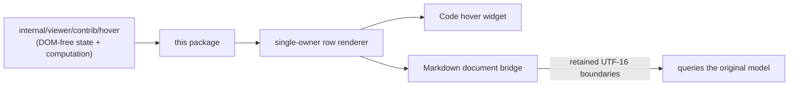

# internal/viewer/contrib/hover/browser

The JS-only content-hover browser implementation. It owns mouse-target event
reduction, anchor discovery, the concrete hover controller, DOM rendering and
geometry, and the persistent scrollable content widget. The root Viewer owns
the controller lifetime, timers, provider execution, decorations, and widget
mounting.

> The code blocks on this page are `mbt nocheck`. This package is js-only and
> its values need a live DOM, which `moon test` (Node, no DOM) cannot provide.
> Its executable coverage is the Playwright suites under `tests/browser/`; see
> `docs/harness.md` for how to choose a test layer.



The row renderer is shared by Code hover and the Markdown document bridge
without sharing widget state. Before any DOM commit the bridge's freshness stamp
covers request, model, content, URI/revision, attach, projection, block,
source-offset, and cancellation identities.

```mbt nocheck
// The bridge is owned by MarkdownBrowserData, not by the central contribution
// table, and is cancelled before any source or theme reprojection.
let bridge = MarkdownDocumentHoverBridge::new(model, projection, language_handle)
bridge.cancel()
bridge.dispose()
```

DOM-free hover state, participants, reconciliation, and fenced-code
tokenization live in `internal/viewer/contrib/hover`. The widget builds the
Monaco-shaped row/wrapper DOM and renders Markdown through
`internal/viewer/browser/markdown` into retained `.hover-contents` targets. It
owns every returned render disposable and clears those lifetimes on content
replacement, hide, and retained-widget teardown. Browser view and scrollbar
dependencies are internal packages under `internal/viewer/**`. The emitted
stylesheet remains at `viewer/contrib/hover/hover.css`.

`render_hover_rows` is the shared safe row-rendering boundary. It returns a
single-owner `HoverRowsRender`: `mount_into` succeeds at most once, and
`dispose` is idempotent and releases every nested Markdown renderer. Both the
Code content widget and the Markdown document bridge use this lifetime, so
they share content and sanitization policy without sharing widget state.

`MarkdownDocumentHoverBridge` is a presentation-local bridge over the original
`TextModel` and owns one retained `MarkdownDocumentHoverWidget`. Browser FFI
supplies only caret text-node offsets and primitive native `Range`/DOM rectangle
access. MoonBit resolves the retained semantic row, locates UTF-16 range
endpoints in the rendered text tree, interprets raw geometry, converts the
caret boundary to the original model position, runs `ContentHoverComputer`,
projects live marker decorations, and owns request cancellation. A changing
pointer replaces one clearable first-wait timer; only a source boundary held
for the shared 150 ms first-wait launches semantic work, and a still-pending
request displays the shared loading row roughly 900 ms after the pointer
settles (plus synchronous computation time). This presentation-local bridge
intentionally omits Code's separate 300 ms display gate. Every async completion
is gated by model identity, caller and content versions, URI/revision, attach
generation, projection generation/source version, block identity, source
offset, and request token. Content, theme, and model replacement invalidate the
relevant state before presentation DOM replacement. Layout may update geometry
synchronously first; layout, marker change, pointer exit, and disposal still
invalidate freshness before a pending async hover may commit. Before measuring
each row set, the widget temporarily releases its previous locked box against
the full Markdown viewport, then clamps and locks the resulting readable
natural size.

Hover-range painting is a behavior port of VS Code revision
`b18492a288de038fbc7643aae6de8247029d11bd`,
`RenderedContentHoverParts::_createEditorDecorations`, and
`DecorationsOverlay::_renderNormalDecoration`. Code uses a model decoration
that the ViewModel clips into wrapped view rows. The independent Markdown
surface instead coalesces adjacent raw browser `Range.getClientRects()` into
row-local fragments and mounts one line-relative overlay per fragment; a range
confined to one wrapped row cannot paint another row. Browser FFI supplies only
native Range operations, raw rectangles, and the computed line-height scalar,
while MoonBit owns text-node endpoint discovery, row normalization, source
projection, DOM lifetime, and freshness. Diagnostic squiggles retain their
separate 3 px vertical paint policy.

Projected diagnostics consume the marker package's resolved class, z-index,
and range metadata in the same overlay order as Code. Markdown owns the visible
severity squiggles plus the `showUnused` underline gate. Monaco's inline
unnecessary opacity and deprecated strike change the actual source glyphs;
those text-mutating effects are intentionally deferred for the readonly
Markdown projection rather than approximated on an empty overlay span.

Exact callable types are in `pkg.generated.mbti`. Run focused tests with:

```sh
moon test internal/viewer/contrib/hover/browser --target js
```
