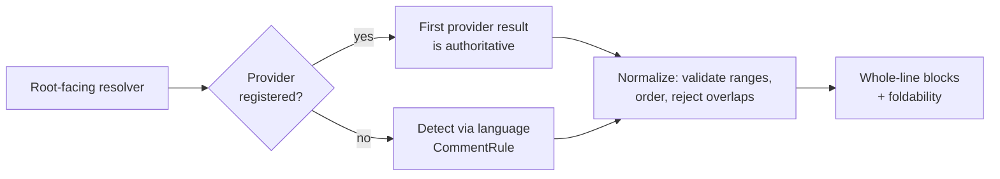

# internal/viewer/contrib/markdown_comments

DOM-free whole-line Markdown-comment detection and normalization.



## Detection

The package-private `detect_markdown_comments` helper scans a `TextModel`; its
snapshot overload is the deterministic core used by the resolver and white-box
tests. Both consume the owning language's `CommentRule`. The examples in this
section are package-internal evidence, not exported API.

Consecutive line comments are grouped into one block, and the comment delimiter
is stripped from the emitted Markdown.

```mbt nocheck
///|
let moonbit_comments : @languages.CommentRule = {
  line_comment: Some(LineCommentRule("//")),
  block_comment: Some({ open: "/*", close: "*/" }),
}

///|
fn commented(text : String) -> @model.TextModel raise {
  TextModel(
    @base_common.Uri::parse("file:///markdown-comments-doc.mbt"),
    "markdown-comments-doc.mbt",
    "moonbit",
    1,
    "rev-1",
    text,
  )
}

///|
test "consecutive whole-line comments become one block" {
  let model = commented(
    "// # Title\n// Some prose.\nlet x = 1\n// Another block\n",
  )
  debug_inspect(
    detect_markdown_comments(model, moonbit_comments).map(block => {
      (block.line_range, block.markdown)
    }),
    content=(
      #|[
      #|  (
      #|    { start_line_number: 1, end_line_number_exclusive: 3 },
      #|    "# Title\nSome prose.",
      #|  ),
      #|  (
      #|    { start_line_number: 4, end_line_number_exclusive: 5 },
      #|    "Another block",
      #|  ),
      #|]
    ),
  )
}
```

Only *whole-line* comments qualify. A trailing comment after code is not a
Markdown block, because replacing it would destroy the code on that line.

```mbt nocheck
///|
test "a trailing comment after code is not a block" {
  let model = commented("let x = 1 // not a doc comment\n")
  debug_inspect(
    detect_markdown_comments(model, moonbit_comments).length(),
    content=(
      #|0
    ),
  )
}
```

Line comments win when configured delimiters overlap, and only whole-line block
comments are accepted.

```mbt nocheck
///|
test "a whole-line block comment is accepted" {
  let model = commented("/* # Block heading */\nlet x = 1\n")
  debug_inspect(
    detect_markdown_comments(model, moonbit_comments).map(block => {
      (block.line_range, block.markdown)
    }),
    content=(
      #|[
      #|  (
      #|    { start_line_number: 1, end_line_number_exclusive: 2 },
      #|    "# Block heading ",
      #|  ),
      #|]
    ),
  )
}
```

## Normalization

The package-private `normalize_markdown_comment_blocks` helper is the shared
provider/detector boundary. It validates 1-based half-open line ranges, orders
blocks, rejects later overlaps, drops exact-empty bodies, and preserves the
viewer's all-lines-visible fallback. Invalid and overlapping inputs are
reported through `LogHandle`. These are package-internal white-box examples.

Because both the provider path and the detection path pass through it, a
provider cannot produce a block shape the detector could not.

```mbt nocheck
///|
test "normalization orders blocks and rejects later overlaps" {
  let log = @log.LogService(logger=@log.NullLogger()).log_handle()
  let normalized = normalize_markdown_comment_blocks(
    [
      { line_range: LineRange(5, 7), markdown: "second" },
      { line_range: LineRange(1, 3), markdown: "first" },
      // overlaps the block already accepted at 5..7
      { line_range: LineRange(6, 8), markdown: "dropped" },
      // an exactly empty body is dropped
      { line_range: LineRange(9, 10), markdown: "" },
    ],
    20,
    log,
  )
  debug_inspect(
    normalized.map(block => (block.line_range, block.markdown)),
    content=(
      #|[
      #|  ({ start_line_number: 1, end_line_number_exclusive: 3 }, "first"),
      #|  ({ start_line_number: 5, end_line_number_exclusive: 7 }, "second"),
      #|]
    ),
  )
}
```

A range outside the document is invalid and is dropped rather than clamped, so
a stale provider result cannot decorate lines that no longer exist.

```mbt nocheck
///|
test "a range beyond the document is dropped, not clamped" {
  let log = @log.LogService(logger=@log.NullLogger()).log_handle()
  debug_inspect(
    normalize_markdown_comment_blocks(
      [
        { line_range: LineRange(1, 2), markdown: "kept" },
        { line_range: LineRange(90, 95), markdown: "out of range" },
      ],
      3,
      log,
    ).map(block => block.markdown),
    content=(
      #|["kept"]
    ),
  )
}
```

## Resolution

`resolve_markdown_comment_blocks_with_presentation` is the exported root-facing
resolver. The first matching provider result is authoritative, including an
empty result. Only an absent provider falls back to the model language's
configured comment rules; both paths pass through the same private normalizer.

```mbt nocheck
///|
test "with no provider, resolution falls back to the language rules" {
  let log = @log.LogService(logger=@log.NullLogger())
  let registry = @languages.Languages()
  registry.set_language_configuration("moonbit", {
    comments: Some(moonbit_comments),
    folding_rules: None,
  })
  let model = commented("// # Title\nlet x = 1\n")
  let resolved = @markdown_comments.resolve_markdown_comment_blocks_with_presentation(
    model,
    registry.language_handle(log.log_handle()),
    log.log_handle(),
  )
  debug_inspect(
    (resolved.foldable, resolved.blocks.map(block => block.markdown)),
    content=(
      #|(false, ["# Title"])
    ),
  )
}
```

`resolve_markdown_comment_blocks_with_presentation` also returns the explicit
foldability captured from the selected provider registration. Configuration
detection is always non-foldable, so a leading Markdown thematic break is never
treated as provenance.

## Boundaries and checks

This package has no DOM or browser dependencies. Run its focused suite on both
portable targets with:

```sh
moon test internal/viewer/contrib/markdown_comments --target js
moon test internal/viewer/contrib/markdown_comments --target native
```
