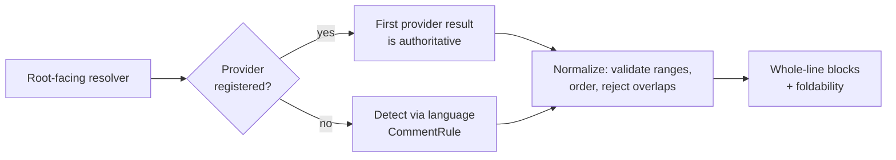

# internal/viewer/contrib/markdown_comments

DOM-free whole-line Markdown-comment detection and normalization.

`detect_markdown_comments` scans a `TextModel`; the snapshot overload is the
deterministic core used by tests and callers that already hold an immutable
snapshot. Both consume the owning language's `CommentRule`. Line comments win
when configured delimiters overlap, consecutive line comments are grouped,
and only whole-line block comments are accepted.

`normalize_markdown_comment_blocks` is the shared provider/detector boundary.
It validates 1-based half-open line ranges, orders blocks, rejects later
overlaps, drops exact-empty bodies, and preserves the viewer's all-lines-visible
fallback. Invalid and overlapping inputs are reported through `LogHandle`.

`resolve_markdown_comment_blocks` is the root-facing resolver. The first
matching provider result is authoritative, including an empty result. Only an
absent provider falls back to the model language's configured comment rules;
both paths pass through the same normalizer.



`resolve_markdown_comment_blocks_with_presentation` also returns the explicit
foldability captured from the selected provider registration. Configuration
detection is always non-foldable, so a leading Markdown thematic break is never
treated as provenance.

This package has no DOM or browser dependencies. Run its focused suite on both
portable targets with:

```sh
moon test internal/viewer/contrib/markdown_comments --target js
moon test internal/viewer/contrib/markdown_comments --target native
```
