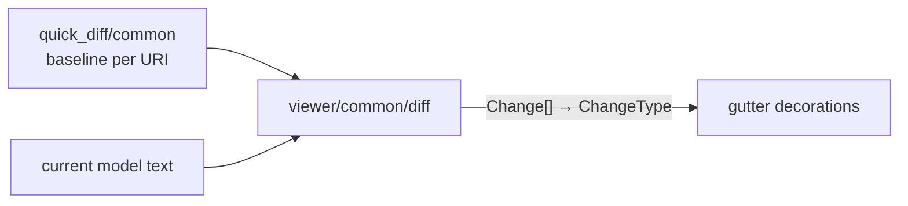

# internal/viewer/contrib/quick_diff/browser

The JS-target quick-diff calculation and decoration implementation. It
converts detailed line mappings into model changes, computes line diffs, and
maps changes to editor decorations consumed by the root Viewer.

> The code blocks on this page are `mbt nocheck`. This package is js-only and
> its values need a live DOM, which `moon test` (Node, no DOM) cannot provide.
> Its executable coverage is the Playwright suites under `tests/browser/`; see
> `docs/harness.md` for how to choose a test layer.



```mbt nocheck
// Decorations are recomputed from the baseline and the current text; this
// package stores no diff of its own.
let decorations = compute_quick_diff_decorations(model, baseline)
model.delta_decorations(previous_ids, decorations) |> ignore
```

Service state and public-host adaptation remain in
`internal/viewer/contrib/quick_diff/common` and
`viewer/common/quick_diff_api`, respectively. The emitted stylesheet remains
at `viewer/contrib/quick_diff/browser/quick_diff.css`.

Exact callable types are in `pkg.generated.mbti`. Run focused tests with:

```sh
moon test internal/viewer/contrib/quick_diff/browser --target js
```
