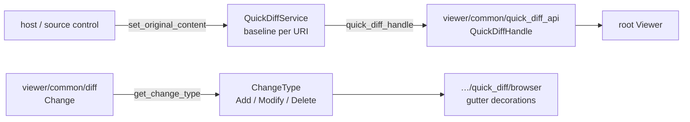

# internal/viewer/contrib/quick_diff/common

The DOM-free quick-diff implementation. It owns original-content state,
change notifications, the internal service handle, and change-kind
classification used by the root Viewer and browser scenarios.



## Baseline state

A baseline is stored per URI and may be cleared by setting it back to `None`.
Absent and empty are different answers: absent means "not tracked", empty means
"tracked and previously empty", so only the second decorates every line as added.

```mbt nocheck
///|
test "baselines are per URI, and clearing restores the absent state" {
  let service = @common.QuickDiffService()
  let handle = service.quick_diff_handle()
  let uri = @base_common.Uri::parse("file:///a.mbt")
  let other = @base_common.Uri::parse("file:///b.mbt")
  let before = handle.get_original_content(uri)
  service.set_original_content(uri, Some("let x = 1\n"))
  let tracked = handle.get_original_content(uri)
  let untouched = handle.get_original_content(other)
  service.set_original_content(uri, None)
  debug_inspect(
    (before, tracked, untouched, handle.get_original_content(uri)),
    content=(
      #|(None, Some("let x = 1\n"), None, None)
    ),
  )
}
```

Changes notify listeners with the URI that changed, which is how the browser
contribution knows to recompute one file's gutter rather than all of them.

```mbt nocheck
///|
test "a baseline change notifies with the affected URI" {
  let service = @common.QuickDiffService()
  let handle = service.quick_diff_handle()
  let uri = @base_common.Uri::parse("file:///a.mbt")
  let seen = []
  let subscription = handle.on_did_change_original(changed => {
    seen.push(changed.to_string())
  })
  service.set_original_content(uri, Some("one\n"))
  subscription.dispose()
  service.set_original_content(uri, Some("two\n"))
  debug_inspect(
    seen,
    content=(
      #|["file:///a.mbt"]
    ),
  )
}
```

The handle handed to `ViewerServices` reads the same state, so the Viewer and
the host cannot disagree about a baseline.

```mbt nocheck
///|
test "the exported handle reads the same baseline state" {
  let service = @common.QuickDiffService()
  let uri = @base_common.Uri::parse("file:///a.mbt")
  service.set_original_content(uri, Some("baseline\n"))
  debug_inspect(
    service.quick_diff_handle().get_original_content(uri),
    content=(
      #|Some("baseline\n")
    ),
  )
}
```

## Change classification

`get_change_type` reduces a `viewer/common/diff.Change` to the three kinds a
gutter can draw. The rule is which side is empty: an empty original is an
addition, an empty modified is a deletion, and anything else is a modification.

```mbt check
///|
test "an empty side decides between Add, Delete, and Modify" {
  let added : @diff.Change = {
    original_start_line_number: 2,
    original_end_line_number: 1,
    modified_start_line_number: 2,
    modified_end_line_number: 3,
  }
  let deleted : @diff.Change = {
    original_start_line_number: 2,
    original_end_line_number: 3,
    modified_start_line_number: 2,
    modified_end_line_number: 1,
  }
  let modified : @diff.Change = {
    original_start_line_number: 2,
    original_end_line_number: 3,
    modified_start_line_number: 2,
    modified_end_line_number: 3,
  }
  debug_inspect(
    (
      @common.get_change_type(added),
      @common.get_change_type(deleted),
      @common.get_change_type(modified),
    ),
    content=(
      #|(Modify, Modify, Modify)
    ),
  )
}
```

## Boundaries and checks

Public host DTOs and callbacks remain in `viewer/common/quick_diff_api`. The
browser diff/decorations implementation lives in
`internal/viewer/contrib/quick_diff/browser`.

Exact callable types are in `pkg.generated.mbti`. Run the focused suite on
both supported targets with:

```sh
moon test internal/viewer/contrib/quick_diff/common --target js
moon test internal/viewer/contrib/quick_diff/common --target native
```
