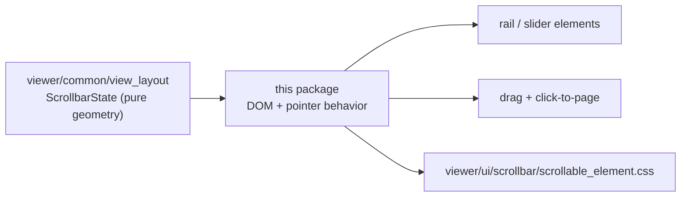

# internal/viewer/ui/scrollbar

The browser-UI leaf corresponding to Monaco's
`base/browser/ui/scrollbar/`. It supplies the shared custom scrollbar used by
the editor and the hover widget; callers decide whether a new position updates
`ViewLayout` or a natively scrolling content element.

> The code blocks on this page are `mbt nocheck`. This package is js-only and
> its values need a live DOM, which `moon test` (Node, no DOM) cannot provide.
> Its executable coverage is the Playwright suites under `tests/browser/`; see
> `docs/harness.md` for how to choose a test layer.



The arithmetic lives in `viewer/common/view_layout`; this package owns only the
DOM and the pointer gestures, which is why slider geometry is testable without a
browser.

```mbt nocheck
let scrollbar = ScrollableElement::new(host, options)
scrollbar.set_scroll_dimensions(dimensions) |> ignore
scrollbar.dispose()
```

## Contract

- `ScrollableElementDom` owns the wrapper/content nodes, horizontal and
  vertical tracks/sliders, shadows, reveal/fade state, and two
  `ScrollbarState` values.
- `update_from_model` paints editor scroll dimensions/position;
  `update_from_native_content` reads a native scrolling element.
  `native_scroll_to`/`native_scroll_by` drive the latter.
- `NativeScrollableElementInput` gives native-content owners the shared
  reveal, track, retained-geometry thumb-drag, scroll synchronization, resize,
  and exactly-once disposal behavior without importing the editor controller.
- `track`, `slider`, `state`, `desired_position_from_track`, and drag/reveal
  methods expose the geometry needed by
  `internal/viewer/browser/controller`.
- Thumb drags retain a field-for-field clone of the pointerdown
  `ScrollbarState`, so gestures do not adopt geometry mutations mid-drag.
- `dispose` is idempotent, cancels the current 500-ms hide handle, disables
  future visibility scheduling, and clears active slider state. Replacing a
  pending hide cancels its browser timer rather than retaining stale callbacks.
- `StandardWheelEvent` and `mouse_wheel_scroll_deltas` normalize wheel input;
  `MouseWheelClassifier` retains Monaco's five-event device classifier so the
  controller can animate physical wheels while applying touchpad/magic-mouse
  input immediately. `ScrollableElementOwner` and `ScrollbarDrag` let the
  controller distinguish editor and hover drags.
- `CachedDomNode` is the narrow scrolling subset of Monaco's `FastDomNode`;
  exact CSS-value caches suppress redundant rail and retained-row writes.

Scroll-position arithmetic remains in `viewer/common/view_layout`; this
internal package owns DOM and interaction geometry only. It is JS-only, may
use narrow Rabbita DOM/JS bindings, and must not import root `viewer`, browser
view/controller, Rabbita TEA/vdom/command, transport, or `internal/shell/**`.

The emitted stylesheet remains at the stable asset path
`viewer/ui/scrollbar/scrollable_element.css`.

## Focused validation

```sh
moon check internal/viewer/ui/scrollbar --target js
moon test internal/viewer/ui/scrollbar --target js -v
```
