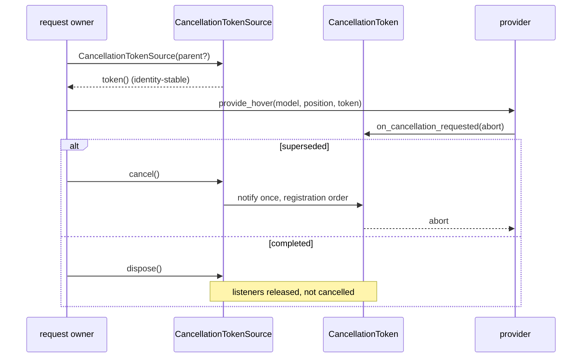

# language

Backend-neutral contracts for readonly language features. This package is the
*shape* of a language backend, not an implementation and not a registry: it has
no `moon ide` adapter, no LSP client, and no provider table.

```d2
direction: right

host: host / backend {
  grid-columns: 1
  a: moon ide, LSP, in-memory...
}
lang: language (this package) {
  grid-columns: 1
  b: provider traits
  c: result DTOs
  d: CancellationToken
  e: LanguageSelector
}
reg: viewer/common/languages {
  grid-columns: 1
  f: runtime registration
}
mk: viewer/common/markers {
  grid-columns: 1
  g: Diagnostic -> decorations
}

host -> lang: implements traits
lang -> reg: registered by hosts
lang -> mk: Diagnostic is a shared shape only
```

## Surface and behavior

- Result DTOs: `Hover`/`HoverContent`, `Diagnostic`, `Location`,
  `DocumentSymbol`, and `MarkdownCommentBlock`. Their `Position`, `Range`, and
  half-open `LineRange` values use the repository's 1-based UTF-16 convention.
- Async provider traits: `HoverProvider`, `DefinitionProvider`,
  `ReferencesProvider`, and `DocumentSymbolProvider`.
  Providers receive a readonly `TextModel` and a cooperative
  `CancellationToken`.
- `MarkdownCommentProvider` is the synchronous open registration contract for
  whole-line Markdown comment blocks. Detection and result normalization remain
  viewer-contribution responsibilities.

`Diagnostic` is only a shared data shape; diagnostics enter the viewer through
`viewer/common/markers`. There is currently no diagnostic-provider or
semantic-token contract. Definition and reference traits exist for host/protocol
use, but `viewer/common/languages` does not currently register them.

Severity and tag values carry their own stable labels, so a host does not invent
a second naming scheme when it renders or serializes them.

```mbt check
///|
test "diagnostic severities and tags own their labels" {
  let severities : Array[@language.DiagnosticSeverity] = [
    Error,
    Warning,
    Info,
    Hint,
  ]
  let tags : Array[@language.DiagnosticTag] = [Unnecessary, Deprecated]
  debug_inspect(
    (severities.map(s => s.label()), tags.map(t => t.label())),
    content=(
      #|(["Error", "Warning", "Info", "Hint"], ["Unnecessary", "Deprecated"])
    ),
  )
}
```

A `Hover` is a range plus ordered content parts; `HoverContent` distinguishes
plain text from Markdown so the renderer never has to guess.

```mbt check
///|
test "hover content keeps plain text and markdown apart" {
  let hover : @language.Hover = {
    range: Range(3, 5, 3, 12),
    contents: [PlainText("fn main"), Markdown("```mbt\nfn main {}\n```")],
  }
  debug_inspect(
    hover,
    content=(
      #|{
      #|  range: {
      #|    start_line_number: 3,
      #|    start_column: 5,
      #|    end_line_number: 3,
      #|    end_column: 12,
      #|  },
      #|  contents: [PlainText("fn main"), Markdown("```mbt\nfn main {}\n```")],
      #|}
    ),
  )
}
```

## Cancellation

`CancellationTokenSource` owns cancellation. Repeated token reads are
identity-stable; cancellation notifies listeners once in registration order,
parent cancellation propagates, and `dispose(cancel=...)` separates listener
teardown from cancellation.



The token a source hands out is the same value every time, so a request owner
can stash it once and compare identities later.

```mbt check
///|
test "one source hands out one identity-stable token" {
  let source = @language.CancellationTokenSource()
  let first = source.token()
  let second = source.token()
  let fired = []
  first.on_cancellation_requested(() => fired.push("first-listener")) |> ignore
  second.on_cancellation_requested(() => fired.push("second-listener"))
  |> ignore
  source.cancel()
  source.cancel()
  debug_inspect(
    (first.is_cancellation_requested(), fired),
    content=(
      #|(true, ["first-listener", "second-listener"])
    ),
  )
}
```

A listener registered *after* cancellation still runs. The delivery is
scheduled, and the scheduler is injectable so this package stays cross-target:
the default delivers inline, while browser request owners pass a clearable
zero-delay scheduler.

```mbt check
///|
test "late listeners still fire under the default inline scheduler" {
  let source = @language.CancellationTokenSource()
  let token = source.token()
  source.cancel()
  let fired = []
  token.on_cancellation_requested(() => fired.push("late")) |> ignore
  debug_inspect(
    (token.is_cancellation_requested(), fired),
    content=(
      #|(true, ["late"])
    ),
  )
}
```

Cancelling a parent cancels every child, which is how one model swap retires all
of that generation's in-flight provider requests at once.

```mbt check
///|
test "parent cancellation propagates to children" {
  let parent = @language.CancellationTokenSource()
  let child = @language.CancellationTokenSource(parent=parent.token())
  let grandchild = @language.CancellationTokenSource(parent=child.token())
  parent.cancel()
  debug_inspect(
    (
      parent.token().is_cancellation_requested(),
      child.token().is_cancellation_requested(),
      grandchild.token().is_cancellation_requested(),
    ),
    content=(
      #|(true, true, true)
    ),
  )
}
```

`dispose` releases listeners *without* cancelling, which is the completion path;
`dispose(cancel=true)` is the abort path. Confusing the two is the bug this
split exists to prevent.

```mbt check
///|
test "dispose separates listener teardown from cancellation" {
  let completed = @language.CancellationTokenSource()
  let aborted = @language.CancellationTokenSource()
  let fired = []
  completed.token().on_cancellation_requested(() => fired.push("completed"))
  |> ignore
  aborted.token().on_cancellation_requested(() => fired.push("aborted"))
  |> ignore
  completed.dispose()
  aborted.dispose(cancel=true)
  debug_inspect(
    (
      completed.token().is_cancellation_requested(),
      aborted.token().is_cancellation_requested(),
      fired,
    ),
    content=(
      #|(false, true, ["aborted"])
    ),
  )
}
```

The two constant tokens cover the "never cancelled" and "already cancelled"
cases without allocating a source.

```mbt check
///|
test "none and cancelled are the constant tokens" {
  debug_inspect(
    (
      @language.CancellationToken::none().is_cancellation_requested(),
      @language.CancellationToken::cancelled().is_cancellation_requested(),
    ),
    content=(
      #|(false, true)
    ),
  )
}
```

## Selectors

`LanguageSelector` matches by language id, filter, or selector list. Filters
combine optional language, URI scheme, and path pattern checks. An omitted field
is "don't care", so an empty filter matches every model.

```mbt check
///|
test "a filter's omitted fields are wildcards" {
  let model = @model.TextModel(
    @base_common.Uri::parse("file://workspace/src/main.mbt"),
    "main.mbt",
    "moonbit",
    1,
    "rev-1",
    "fn main {}\n",
  )
  debug_inspect(
    (
      @language.LanguageSelector::LanguageId("moonbit").matches(model),
      @language.LanguageSelector::LanguageId("javascript").matches(model),
      @language.LanguageFilter::LanguageFilter().matches(model),
      @language.LanguageFilter::LanguageFilter(scheme="file").matches(model),
      @language.LanguageFilter::LanguageFilter(scheme="memory").matches(model),
    ),
    content=(
      #|(true, false, true, true, false)
    ),
  )
}
```

Pattern matching is deliberately simpler than Monaco scoring. It strips one
leading `/` from the URI path, then:

- an empty pattern or `"*"` matches everything;
- a pattern with no `*` must equal the path exactly;
- otherwise the **first** `*` splits the pattern into a prefix and a suffix, and
  the path must start with the prefix *and* end with the suffix.

That last rule is why the `*` may sit anywhere, not just at an end — but also
why any further `*` is matched **literally**, so `**` and `*` in two places do
not mean what a glob library would make them mean. There is no brace expansion
and no character class.

```mbt check
///|
test "the first star splits the pattern into a prefix and a suffix" {
  let model = @model.TextModel(
    @base_common.Uri::parse("file://workspace/src/main.mbt"),
    "main.mbt",
    "moonbit",
    1,
    "rev-1",
    "fn main {}\n",
  )
  let matches = pattern => {
    @language.LanguageFilter::LanguageFilter(pattern~).matches(model)
  }
  debug_inspect(
    (
      // exact, no star
      matches("src/main.mbt"),
      matches("src/other.mbt"),
      // prefix and suffix around the first star
      matches("src/*"),
      matches("*.mbt"),
      matches("src/*.mbt"),
      // the second star is a literal character, so this cannot match
      matches("**/*.mbt"),
    ),
    content=(
      #|(true, false, true, true, true, false)
    ),
  )
}
```

A selector list is an "any of" combinator, so a host registers one provider
against several languages without duplicating the registration.

```mbt check
///|
test "a selector list matches if any member matches" {
  let model = @model.TextModel(
    @base_common.Uri::parse("file://workspace/src/main.mbt"),
    "main.mbt",
    "moonbit",
    1,
    "rev-1",
    "fn main {}\n",
  )
  let selector : @language.LanguageSelector = LanguageSelectorList([
    LanguageId("javascript"),
    LanguageId("json"),
    LanguageFilter(LanguageFilter(language="moonbit")),
  ])
  let unmatched : @language.LanguageSelector = LanguageSelectorList([
    LanguageId("javascript"),
    LanguageId("json"),
  ])
  debug_inspect(
    (selector.matches(model), unmatched.matches(model)),
    content=(
      #|(true, false)
    ),
  )
}
```

## Boundaries and Monaco map

This package depends only on `base/common` and `viewer/common/model`. It must not
import registries, DOM/browser code, transport, native hosts, servers, or
`internal/shell`. Hosts adapt wire/backend payloads before calling these traits.

The shapes follow the relevant interfaces in `vs/editor/common/languages.ts`; this
package is the contract layer, not Monaco's `LanguageFeaturesService`. See
`pkg.generated.mbti` for the complete API and run
`moon test --target js language` for focused coverage.
