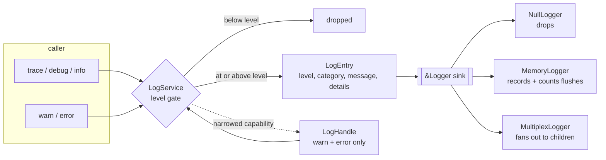

# platform/log

Host-neutral structured logging used by the viewer and reference shell.

This package is a *sink-injection* boundary, not a service locator. Nothing here
knows about the DOM, a transport, a file system, or a shell. A host constructs
one `LogService`, picks the `Logger` implementation, and hands narrower
capabilities downward.

## Shape



`LogHandle` is the only part of this package that crosses into `ViewerServices`.
It captures the concrete service without transferring ownership, so the host
keeps the logger, the level control, the lower-severity methods, `flush`, and
the service lifetime.

## Contracts

- `LogEntry` carries a level, category, message, and string key/value details.
- `LogService` applies a minimum `LogLevel`; `Off` disables emission and the
  convenience methods (`trace` through `error`) forward to a `Logger` sink.
- `NullLogger` drops output, `MemoryLogger` records entries and flushes for tests,
  and `MultiplexLogger` fans out to each child sink. `Logger` methods are
  `noraise`, so logging cannot fail the calling workflow.

## The level gate

`LogLevel` is ordered `Off < Trace < Debug < Info < Warning < Error`. A call is
emitted when its own level is at or above the service level, so a service
configured at `Warning` keeps `warn` and `error` and drops everything quieter.

```mbt check
///|
test "the service level decides what reaches the sink" {
  let memory = @log.MemoryLogger()
  let service = @log.LogService(level=Warning, logger=memory)
  service.trace("gate", "dropped")
  service.debug("gate", "dropped")
  service.info("gate", "dropped")
  service.warn("gate", "kept", details=[("reason", "at level")])
  service.error("gate", "kept")
  debug_inspect(
    memory.entries(),
    content=(
      #|[
      #|  {
      #|    level: Warning,
      #|    category: "gate",
      #|    message: "kept",
      #|    details: [("reason", "at level")],
      #|  },
      #|  { level: Error, category: "gate", message: "kept", details: [] },
      #|]
    ),
  )
}
```

`Off` is not "the quietest level"; it is a complete disable, so even `error`
produces nothing.

```mbt check
///|
test "Off disables emission entirely" {
  let memory = @log.MemoryLogger()
  let service = @log.LogService(level=Off, logger=memory)
  service.error("gate", "still dropped")
  debug_inspect(
    memory.entries().length(),
    content=(
      #|0
    ),
  )
}
```

`is_warning_or_error` and `label` let a host classify or render a level without
matching the enum itself.

```mbt check
///|
test "level labels and severity classification" {
  let levels : Array[@log.LogLevel] = [Off, Trace, Debug, Info, Warning, Error]
  debug_inspect(
    levels.map(level => (level.label(), level.is_warning_or_error())),
    content=(
      #|[
      #|  ("off", false),
      #|  ("trace", false),
      #|  ("debug", false),
      #|  ("info", false),
      #|  ("warning", true),
      #|  ("error", true),
      #|]
    ),
  )
}
```

## Sinks

`MemoryLogger` is the test sink: it retains every `LogEntry` in call order and
counts `flush` separately, so a test can assert both what was logged and that
the host drained it.

`MultiplexLogger` fans one entry out to each child in registration order and
forwards `flush` to all of them. Children are ordinary `&Logger` values, so a
multiplexer can contain another multiplexer.

```mbt check
///|
test "multiplex fans entries and flushes out to every child" {
  let first = @log.MemoryLogger()
  let second = @log.MemoryLogger()
  let service = @log.LogService(
    level=Trace,
    logger=@log.MultiplexLogger([first, second, @log.NullLogger()]),
  )
  service.debug("fanout", "one entry in")
  service.flush()
  debug_inspect(
    (
      first.entries().length(),
      second.entries().length(),
      first.flush_count(),
      second.flush_count(),
    ),
    content=(
      #|(1, 1, 1, 1)
    ),
  )
}
```

`LogService::log` accepts a fully-formed `LogEntry`, which is what an adapter
uses when it is replaying entries that were built elsewhere.

```mbt check
///|
test "a pre-built entry goes through the same gate" {
  let memory = @log.MemoryLogger()
  let service = @log.LogService(level=Info, logger=memory)
  service.log({
    level: Debug,
    category: "replay",
    message: "dropped",
    details: [],
  })
  service.log({
    level: Error,
    category: "replay",
    message: "kept",
    details: [("source", "adapter")],
  })
  debug_inspect(
    memory.entries(),
    content=(
      #|[
      #|  {
      #|    level: Error,
      #|    category: "replay",
      #|    message: "kept",
      #|    details: [("source", "adapter")],
      #|  },
      #|]
    ),
  )
}
```

## The narrowed handle

`LogService::log_handle()` returns the opaque Viewer capability with exactly
`warn` and `error`. Entries it produces are indistinguishable from entries the
service produced directly — same gate, same sink, same category and details.

```mbt check
///|
test "handle entries are ordinary entries" {
  let memory = @log.MemoryLogger()
  let service = @log.LogService(level=Trace, logger=memory)
  let handle = service.log_handle()
  handle.warn("handle", "warning", details=[("kind", "warn")])
  handle.error("handle", "error", details=[("kind", "error")])
  debug_inspect(
    memory.entries(),
    content=(
      #|[
      #|  {
      #|    level: Warning,
      #|    category: "handle",
      #|    message: "warning",
      #|    details: [("kind", "warn")],
      #|  },
      #|  {
      #|    level: Error,
      #|    category: "handle",
      #|    message: "error",
      #|    details: [("kind", "error")],
      #|  },
      #|]
    ),
  )
}
```

The handle is a capability, not a copy: it still observes the service's level,
so tightening the host's level also tightens whatever the Viewer can emit.

```mbt check
///|
test "the handle observes the owning service level" {
  let memory = @log.MemoryLogger()
  let handle = @log.LogService(level=Error, logger=memory).log_handle()
  handle.warn("handle", "below level")
  handle.error("handle", "at level")
  debug_inspect(
    memory.entries().map(entry => entry.message),
    content=(
      #|["at level"]
    ),
  )
}
```

## Boundaries and checks

This is the explicit, dependency-injected role of Monaco/VS Code's logging service,
not a port of its global service container. The package has no product, viewer,
browser, native, transport, or shell dependency; hosts choose the sink. See
`pkg.generated.mbti` for the complete API and run
`moon test --target js platform/log` for focused coverage.
