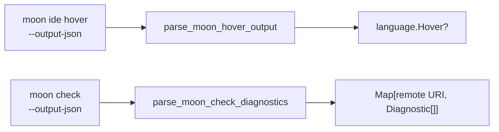

# server/host

Native effect adapter and executable backend for the reference shell.

## The two pure adapters

Almost everything in this package is an effect. The two exceptions are the
parsers that turn `moon` CLI output into `language` values, and because they are
pure they are the part worth reading first — they define exactly what the
backend understands.



`parse_moon_hover_output` maps one hover payload onto the request position. A
payload without a range collapses to a one-column range at the requested
position, and a non-JSON "no hover information" line is `None` rather than an
error.

```mbt check
///|
test "hover output maps onto the requested position" {
  let with_range =
    #|{"range":"20:15-20:33","contents":["```moonbit\nenum DiagnosticSeverity {}\n```","\n Doc text."]}
  let rangeless =
    #|{"contents":["plain"]}
  debug_inspect(
    (
      @host.parse_moon_hover_output(with_range, Position(3, 7)).map(hover => {
        hover.range
      }),
      @host.parse_moon_hover_output(rangeless, Position(3, 7)).map(hover => {
        hover.range
      }),
      @host.parse_moon_hover_output(
        "No hover information found at src/main.mbt:1:1",
        Position(1, 1),
      )
      is None,
      @host.parse_moon_hover_output("{\"contents\":[]}", Position(1, 1)) is None,
    ),
    content=(
      #|(
      #|  Some(
      #|    {
      #|      start_line_number: 20,
      #|      start_column: 15,
      #|      end_line_number: 20,
      #|      end_column: 33,
      #|    },
      #|  ),
      #|  Some(
      #|    {
      #|      start_line_number: 3,
      #|      start_column: 7,
      #|      end_line_number: 3,
      #|      end_column: 8,
      #|    },
      #|  ),
      #|  true,
      #|  true,
      #|)
    ),
  )
}
```

`parse_moon_check_diagnostics` groups diagnostics by *remote workspace URI*, not
by disk path. A diagnostic for a path outside the workspace root is dropped
rather than published under a fabricated URI, and non-JSON progress lines are
ignored.

```mbt check
///|
test "diagnostics are grouped by remote URI and clipped to the root" {
  let raw =
    #|{"$message_type":"diagnostic","level":"warning","error_code":1,"path":"/workspace/demo/src/bad.mbt","loc":"2:4-2:17","message":"Warning (unused_value): Unused function 'unused_helper'"}
    #|{"$message_type":"diagnostic","level":"error","error_code":4014,"path":"/workspace/demo/src/bad.mbt","loc":"4:7-4:8","message":"Expr Type Mismatch"}
    #|{"$message_type":"diagnostic","level":"error","error_code":1,"path":"/elsewhere/other.mbt","loc":"1:1-1:2","message":"outside the workspace root"}
    #|Finished. moon: no work to do
    #|
  let grouped = @host.parse_moon_check_diagnostics("/workspace/demo", raw)
  debug_inspect(
    grouped
    .iter()
    .map(entry => {
      (
        entry.0,
        entry.1.map(diagnostic => (diagnostic.severity, diagnostic.range)),
      )
    })
    .collect(),
    content=(
      #|[
      #|  (
      #|    "readonly-remote://workspace/src/bad.mbt",
      #|    [
      #|      (
      #|        Warning,
      #|        {
      #|          start_line_number: 2,
      #|          start_column: 4,
      #|          end_line_number: 2,
      #|          end_column: 17,
      #|        },
      #|      ),
      #|      (
      #|        Error,
      #|        {
      #|          start_line_number: 4,
      #|          start_column: 7,
      #|          end_line_number: 4,
      #|          end_column: 8,
      #|        },
      #|      ),
      #|    ],
      #|  ),
      #|]
    ),
  )
}
```

## Runtime

- `NativeServerHost` implements `server.ServerHost`: root-contained coherent
  text/revision reads, one-level directory reads, and polling watches (500 ms
  by default).
- `run_native_editor_server` serves `web/dist` over HTTP and `/protocol` over
  WebSocket. It binds to `127.0.0.1` by default. Pass `host="0.0.0.0"` to
  accept IPv4 traffic from every interface; startup output then includes the
  localhost URL and, when the operating system has a default route, the
  selected LAN URL. Each connection owns an isolated remote-server session,
  unbounded outbox, and socket writer, so closing one connection cannot dispose
  another's watches and concurrent watch/diagnostic pushes cannot interleave
  frames.
- `MoonWorkspaceLanguageProvider` implements hover with ordinary
  `moon ide hover --output-json`. It requires normalized disk text and the
  provider signature to match the request model before the command and to stay
  unchanged after it. Definition, references, and document symbols currently
  return no result.
- `MoonCheckDiagnostics` coalesces document syncs into single-flight
  `moon check --output-json` runs. Each run captures synced document revisions,
  normalized text, and disk signatures; raced output is discarded and causes
  one follow-up run. A stable disk/model mismatch publishes nothing for that
  document and keeps its prior accepted set without blocking compatible
  documents. Stored sets retain their producing document state, pushes include
  that revision, and replay requires an exact match.
- URI/root validation, file watching, process execution, static serving, and
  Moon CLI output parsing are owned here; protocol policy remains in `server`.

Public entry points also include `native_server_host`, hover/check parsers, and
the configurable constructors. The `main` package accepts `--root`, `--host`,
`--port`, `--asset-dir`, and `--moon-command`.

The reusable API, direct CLI, and lower-level `just serve` recipe remain
loopback-only by default. The developer launcher instead defaults to
`HOST=0.0.0.0`, so plain `just dev` prints both the Local URL and the LAN URL
detected from the default route. Set `HOST=127.0.0.1` to bind and print only the
Local URL.

**Warning:** the reference server has no authentication and exposes workspace
source files. Use the default Just launcher only on a trusted LAN.

## Boundary and validation

This package is native-only and is not part of the reusable viewer API. It owns
concrete host/provider behavior, but not protocol packet routing or browser UI.

Run `moon test server/host`, `just build`,
or launch it with `just dev ROOT=. PORT=5173`. Use `HOST=127.0.0.1` when the
workspace must remain local to the development machine.
