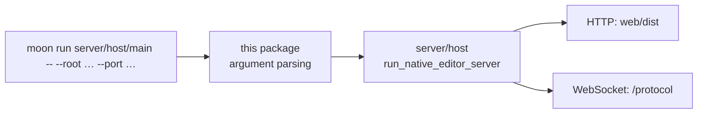

# server/host/main

The native executable entry point for the reference workspace server. It is a
`main` package: it parses arguments and calls
`server/host.run_native_editor_server`, and owns no policy of its own.

Main packages deliberately keep a plain `README.md` rather than a literate
`README.mbt.md`, because a `.mbt.md` file in a main package is treated as a
black-box test input and trips the "blackbox tests in a main package"
deprecation. The tested contracts live one level down, in
`server/host/README.mbt.md` and `server/server/README.mbt.md`.



## Running it

The recipe in the `justfile` is the supported entry point; it resolves the
asset directory and defaults before invoking this package.

```sh
just dev ROOT=. PORT=5173      # build, serve, print Local/Network URLs
just dev HOST=127.0.0.1        # restrict the listener to loopback
just serve ROOT=. PORT=5173    # serve without rebuilding assets
```

**Warning:** the reference server has no authentication and exposes workspace
source files. `just dev` defaults to `HOST=0.0.0.0` and is intended only for
trusted LANs.

Flags accepted after `--` are `--root`, `--host`, `--port`, `--asset-dir`, and
`--moon-command`. This module is a separate `moon.work` member
(`moonbitlang/editor-server`) with `preferred-target = "native"`, so no target
flag is needed.
