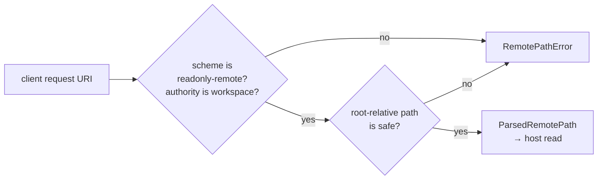

# server/server

Native-only policy and state for the reference remote workspace server. Native
effects are supplied through `ServerHost`.

## The URI namespace

`remote_document_uri`, `resolve_remote_document_uri`, and
`resolve_remote_directory_uri` enforce the
`readonly-remote://workspace[/...]` namespace and safe root-relative paths.

This is the server's containment boundary. A request names a document by URI,
and the only URIs that resolve are the ones inside the workspace namespace —
traversal, absolute paths, and foreign schemes are rejected before any
filesystem effect runs.



```mbt check
///|
fn resolved(raw : String) -> String raise {
  match @server.resolve_remote_document_uri(@base_common.Uri::parse(raw)) {
    ParsedRemotePath(path) => "ok:" + path.to_string()
    RemotePathError(error) => "rejected:" + error.code.to_string()
  }
}

///|
test "only in-namespace, non-traversing paths resolve" {
  debug_inspect(
    [
      "readonly-remote://workspace/src/main.mbt", "readonly-remote://workspace/../outside.mbt",
      "readonly-remote://other/src/main.mbt", "file:///src/main.mbt",
    ].map(resolved),
    content=(
      #|[
      #|  "ok:src/main.mbt",
      #|  "rejected:InvalidUri",
      #|  "rejected:InvalidUri",
      #|  "rejected:InvalidUri",
      #|]
    ),
  )
}
```

`remote_document_uri` builds the same namespace from a root-relative path, and
returns `None` for a path it would not accept — so constructing and resolving
agree.

```mbt check
///|
test "constructing a remote URI agrees with resolving one" {
  debug_inspect(
    ["src/main.mbt", "../escape.mbt", "/absolute.mbt"].map(path => {
      @server.remote_document_uri(path).map(uri => uri.to_string())
    }),
    content=(
      #|[Some("readonly-remote://workspace/src/main.mbt"), None, None]
    ),
  )
}
```

## Flow and API

- `remote_document_uri`, `resolve_remote_document_uri`, and
  `resolve_remote_directory_uri` enforce the
  `readonly-remote://workspace[/...]` namespace and safe root-relative paths.
- `RemoteServer::with_language_providers` receives explicit hover, definition,
  references, and document-symbol providers.
- `RemoteServer::new_session` shares those host/provider services and document
  sync delivery while giving each protocol connection its own document cache
  and watch map.
- `handle_client_packet` resolves one tree level, opens/caches documents,
  starts or replaces watches, closes documents, and routes feature requests.
- Feature requests use the cached URI/revision (a non-empty requested revision
  must match), adapt the snapshot to a `TextModel`, and never reread the active
  file implicitly. Hover additionally revalidates the captured cache entry
  after its provider returns, including normalized text, so a watch replacement
  cannot be packaged under the old request. Reference locations are enriched
  with line previews.
- Open and watch updates notify the optional document-sync listener used by the
  native diagnostics runner. Watch callbacks emit later packets; immediate
  request results are returned from `handle_client_packet`.
- `dispose_watches` is the connection-teardown boundary for that session only.

Public supporting types are `ServerHost`, `ServerWatch`, host read/resolve
results, URI parse results, and `RemoteServer` methods. This package belongs to
the reference shell; embedders do not need it.

## Boundary and validation

Server owns URI policy, cache/watch lifecycle, protocol dispatch, and provider
routing. It must not import browser/workbench/web packages; filesystem, process,
timer, socket, and concrete tool behavior stay in a host adapter.

Run `moon test server/server` and `just check`.
