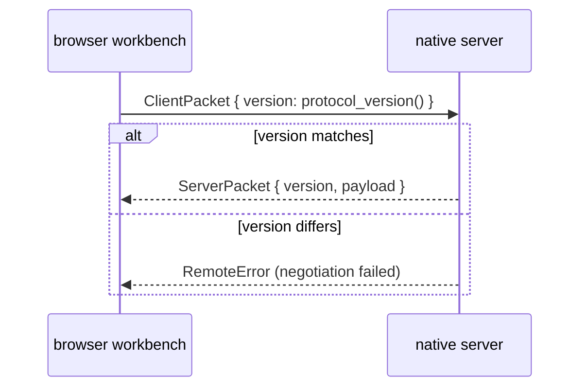

# shell/remote_protocol

MoonBit-owned JSON contract between the reference browser workbench and native
server. Protocol version `4` is carried by every packet and must match exactly.

## Wire contract

- Client requests: `ResolveDirectory`, `OpenDocument`, `WatchDocument`,
  `CloseDocument`, `Hover`, `Definition`, `References`, and `DocumentSymbols`.
- Server packets: directory/document results, watched `DocumentChanged` pushes,
  pushed `Diagnostics`, semantic feature results, and `RemoteError`.
- Position requests carry a document revision and UTF-16 offset; whole-document
  feature requests carry a revision. Request IDs correlate replies. Diagnostics
  deliberately have no request ID; watch pushes reuse the watch request ID.
- Decoders return structured errors for invalid JSON, version, packet shape,
  URI, or provider failure. `provider_code` preserves the lower-level category.
- Reference results add line, column, and line-text preview fields. There is no
  semantic-token packet.

The public surface is the packet/payload types plus `protocol_version`,
`negotiate_protocol_version`, `decode_client_packet`, and
`decode_server_packet`; see `pkg.generated.mbti` for exact fields.

## Version negotiation

Protocol version `4` is carried by every packet and must match exactly. There is
no forward or backward compatibility window: a mismatch is a negotiation
failure, not a downgrade.



```mbt check
///|
test "only the exact protocol version negotiates" {
  debug_inspect(
    (
      @remote_protocol.protocol_version(),
      @remote_protocol.negotiate_protocol_version(
        @remote_protocol.protocol_version(),
      ),
      @remote_protocol.negotiate_protocol_version(
        @remote_protocol.protocol_version() - 1,
      ),
      @remote_protocol.negotiate_protocol_version(999),
    ),
    content=(
      #|(
      #|  4,
      #|  ProtocolAccepted(4),
      #|  ProtocolRejected(
      #|    {
      #|      code: ProtocolUnsupportedVersion,
      #|      message: "Unsupported remote protocol version 3",
      #|      request_id: "",
      #|      provider_code: "",
      #|    },
      #|  ),
      #|  ProtocolRejected(
      #|    {
      #|      code: ProtocolUnsupportedVersion,
      #|      message: "Unsupported remote protocol version 999",
      #|      request_id: "",
      #|      provider_code: "",
      #|    },
      #|  ),
      #|)
    ),
  )
}
```

## Decoding

Decoders return structured errors for invalid JSON, version, packet shape,
URI, or provider failure. Nothing raises: a malformed packet from the network
is an ordinary value the caller matches on.

```mbt check
///|
test "malformed input decodes to a structured error, never a raise" {
  debug_inspect(
    ["", "not json at all", "{}", "{\"version\":1,\"kind\":\"hover\"}"].map(raw => {
      match @remote_protocol.decode_client_packet(raw) {
        DecodedClientPacket(_) => "decoded"
        ClientPacketDecodeError(error) => "error:" + error.code.to_string()
      }
    }),
    content=(
      #|[
      #|  "error:InvalidJson",
      #|  "error:InvalidJson",
      #|  "error:UnsupportedVersion",
      #|  "error:UnsupportedVersion",
      #|]
    ),
  )
}
```

`ProtocolErrorCode` round-trips through its wire string, so an error category
survives the hop without a lookup table on each side. The wire form is the
CamelCase name, and anything unrecognized decodes to `ProtocolInvalidPacket`
rather than raising — an unknown category from a newer peer is still a usable
error.

```mbt check
///|
test "error codes round-trip, and unknown input falls back" {
  let codes : Array[@remote_protocol.ProtocolErrorCode] = [
    ProtocolInvalidJson,
    ProtocolUnsupportedVersion,
    ProtocolUnknownPacket,
    ProtocolInvalidPacket,
    ProtocolInvalidUri,
    ProtocolProviderError,
  ]
  debug_inspect(
    (
      codes.map(code => {
        (
          code.to_string(),
          @remote_protocol.ProtocolErrorCode::from_string(code.to_string()) ==
          code,
        )
      }),
      @remote_protocol.ProtocolErrorCode::from_string("SomethingNewer"),
    ),
    content=(
      #|(
      #|  [
      #|    ("InvalidJson", true),
      #|    ("UnsupportedVersion", true),
      #|    ("UnknownPacket", true),
      #|    ("InvalidPacket", true),
      #|    ("InvalidUri", true),
      #|    ("ProviderError", true),
      #|  ],
      #|  ProtocolInvalidPacket,
      #|)
    ),
  )
}
```

## Boundary and validation

This package may depend on domain types and `shell/workspace`, but not
on browser, viewer implementation, server routing, or native effects.

Run `moon test shell/remote_protocol --target js` and `just check`.
