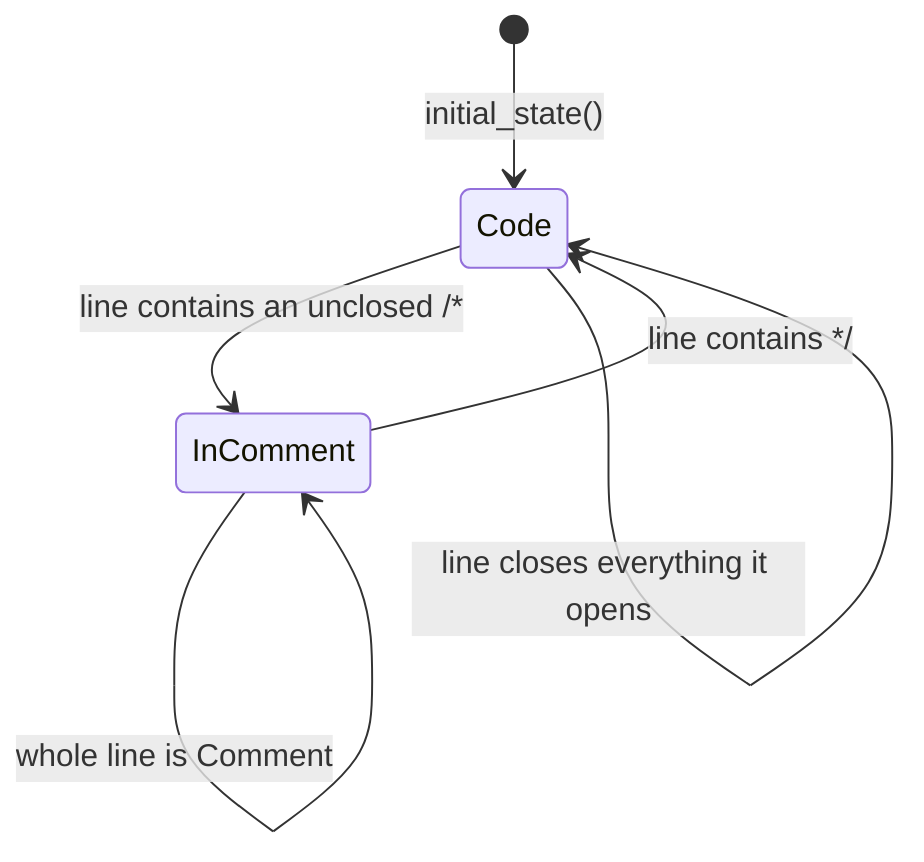

# syntax/lang_json

The JSON (and JSONC) lexer. It implements `@syntax.LineTokenizer` with a
compile-time `lexmatch` DFA.

`JsonTokenizer` is the whole public surface. Hosts, examples, and tests select it
explicitly; reusable viewer core packages must not import it.

## Reading a token stream

```mbt check
///|
/// Renders each token as `text|tag`, carrying state line to line.
fn annotate(lines : Array[String]) -> Array[String] {
  let tokenizer : &@syntax.LineTokenizer = @lang_json.JsonTokenizer()
  let rendered = []
  let mut state = tokenizer.initial_state()
  for line in lines {
    let (tokens, next_state) = tokenizer.tokenize_line(line, state)
    for token in tokens {
      rendered.push("\{line[token.start:token.end].to_owned()}|\{token.tag}")
    }
    state = next_state
  }
  rendered
}
```

## Property names versus string values

A JSON string is tagged by its *role*, not its shape: a string followed by `:`
is a property name, every other string is a value. The lexer decides this with
one lookahead over the remainder of the line rather than by parsing structure.

```mbt check
///|
test "a colon after a string makes it a property name" {
  debug_inspect(
    annotate(["{ \"name\": \"moonbit\", \"version\": 3 }"]),
    content=(
      #|[
      #|  "{|Delimiter",
      #|  "\"name\"|Attribute",
      #|  ":|Delimiter",
      #|  "\"moonbit\"|String",
      #|  ",|Delimiter",
      #|  "\"version\"|Attribute",
      #|  ":|Delimiter",
      #|  "3|Number",
      #|  "}|Delimiter",
      #|]
    ),
  )
}
```

Literals and numbers get their own classes, and anything unquoted that is not a
literal is `Invalid` — JSON has no bare words, so surfacing them as invalid is
the whole diagnostic value this lexer can offer without a parser.

```mbt check
///|
test "JSON literals are Constant and bare words are Invalid" {
  debug_inspect(
    annotate(["[true, false, null, -1.5e3, undefined]"]),
    content=(
      #|[
      #|  "[|Delimiter",
      #|  "true|Constant",
      #|  ",|Delimiter",
      #|  "false|Constant",
      #|  ",|Delimiter",
      #|  "null|Constant",
      #|  ",|Delimiter",
      #|  "-1.5e3|Number",
      #|  ",|Delimiter",
      #|  "undefined|Invalid",
      #|  "]|Delimiter",
      #|]
    ),
  )
}
```

## Cross-line state

This is the one lexer feature that needs state: a JSONC `/* … */` block comment
runs past the end of a line, so the closing state must survive into the next
`tokenize_line` call. `lang_json` does not use the shared mode stack; its state
is a single in-comment flag.



```mbt check
///|
test "a block comment carries across lines through TokenizerState" {
  debug_inspect(
    annotate(["{ /* start", "still inside", "done */ \"k\": 1 }"]),
    content=(
      #|[
      #|  "{|Delimiter",
      #|  "/*|Comment",
      #|  " start|Comment",
      #|  "still inside|Comment",
      #|  "done |Comment",
      #|  "*/|Comment",
      #|  "\"k\"|Attribute",
      #|  ":|Delimiter",
      #|  "1|Number",
      #|  "}|Delimiter",
      #|]
    ),
  )
}
```

Because the flag is the entire state, re-lexing a line only needs to know
whether the previous line ended inside a comment.

```mbt check
///|
test "the in-comment flag is the whole state" {
  let tokenizer : &@syntax.LineTokenizer = @lang_json.JsonTokenizer()
  let initial = tokenizer.initial_state()
  let (_, opened) = tokenizer.tokenize_line("{ /* start", initial)
  let (_, closed) = tokenizer.tokenize_line("done */", opened)
  debug_inspect(
    (initial, opened, closed),
    content=(
      #|(TokenizerState("n"), TokenizerState("c"), TokenizerState("n"))
    ),
  )
}
```

## Boundaries and checks

This package may depend only on `syntax`. It uses neither `@syntax.push_token`
nor `@syntax.is_capitalized`. The complete API is `pkg.generated.mbti`; the
line-tokenizer contract and the porting rules live in `syntax/README.mbt.md`.

```sh
moon test --target js syntax/lang_json
```
