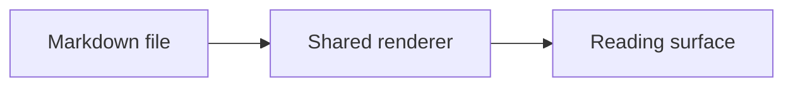

# Fixture Workspace

This README renders as a **whole document** in the readonly workbench.

- the explorer and watcher stay source-truthful
- selection and copy keep model coordinates

## Flow

```d2
direction: right

open: open README.md
provider: markdown document provider
zone: rendered document zone

open -> provider
provider -> zone: one whole-file block
```



```moonbit
fn readme_snippet() -> Unit {
}
```

Closing prose keeps the document honest.
