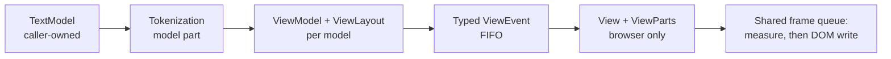

# viewer

The reusable readonly editor facade. It plays Monaco's
`CodeEditorWidget`/`ICodeEditor` role over the packages below it; the reference
workbench, transport, files, and reload policy live under `internal/shell/`.
`pkg.generated.mbti` is the authoritative public API. This README records the
ownership and lifecycle rules that are not obvious from signatures.

> The code blocks on this page are `mbt nocheck`. This package is js-only and a
> `Viewer` needs a live DOM host element, which `moon test` (Node, no DOM)
> cannot provide. The executable proofs for this surface are the Playwright
> component scenarios under `tests/browser/component/` and the headless
> white-box suite in `viewer/test_viewer_wbtest.mbt`; see `docs/harness.md` for
> how to pick a layer.

## The shortest embedding

```mbt nocheck
// The one public construction path. `host` stays caller-owned and must not
// receive host-rendered children.
let viewer = @viewer.Viewer::create(host)

// Models are caller-owned too. Installing one is a slot assignment, not a
// transfer of ownership.
let model = @model.TextModel(uri, "main.mbt", "moonbit", 1, "rev-1", text)
viewer.set_model(Some(model))

// The host tells the Viewer when initial option/view-state setup is done, so
// visible-token demand is published outside attach_model.
viewer.handle_initialized()

// Teardown removes Viewer-owned DOM but returns the host to the caller intact.
viewer.dispose()
```

Sharing services between two Viewers is the difference between passing
`services` and omitting it:

```mbt nocheck
// Omitted: the Viewer creates and owns a private bundle.
let standalone = @viewer.Viewer::create(host)

// Passed: the bundle is borrowed, so both Viewers see the same languages,
// diagnostics, feedback, and quick-diff state. The caller keeps its lifetime.
let shared = @viewer.ViewerServices(languages=..., markers=...)
let left = @viewer.Viewer::create(left_host, services=shared)
let right = @viewer.Viewer::create(right_host, services=shared)
```

Presentation is selected from the model, never by the host:

```mbt nocheck
// A .md or .mbt.md URI path suffix, or the exact "markdown" language id,
// selects the Markdown root. Everything else selects Code. Shells pass an
// ordinary TextModel either way and do not branch.
viewer.set_model(Some(code_model))     // → internal/viewer/browser/view.View
viewer.set_model(Some(markdown_model)) // → MarkdownDocumentView + hover bridge
```

## Construction and ownership

```d2
direction: down

host: host element — caller-owned
model: TextModel — caller-owned

viewer: Viewer {
  config: EditorConfigurationState
  slot: ViewerModelSlot {
    data: "ModelData?" {
      browser: "ModelBrowserData? — View + mouse handler"
    }
  }
  mount: ViewerMount
  contribs: EditorContributions
  delivery: CursorEventDelivery
}

viewer.mount -> host: mounts into, never owns
viewer.slot.data -> model: borrows readonly
```

- Browser embedders call `Viewer::create(host, services~, options~)`. The host
  element must stay mounted and must not receive host-rendered children.
  This is the only public construction path. The package keeps a private
  headless constructor for white-box tests; there is no public two-step mounting
  API. Construction synchronously reads the host's `clientWidth`/
  `clientHeight` (clamped to Monaco's 5px minimum), so options, model attachment,
  and model-line projection use the measured viewport. The internal ViewLayout
  is seeded synchronously before it becomes observable or publishes stable
  visible-token demand. Later `layout()` calls use the same client-box
  semantics, including while the no-model placeholder is showing. Headless
  means no host, placeholder, browser presentation, DOM focus state,
  measurement, or root animation frame, although a model and `ViewModel` may
  still be installed with `ModelData.browser=None`; a model installed through
  the public mounted path always has `Some(BrowserPresentation)`.
- Mounting is a one-way private transition. A mounted Viewer with no model owns
  one atomic placeholder root/text pair; attaching a model installs the active
  presentation root through `ViewerMount`, and ordinary detach restores the
  same pair. Disposal removes Viewer-owned DOM and clears
  placeholder/frame/focus state without returning to headless or releasing the
  caller's host. `get_container_dom_node` returns that original host before and
  after disposal, while `get_dom_node` is nullable when no mounted presentation
  exists.
- Omitting `services` makes the Viewer create and own an internal bundle.
  Passing `services` explicitly always borrows that bundle, including a bundle
  returned by `ViewerServices(...)`; this is the form for sharing languages,
  diagnostics, feedback, navigation capabilities, and quick-diff state between
  Viewers.
- `set_model(TextModel?)` installs a caller-owned readonly model in the one
  `ViewerModelSlot.current` bundle. The same object is a no-op; replacement or
  clearing invalidates the generation before cleanup. Code and headless retain
  their existing listener → attached-view → optional View → ViewModel order,
  followed by mounted root removal. Markdown first cancels its bridge and
  disposes semantic/render lifetimes while the root is mounted, removes that
  inert root, then releases listeners, the attached-view handle, and the
  ViewModel. Attachment acquires the handle before `ViewModel` construction and
  selects one private closed presentation kind. Shells and embedders always
  use this same ordinary-model path; they neither parse Markdown nor select a
  presentation. An exact lowercase URI-path `.md` suffix (including `.mbt.md`)
  or the exact `markdown` language id selects
  `Markdown(MarkdownBrowserData)`; every other model selects
  `Code(CodeBrowserData)`. URI matching does not include query/fragment text
  and is case-sensitive. Headless attachments retain the same kind without
  constructing DOM. The Code payload cannot hold a `View` without its retained
  mouse handler and render/reveal facts; the `View` remains the handler's sole
  disposal owner. The Markdown payload owns a focusable root, native viewport,
  replaceable article, persistent overlay mount, same-parse source projection,
  monotonic projection generation, and presentation-local hover and definition
  bridges. Model swaps reset scroll and feature model state; use
  `save_view_state`/`restore_view_state` when the host wants persistence.
- Contributions are created once per `Viewer` and disposed with it.
  `Viewer.contributions` is the `EditorContributions` owner, and its `instances`
  map is the only per-Viewer instance store. Each central entry owns one
  concrete hover, folding, feedback-input, feedback-widget, quick-diff, or
  Markdown-comment state value, the context-menu shell/source-anchor state, or
  the definition request/link/Peek state, plus its root listeners; feature
  packages keep no editor-id-keyed instance table.
  The content-hover payload additionally
  owns its controller, lazy widget and logical widget view, and timeout/async
  launch policy across model swaps. The Markdown-comment payload owns its
  model/content subscriptions and the current model's stable-key rendered-zone
  map. Construction rejects duplicate ids before side effects, inserts the bare
  typed entry before synchronous initialization, and then installs listeners.
  All modes currently instantiate eagerly.
- `dispose` is idempotent. The complete contribution map remains installed for
  ordered behavior teardown, then becomes non-lookuppable; retained hover
  browser resources are released at the later root cleanup slot before the map
  is cleared. `on_did_dispose` fires after model detach and owner-decoration
  cleanup but before those contribution and Viewer-lifetime phases, while every
  central entry is still reachable. Disposal cancels pending render work and
  pending per-model smooth-scroll registrations, removes Viewer/View listeners
  and owned DOM, and never disposes the caller's model, host, or explicitly
  supplied services. An internally created service bundle is released
  afterward in marker-decoration, marker, then feedback order.
- Each attached model stores one marker-decoration acquisition lease and one
  exact attached-view handle in its `ModelData`. Multiple Viewers sharing a
  service and model share the identity owner until the final lease and maintain
  an aggregate attached count; `set_value` refreshes that owner without
  acquiring again. Code publishes the final model-detachment boundary before
  disposing its View, preserving the established Monaco order. Markdown
  publishes that boundary only after its renderer is disposed and presentation
  root removed, so no attachment callback can observe live Markdown feature DOM.
- Overlay-widget registrations belong to the Viewer and are re-added to each
  Code presentation. With another presentation active, add/remove still update
  the Viewer-lifetime registration map but perform no DOM work. Content widgets
  are an internal code-view-part seam; hover and the definition action's
  request-anchored message own the current implementations.

The active presentation owns DOM lookup, focus, layout, theme, scroll
position/extents, reveal, visible ranges, render publication, and root
lifecycle. Markdown content is always rendered from the original `TextModel`
snapshot and URI; `set_value` replaces only the article contents while
retaining the root, viewport, and overlay mount. Theme changes perform another
same-source projection replacement so tokenized fences and Mermaid use the
current theme. Only `.mbt.md` selects the `MoonBitMarkdown` resource policy;
there, a full fence info string whose first two nonempty ASCII-space-separated
tokens are exact lowercase `mbt check` or `moonbit check` is semantic.
Repeated spaces and trailing tokens are accepted; ordinary Markdown,
nonmatching fences, case changes, and tab-separated forms remain static. The
Markdown document exposes one projection-owned semantic pointer mapping. A real
DOM caret in a semantic row is converted through the retained
`MarkdownCodeLine` boundary map to the original model's 1-based position;
synthetic indentation never becomes a provider position. The
presentation-local hover and definition bridges consume that mapping and query
providers against the original model/URI/revision, with no virtual model or
URI. Live original-model marker decorations are projected into those same rows
without a block-local marker store or synthetic-model decoration, and their
marker hover parts are merged with language hover rows.

Every pending Markdown hover commit is stamped with request generation, model
identity and versions, URI/revision, attach generation, projection generation
and source version, block identity, source offset, and cancellation token.
Content, theme, and model replacement retire the relevant state before
presentation DOM replacement. Layout may update geometry synchronously first;
layout, marker, pointer, and disposal transitions still invalidate freshness
before any pending async hover may commit. Projected diagnostics reuse the
resolved Code class, range, z-index, severity squiggle, and `showUnused`
underline policy. The `squiggly-inline-unnecessary` opacity and
`squiggly-inline-deprecated` strike-through effects are explicitly deferred
because they require mutating source glyphs; the readonly overlay does not
approximate them.

Markdown reveal converts the validated model range to an absolute source offset
through `TextSnapshot` and selects the containing or nearest preceding source
anchor. Visible ranges convert intersecting rendered anchors back through the
same snapshot; a document with no renderable anchor falls back to its full
model range. Cursor, selection, ViewZones, editor mouse events, folding, quick
diff, feedback widgets, Markdown comments, and Code-view overlays remain
dormant on the Markdown variant. Its presentation-owned bridges use native root
listeners for hover and definition navigation; diagnostic and definition-link
spans plus the DOM-anchored hover and Peek widgets stay in the Markdown
projection rather than entering Code contributions.

## Public surface

The API is a readonly subset of Monaco's editor API:

- lifecycle/model/options: `create`, `set_model`, `handle_initialized`,
  `update_options`, `layout`, `focus`, `dispose`;
- position, selection, scroll, reveal, geometry, and read queries;
- model decorations and `EditorDecorationsCollection`;
- view zones and null-position overlay widgets;
- model, cursor, scroll, ViewZone, hidden-area, mouse, and disposal events.

Canonical public event values and editor-option enums are owned by
`viewer/common/editor_api`; the root facade consumes those types directly and
does not provide compatibility aliases.

`update_options` accepts and replaces one complete typed `ViewerOptions`
snapshot. It is intentionally not Monaco's JavaScript partial-object merge:
the representation is opaque, and callers changing one field derive a new
snapshot with a reviewed builder such as
`viewer.get_options().with_render_whitespace(All)`. The public read floor is
limited to `soft_wrap()` and `line_height()`; internal packages derive the rest.
An equal complete snapshot is a strict no-op. A changed snapshot computes
option-specific facts once and delivers the resulting mapping, decoration, and
configuration view events as one ordered batch before scheduling the frame.
The readonly product keeps its approved
`render_validation_decorations=On` default; `Editable` still filters validation
decorations because readonly is a fixed product fact.

The viewer is single-cursor: secondary cursor/selection arrays are empty and
`set_selections` uses the first selection. The primary Left/Right/Up/Down,
PageUp/PageDown, Home, and End bindings (with Shift variants) move the cursor;
a winning binding remains handled at a document boundary. Pointer click/drag,
word, line, gutter, and select-all gestures use source-shaped command objects
registered under their source IDs and the same transition path. Their
runtime-partial argument shapes return before mutation when required
position/selection data is absent; the readonly model has no undo stack, so
Monaco's cursor-command `pushStackElement` calls have no local state to update.
Alternate platform bindings, editable commands, multi-cursor, and column
selection are outside the readonly surface. Build/render/hover telemetry and
the disabled-by-default scroll state/render-phase trace are not part of the
public Viewer API; the internal workbench and browser scenarios use the
Viewer-id-keyed `internal/viewer/browser/testing` seam.

Cursor payload versions are `TextModel.get_version_id()`, never the caller's
host metadata version. `set_position`/`set_selection` accept an optional
source, while `set_selections` accepts optional source and reason; their
defaults are `api`/`NotSet`. Keyboard and ordinary pointer gestures emit
`keyboard` or `mouse` with `Explicit`;
four-click SelectAll deliberately keeps source `keyboard`. `set_value` resets
the cursor to `(1,1)` and emits source `model`/reason `ContentFlush`, old version
`0`, and `old_selections=None`, even when the visible cursor was already at the
origin. State is committed and rendering is scheduled before public cursor
callbacks. Delivery is FIFO and reentrancy-safe: ordinary transitions fire
position then selection as an adjacent pair, while flush delivery is model
content, position, then selection. The private `CursorEventDelivery` owns the
queue, active drain gate, exact content-barrier depth, and completed versions.
A model reset clears queued model facts and versions but never clears an active
outer drain gate; active-model checks and public event effects remain at the
root Viewer boundary.

`on_did_change_hidden_areas` is the public, payload-free notification for the
current model's changed view-line mapping. The root subscribes to the
ViewModel's heterogeneous outgoing dispatcher through the model-scoped
generation gate, so a detached model, a missing model, and callbacks retired by
replacement or disposal cannot reach the Viewer emitter. The event fires once
after the hidden-area transaction has delivered its internal mapping,
cursor/decorations, layout, and stable-viewport recovery facts. Equal ranges
and a forced update that leaves the mapping equal do not fire. Applying hidden
areas remains package-private root/contribution behavior rather than a public
Viewer mutation API.

On a mounted Viewer, the Markdown-comment contribution resolves whole-line
blocks from the first matching provider or the language's comment
configuration, then replaces those lines only in the view projection with
measured ViewZones. The model value, coordinates, tokens, selection, and code
copy remain source truth. Each stable range key retains one DOM target while a
body-only change replaces its shared safe-renderer lifetime; same-model content
flushes force the hidden-source projection refresh even when the normalized
ranges stay equal. Model detach disposes renderers and size observers, removes
zones, and clears the feature's one hidden source before the outgoing browser
`View` is destroyed. A headless Viewer never hides these source lines because
it has no replacement DOM. Offscreen zones measure invisibly at the editor
content width, so scroll geometry converges before first reveal and responds to
width/image changes without exposing hidden content. The feature enables only
sanitized HTTP(S) images and routes sanitized links through its external action
handler; raw HTML and unsafe schemes stay inert under the shared renderer
policy.

Cursor-command reveals keep the committed view coordinate. Keyboard commands
request non-minimal Smooth reveal; pointer MoveTo/Word/Line commands use the
same Smooth request with `minimalReveal=true` after their `None` gate, so a
target already at the viewport edge gains no extra vertical or horizontal
padding. Smooth requests of at most one line downgrade to immediate, and the
`smooth_scrolling=false` default also commits them immediately.

## HTML editor context menu

The browser Viewer uses a Monaco-shaped HTML context menu for definition
commands. A right click on Code content text or empty content focuses the
Viewer and moves the cursor only when the hit is outside the current selection.
A right click on an exact semantic `.mbt.md` source row anchors the same
original-model definition position. The live menu contains
`Go to Definition` and `Peek Definition` as adjacent top-level actions;
unavailable actions disappear. Ordinary Markdown, synthetic padding, injected
text, margins, widgets, scrollbars, stale projections, and a Viewer with no
available definition command retain the browser-native menu.

The context-menu contribution owns one lazy browser widget per Viewer. Showing
again replaces its transient DOM; running an action hides first. Escape, Tab,
outside primary pointer input, focus/window blur, model/content change, scroll,
and disposal dismiss it. Shift+F10 or the Context Menu key opens at the Code
cursor, or at Markdown's most recent still-valid semantic pointer anchor.
Keyboard navigation supports Up/Down/Home/End/PageUp/PageDown and Enter/Space.
The root overlay prefers right/down placement, flips at viewport edges, exposes
`menu`/`menuitem`, and restores the prior focused element when focus still
belongs to the menu. The reusable browser shell can render one submenu level,
but this definition menu does not instantiate one.

This is a Monaco-shaped VS Code Web behavior port with the flattened definition
command layout as a local product choice, not a desktop-native menu or a public
extension surface. Clipboard/edit/refactor/source/history entries, scrollbar
actions, touch long press, visible disabled actions, icons, mnemonics, and
deeper submenus remain outside this first surface. Independent Viewers each own
their menu rather than sharing a process-global context-menu service.

## Definition navigation

Definition UI is a behavior port of Monaco standalone. In Code, F12 and the web
Ctrl/Cmd+F12 fallback request definitions at the current cursor. In semantic
`.mbt.md` fences, F12 uses the most recent valid projected pointer position.
The browser runner starts every matching provider concurrently; completed live
results are flattened in Monaco registry priority (selector score, then newest
registration) and exact URI/range duplicates are removed. One result opens
directly. Multiple results open Peek in an outer mounted Viewer without
querying providers again; a headless or nested Viewer retains the deterministic
provider-first fallback. A same-resource result is applied locally at its
collapsed start with reveal and focus; Code also updates its cursor. A direct
target paints the complete result range with `symbolHighlight`; the decoration
clears after 350 ms only while the exact target model remains installed. A
cross-resource result is sent to the optional host-owned
`LocationOpenerHandle`; the reference workbench applies the same target-range
feedback after installing the resolved model. Rejection or absence produces
non-destructive feedback only while the initiating model/version and opener
generation remain current, so a late failure cannot overwrite a newer
navigation. A zero-result Code request uses the source word in
`No definition found for '<word>'` when available and mounts the message as an
above/below content widget at the validated request position. Neither Viewer
nor the request value owns files, tabs, workspace, groups, navigation history,
or transport.

Ctrl/Command+Click uses an algorithm-fidelity gesture state rather than a
second ordinary-click path. Only exact platform Ctrl or Command over real
content text starts resolution; injected text, foreign elements, margins,
widgets, and non-word positions are excluded. The token becomes a link only
after a non-empty result. An empty result is cached without feedback while the
pointer stays on that word during the exact modifier gesture, avoiding repeated
semantic checks on every mousemove. Moving within one word reuses the preview
request. Selection suppression occurs only when a left mousedown with click
detail at most one matches that armed token and the modifier is held; a
same-line eligible mouseup launches a fresh ordinary Definition action even
when the preview request is still pending. Modifier release, unrelated
Ctrl/Cmd chords, blur, scroll, drag, leave, model/content change, and disposal
cancel the transient link gesture. A selection change cancels the preview
request; when an unresolved link mousedown already recorded its source line, it
preserves that down-line until the same-line mouseup launches the fresh action.
Semantic Markdown stores the most recent plain-click pointer target as its
command anchor; modifier edges do not replace it, while leave, scroll,
projection/model change, and disposal clear it. Code paints an armed link as a
model decoration. Semantic Markdown asks the document projection to paint the
exact source range as caller-owned spans; ordinary fences and synthetic padding
stay inert, and projection replacement removes those spans before their DOM
retires.

Alt+F12 opens Peek only in an outer mounted Viewer. Code reserves up to the
Monaco-default 18 lines with a blank ViewZone and aligns the interactive shell
through a Viewer-owned overlay; keeping the two DOM nodes separate prevents
ViewZone's absolute block styles from collapsing the shell's flex body.
The anchor-to-following-line range is revealed after insertion so the ViewZone
height participates in scroll fitting and the shell cannot open clipped below
the editor.
Semantic Markdown mounts the shell in the persistent projection overlay and
stamps the session with the current projection generation. The shell places
the readonly preview on the left and the result list on the right, labels the
selected filename/directory and result count, and highlights the selected
target range. The same model/version/position command toggles the existing Peek
closed. Results are sorted by URI/range and initially select the location
nearest the source. A zero-result request retires its loading shell, restores
outer focus, and reports `No definition found` instead of leaving an empty
dialog; when the source anchor has a word, the message uses the same
word-specific form as ordinary goto.
Same-resource preview reuses the caller-owned model; cross-resource preview
uses the optional host-owned `TextModelResolverHandle` and retains its
`TextModelReference` only for the preview lifetime. A current missing, rejected,
or wrong-URI resolution replaces the installed child with the unavailable
fallback and releases its reference. Stale, cancelled, or disposed late results
cannot commit and release any returned reference. A slow replacement retains
the installed child/reference until the new preview is current and ready to
commit. Focus is scheduled after the Code ViewZone becomes visible. An
F4/Shift+F4 replacement restores preview focus only when the retiring preview
still owns focus at commit time, so a user focus move during resolution wins.
Enter confirms only from the shell/list focus domain; Enter inside the nested
preview remains native. Escape closes and restores outer focus. A nested
preview borrows services but cannot recursively open another Peek. It retains
raw source presentation: whole-line Markdown-comment replacement remains an
outer-Viewer contribution so an asynchronously measured comment zone cannot
shift the selected target out of the compact preview. Teardown
atomically detaches every session/preview owner slot before any synchronous
cancellation or disposal callback, then disposes the nested Viewer before its
reference, the Code overlay and shell, and finally the active ViewZone spacer
or Markdown overlay.
Confirmation is stamped with both the source model and latest open intent, so
a queued confirmation cannot overwrite a newer cursor or navigation action.

`ViewerServices` is an opaque capability aggregate. Its constructor accepts a
`LanguageHandle`, one closed marker source (`MarkerStore` or `Decorations`), an
`AgentFeedbackHandle`, optional `LocationOpenerHandle` and
`TextModelResolverHandle` navigation capabilities, a `QuickDiffHandle`, and a
`LogHandle`; concrete service fields cannot be recovered through the facade.
Hosts retain concrete language, marker, feedback, navigation, quick-diff, and
logging backings when they need to register providers, publish diagnostics,
mutate feature state, open a resolved location, resolve a Peek model, or inspect
telemetry. Omitted marker, feedback, quick-diff, language, and logging
capabilities create bundle-owned defaults. Navigation capabilities have no
default: same-resource navigation needs no host capability, while unavailable
cross-resource opening or preview remains explicit. `ViewerServices::dispose`
is idempotent and releases only bundle-created defaults, in marker-decoration,
marker-store, then feedback order; supplied handles and captured backings remain
caller-owned. A Viewer disposes only a bundle it created implicitly. The
navigation capabilities are consumed only by definition opening and
cross-resource Peek preview; same-resource navigation remains Viewer-local.

## Runtime pipeline



`base/browser` owns the one realm-global frame coordinator. ViewModel smooth
scroll and controller touch inertia use its strict-next queue; a mounted Viewer
uses current-or-next priority `100` for its coalesced render. Therefore an
animation tick can commit state and append that Viewer render to the same
native frame, while strict-next animation state still advances only once per
frame. Multiple Viewers share the native request and priority queue but retain
independent dirty flags, callbacks, trace ids, and cancellation lifetimes. This
is private composition and leaves `viewer/pkg.generated.mbti` unchanged; it is
not Monaco's cross-editor phased `EditorRenderingCoordinator` port.

The root package owns every `Viewer::` method and the cross-package glue for
input, reveal, widgets, folding, hover, definition navigation and Peek,
Markdown comments, quick diff, feedback, and decorations. Public values remain
in `viewer/common/**` and
`viewer/browser`;
concrete browser and contribution mechanisms live in
`internal/viewer/browser/**` and `internal/viewer/contrib/**`. Those
lower-level packages do not import the root facade, so Viewer-facing
composition stays here without reversing dependencies.

`fold_top_level` remains an explicit host action rather than an attachment
default. For MoonBit models it lexically identifies brace-bodied top-level
functions and uses the opening-brace line as each function's fold header. This
keeps every source-formatted signature line and `{` visible while hiding later
body lines and the closing brace; its collapsed chevron omits the generic
ellipsis. The fold is therefore anchored on the final signature line, an
intentional interaction trade-off that avoids partial-line projection and its
cursor/wrapping coordinate machinery. `declare` and `=`-backed bodyless
functions are ignored, and comments and strings do not participate in brace
matching. Other languages and MoonBit declaration kinds retain ordinary
level-one folding.

Each hover request
captures the physical `TextModel`, its internal content version, a
Viewer-lifetime monotonic generation, and a caller-owned cancellation token.
Replacement, content invalidation, detach, model disposal, and Viewer disposal
cancel before retiring the request; only a stamp that is still fully current
may mutate decorations, hover state, rendering, or resolution events. Hover
mouse/async/sync/loading delays are clearable owned handles with a generation
guard retained for dispatch races.

Grammar tokenization is demand-driven. Model attach/build telemetry and token
change telemetry read the passive store only; `_attachModel` does not own
Monaco's separate `handleInitialized` transition. ViewModel scroll/content
changes publish unstable visible ranges. After `set_model` and any synchronous
view-state restore or option update, the host calls `handle_initialized`; that
separate boundary publishes the current model's stabilized visible demand
without waiting for a render frame. Repeated calls re-stabilize that demand and
can immediately supersede a pending unstable-range debounce.
`restore_view_state(Some(...))` also publishes a stabilized range after the
restored scroll is committed. Model attachment alone, including headless
attachment, publishes no synthetic zero-viewport stable range. This behavior
port does not claim full constructor
arithmetic parity: real DOM `FontInfo` replaces the initial estimate in the
first mounted read phase, and wrap-column computation retains the documented
local reduced formula. The browser scheduler selects one native-idle or 15 ms
timeout fallback implementation, exposes cancellable idle/zero/delay handles,
and lets the model backend bound and cancel background work. The root consumes
the ViewModel's typed outgoing token event only after the browser ViewEvent has
been delivered; it does not subscribe directly to TextModel token events.

## Boundaries and checks

- JS-only: DOM access is through `rabbita/dom`/`rabbita/js`; no Rabbita
  TEA/vdom/command layer, `internal/shell/**`, backend transport, or concrete
  `syntax/lang_*` import belongs here.
- DOM-free logic belongs in `viewer/common/**` or a multi-target contribution.
  The browser renders typed state directly; do not pass render-frame JSON to
  JavaScript.
- Owner-adjacent CSS is assembled by `scripts/build-web.mbtx`.
- Use `just test` for headless/model behavior, `just test-browser-smoke` for
  routine real-DOM input and geometry, `just test-browser-perf` for opt-in
  performance diagnosis, and `just check` for architecture boundaries.
