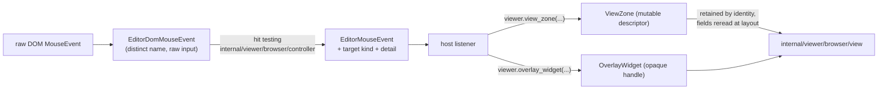

# Viewer browser contracts

This JS-only package owns the DOM-facing contracts that are safe to cross the
public Viewer boundary. The root facade consumes and returns them directly but
external hosts normally use root factories so MoonBit can infer these types
without a direct browser-package import.



> The blocks on this page are `mbt nocheck`: this package is js-only and its
> values only appear inside a live browser Viewer, which `moon test` (Node, no
> DOM) cannot construct. The executable examples for this stack are the
> Playwright component scenarios under `tests/browser/`.

An embedder never imports this package directly. It calls the root factories,
and MoonBit infers these types:

```mbt nocheck
// Add a view zone: the descriptor is mutable and retained by identity, so
// writing to `height_in_px` later is observed at the next layout.
let zone = @viewer.view_zone(after_line_number=12, height_in_px=48, dom_node=node)
viewer.change_view_zones(accessor => accessor.add_zone(zone) |> ignore)
zone.height_in_px = 96 // reread on the next layout pass

// Observe editor mouse events with resolved targets rather than raw DOM ones.
viewer.on_mouse_down(event => match event.target.kind {
  ContentText => handle_text_click(event.target.position)
  GutterLineNumbers => handle_gutter_click(event.target.position)
  _ => ()
})
```

- `EditorMouseEvent`, `PartialEditorMouseEvent`, target kinds, and target detail
  records are canonical public editor-DOM event values. Raw DOM input uses the
  distinct `EditorDomMouseEvent` name.
- `ViewZone` is the mutable public descriptor. The runtime retains it by
  identity and rereads its live fields during layout. Its optional
  `ignore_hidden_area_source` extension tests the declared anchor against all
  hidden-area owners except one, while omission preserves Monaco's merged
  visibility policy.
  `ViewZoneChangeAccessor` is an opaque callback handle; mutable ids, cached
  measurements, render data, and DOM attachment state stay private in
  `internal/viewer/browser/view`.
- `OverlayWidget` is an opaque unmanaged handle with immutable id/node and the
  supported null-position placement. Positioned/content-widget/layout variants
  remain outside the readonly product.

`viewer/browser` never imports root `viewer` or the private view runtime. The
runtime converts descriptors exactly once in the opposite dependency direction.
The external-host import policy permits only root `viewer` and
`viewer/common/**`; use `viewer.view_zone` and `viewer.overlay_widget` from such
hosts.
