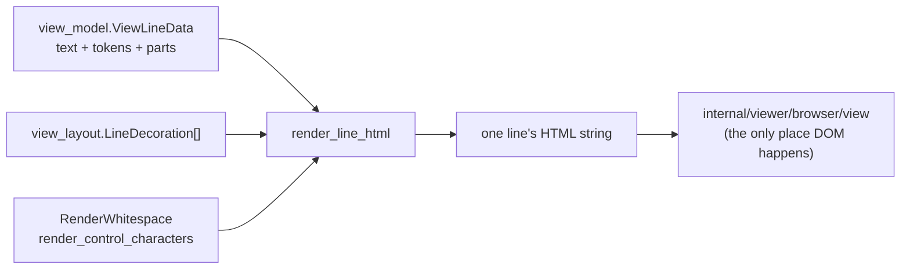

# viewer/common

A small compatibility facade over the focused common-layer packages.

The real content of the common tier lives in the sibling packages
(`model`, `view_model`, `view_layout`, `tokens`, …). What remains here is one
production file, `line_html.mbt`, holding the DOM-free view-line renderer.



Producing markup as a *string*, with no DOM API in sight, is what keeps line
rendering testable on the native target and reusable by the Markdown
presentation.

## Surface

- `escape_html`
- `render_line_class`
- `render_line_html`, which adapts `view_model.ViewLineData` and
  `view_layout.LineDecoration[]` to the DOM-free Monaco-shaped view-line renderer

`escape_html` covers exactly the characters that would otherwise change the
parse of the emitted markup.

```mbt check
///|
test "escaping covers the markup-significant characters" {
  debug_inspect(
    @common.escape_html("<span class=\"x\"> a & b '</span>"),
    content=(
      #|"&lt;span class=&quot;x&quot;&gt; a &amp; b '&lt;/span&gt;"
    ),
  )
}
```

`render_line_class` is the single source for the line element's class name, so
the renderer and any stylesheet cannot drift apart.

```mbt check
///|
test "the line class has one definition" {
  debug_inspect(
    @common.render_line_class(),
    content=(
      #|"view-line"
    ),
  )
}
```

## Rendering a line

`render_line_html` takes the projected line data and the decorations that apply
to it, and returns the markup for that one line.

```mbt check
///|
test "a tokenized line renders to token spans" {
  let text_model = @model.TextModel(
    @base_common.Uri::parse("file:///line-html-doc.mbt"),
    "line-html-doc.mbt",
    "moonbit",
    1,
    "rev-1",
    "let x = 1\n",
  )
  let view_model = @view_model.ViewModel(text_model)
  let line_data = view_model.lines().get_view_line_data(1)
  debug_inspect(
    @common.render_line_html(line_data, []),
    content=(
      #|"<span class=\"view-line-content\"><span class=\"mtk1\">let x = 1</span></span>"
    ),
  )
}
```

Whitespace rendering is an option rather than a default, because the same
renderer serves a code view that may want visible whitespace and a Markdown
fence that never does.

```mbt check
///|
test "whitespace rendering is opt-in per call" {
  let text_model = @model.TextModel(
    @base_common.Uri::parse("file:///line-html-ws.mbt"),
    "line-html-ws.mbt",
    "moonbit",
    1,
    "rev-1",
    "  a b\n",
  )
  let view_model = @view_model.ViewModel(text_model)
  let line_data = view_model.lines().get_view_line_data(1)
  let plain = @common.render_line_html(line_data, [])
  let all_whitespace = @common.render_line_html(
    line_data,
    [],
    render_whitespace=All,
  )
  debug_inspect(
    (plain == all_whitespace, all_whitespace.contains("mtkw")),
    content=(
      #|(false, true)
    ),
  )
}
```

## Boundaries and checks

Mouse targets and hit testing do **not** live here. Browser event/target values are
in `viewer/browser`, and the hit-test implementation is in
`internal/viewer/browser/controller`.

This package may depend on `viewer/common/editor_api`,
`viewer/common/view_layout`, and `viewer/common/view_model`; it must remain
DOM/FFI/host independent and build for JS and native. The complete surface is
`pkg.generated.mbti`.

```sh
moon test --target js viewer/common
```
