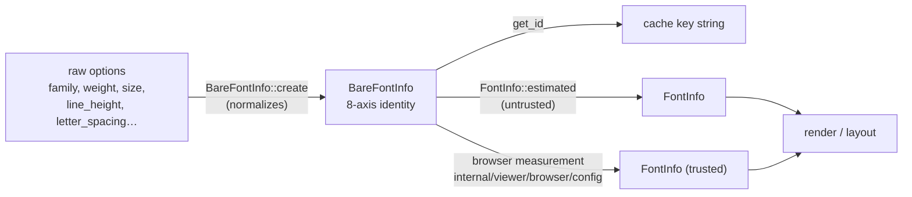
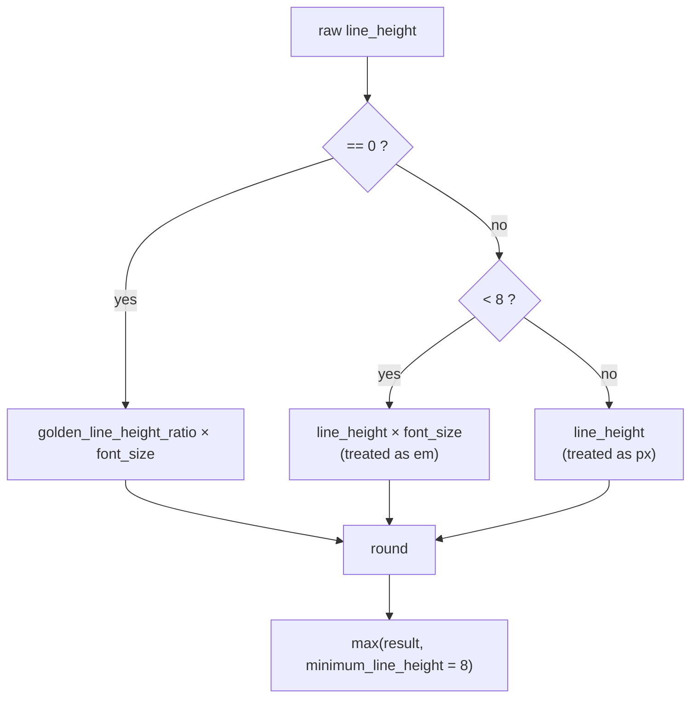

# viewer/common/config

DOM-free editor layout values and canonical font identities.

Nothing in this package measures anything — measurement needs a browser and
lives in `internal/viewer/browser/config`. What lives here is the *identity* of
a font configuration: the value that decides whether two configurations may
share a measurement cache entry, and the normalization rules that turn raw
option input into that identity.



## Font contract

- `BareFontInfo` is the eight-axis measurement/cache identity: pixel ratio,
  family, weight, size, feature settings, variation settings, integer line
  height, and letter spacing. `get_id` joins those axes in that order.

```mbt check
///|
test "get_id joins the eight axes in declaration order" {
  let bare = @config.BareFontInfo::create(
    font_family="Menlo",
    font_weight="normal",
    font_size=12.0,
    font_feature_settings=@config.editor_font_ligatures_off,
    font_variation_settings=@config.font_variation_off,
    line_height=18.0,
    letter_spacing=0.0,
    pixel_ratio=2.0,
  )
  debug_inspect(
    bare.get_id(),
    content=(
      #|"2-Menlo-normal-12-\"liga\" off, \"calt\" off-normal-18-0"
    ),
  )
}
```

### Line-height normalization

`BareFontInfo::create` follows Monaco's line-height normalization: `0` uses
the platform golden ratio, nonzero values below `8` are em multipliers, the
result is rounded and floored at `8`. The readonly viewer has no editor-zoom
option, so Monaco's zoom multiplier is fixed at `1`.



The golden ratio is platform-dependent, so the example asserts the *rule*
rather than a fixed number.

```mbt check
///|
fn line_height_for(raw : Double, size : Double) -> Int {
  @config.BareFontInfo::create(
    font_family="Menlo",
    font_weight="normal",
    font_size=size,
    font_feature_settings=@config.editor_font_ligatures_off,
    font_variation_settings=@config.font_variation_off,
    line_height=raw,
    letter_spacing=0.0,
    pixel_ratio=1.0,
  ).line_height
}

///|
test "zero means the platform golden ratio times the font size" {
  let expected = (@config.golden_line_height_ratio * 14.0).round().to_int()
  debug_inspect(
    (line_height_for(0.0, 14.0) == expected, expected >= 8),
    content=(
      #|(true, true)
    ),
  )
}
```

```mbt check
///|
test "below 8 is an em multiplier, 8 and above is a pixel value" {
  debug_inspect(
    (
      // em multipliers
      line_height_for(1.5, 20.0),
      line_height_for(2.0, 20.0),
      // pixel values
      line_height_for(24.0, 20.0),
      line_height_for(24.4, 20.0),
      // rounded, then floored at the minimum
      line_height_for(0.1, 20.0),
      @config.minimum_line_height,
    ),
    content=(
      #|(30, 40, 24, 24, 8, 8)
    ),
  )
}
```

### Font variation translation

Variation setting `translate` preserves `normal`/`bold` as ordinary weight
with variation `normal`. Other weights use JavaScript `parseInt(_, 10)`
decimal-prefix semantics, emit `'wght' N`, and normalize the retained weight
to `normal`.

The `parseInt` fidelity is literal, including its failure mode: a CSS keyword
weight such as `lighter` has no decimal prefix, so the axis is emitted as
`'wght' NaN`. That is the upstream behavior rather than a local defect, and it
is why callers pass numeric weights when they enable `translate`.

```mbt check
///|
fn translated(weight : String) -> (String, String) {
  let bare = @config.BareFontInfo::create(
    font_family="Menlo",
    font_weight=weight,
    font_size=12.0,
    font_feature_settings=@config.editor_font_ligatures_off,
    font_variation_settings=@config.font_variation_translate,
    line_height=0.0,
    letter_spacing=0.0,
    pixel_ratio=1.0,
  )
  (bare.font_weight, bare.font_variation_settings)
}

///|
test "translate emits a wght axis for numeric weights only" {
  debug_inspect(
    (
      translated("normal"),
      translated("bold"),
      translated("600"),
      // parseInt decimal-prefix semantics: trailing junk is ignored
      translated("350abc"),
      // no leading digits: parseInt yields NaN, and it is emitted verbatim
      translated("lighter"),
    ),
    content=(
      #|(
      #|  ("normal", "normal"),
      #|  ("bold", "normal"),
      #|  ("normal", "'wght' 600"),
      #|  ("normal", "'wght' 350"),
      #|  ("normal", "'wght' NaN"),
      #|)
    ),
  )
}
```

## FontInfo

MoonBit has no class inheritance, so `FontInfo` is the flattened
`BareFontInfo` fields plus the measured trust, monospace, half/full-width,
arrow, space, middot, word-separator-middot, and maximum-digit facts.

`FontInfo::equals` is Monaco's render/configuration identity: it deliberately
ignores `pixel_ratio`, `is_trusted`, and `is_monospace`. Structural `==`
still compares every MoonBit field; callers needing Monaco identity must use
`equals`. Using `==` where `equals` was meant causes spurious re-layout when a
window moves between displays.

```mbt check
///|
test "equals ignores pixel_ratio and trust, while == does not" {
  let bare = @config.BareFontInfo::create(
    font_family="Menlo",
    font_weight="normal",
    font_size=12.0,
    font_feature_settings=@config.editor_font_ligatures_off,
    font_variation_settings=@config.font_variation_off,
    line_height=0.0,
    letter_spacing=0.0,
    pixel_ratio=1.0,
  )
  let one = @config.FontInfo::estimated(bare)
  let retina = { ..one, pixel_ratio: 2.0, is_trusted: true, is_monospace: true }
  debug_inspect(
    (one.equals(retina), one == retina),
    content=(
      #|(true, false)
    ),
  )
}
```

`FontInfo::estimated` and `FontInfo::default` are untrusted headless values
used before DOM measurement. Font-info versioning, serialization, and restore
are absent because the viewer has no persistence channel.

```mbt check
///|
test "headless font info is explicitly untrusted" {
  let fallback = @config.FontInfo::default()
  debug_inspect(
    (
      fallback.is_trusted,
      @config.FontInfo::estimated(fallback.bare()).is_trusted,
      fallback.bare().font_size == fallback.font_size,
    ),
    content=(
      #|(false, false, true)
    ),
  )
}
```

## Defaults

`editor_font_defaults` selects the exact Menlo stack and 12px size on macOS,
the Consolas stack and 14px size on Windows, and the Droid Sans Mono stack and
14px size elsewhere. Default weight is `normal`; raw line height and letter
spacing are zero.

The three stacks are individually addressable, so a caller can name one without
depending on which platform the test happens to run on.

```mbt check
///|
test "the three platform stacks are named constants" {
  debug_inspect(
    (
      @config.default_mac_font_family, @config.default_windows_font_family, @config.default_linux_font_family,
    ),
    content=(
      #|(
      #|  "Menlo, Monaco, 'Courier New', monospace",
      #|  "Consolas, 'Courier New', monospace",
      #|  "'Droid Sans Mono', monospace",
      #|)
    ),
  )
}
```

```mbt check
///|
test "the platform-independent parts of the defaults" {
  let defaults = @config.editor_font_defaults
  debug_inspect(
    (
      defaults.font_weight,
      defaults.line_height,
      defaults.letter_spacing,
      // the size is 12 on macOS and 14 elsewhere
      defaults.font_size == 12.0 || defaults.font_size == 14.0,
    ),
    content=(
      #|("normal", 0, 0, true)
    ),
  )
}
```

## Layout

`EditorLayoutInfo` is the resolved horizontal band structure — glyph margin,
line numbers, decorations, content — plus the overall size and scrollbar
extents. It is a plain value: this package computes no layout, it only gives
the layout result one shared shape.

```mbt check
///|
test "EditorLayoutInfo bands are left offsets plus widths" {
  let layout : @config.EditorLayoutInfo = {
    width: 800.0,
    height: 600.0,
    glyph_margin_left: 0.0,
    glyph_margin_width: 0.0,
    line_numbers_left: 0.0,
    line_numbers_width: 40.0,
    decorations_left: 40.0,
    decorations_width: 10.0,
    content_left: 50.0,
    content_width: 736.0,
    horizontal_scrollbar_height: 12.0,
    vertical_scrollbar_width: 14.0,
  }
  debug_inspect(
    (
      layout.content_left == layout.decorations_left + layout.decorations_width,
      layout.content_left +
      layout.content_width +
      layout.vertical_scrollbar_width ==
      layout.width,
    ),
    content=(
      #|(true, true)
    ),
  )
}
```

## Boundaries and checks

This package is multi-target and depends only on `base/common`. See
`pkg.generated.mbti`.

```sh
moon test --target js viewer/common/config
moon test --target native viewer/common/config
```
