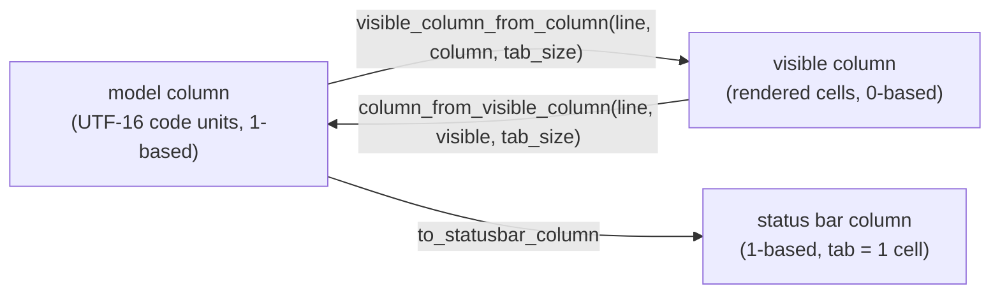
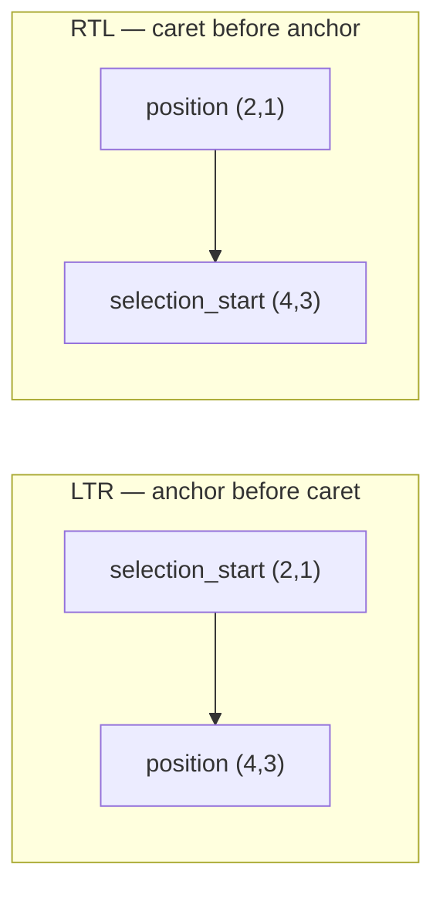

# viewer/common/core

Selection state and the column arithmetic that sits between a model column and
what the reader actually sees on screen.

## Two kinds of column

A model column counts UTF-16 code units. A *visible* column counts rendered
cells, so a tab is worth however many cells it takes to reach the next tab stop.
Everything that positions a caret, draws a selection, or reports a status-bar
position has to know which one it is holding.



Both directions take the line content, because the answer depends on which
characters precede the column.

```mbt check
///|
test "tabs make the visible column diverge from the model column" {
  // "\tab" — one tab then three characters, tab size 4.
  let line = "\tabc"
  debug_inspect(
    (
      // model column 1 is before the tab, so nothing is rendered yet
      @core.visible_column_from_column(line, 1, 4),
      // model column 2 is after the tab: it has consumed a full tab stop
      @core.visible_column_from_column(line, 2, 4),
      @core.visible_column_from_column(line, 3, 4),
      // and back again
      @core.column_from_visible_column(line, 4, 4),
      @core.column_from_visible_column(line, 5, 4),
    ),
    content=(
      #|(0, 4, 5, 2, 3)
    ),
  )
}
```

Without a tab the two agree, which is why the distinction is easy to forget.

```mbt check
///|
test "with no tabs the two column spaces coincide" {
  let line = "let x = 1"
  debug_inspect(
    (
      @core.visible_column_from_column(line, 5, 4),
      @core.column_from_visible_column(line, 4, 4),
    ),
    content=(
      #|(4, 5)
    ),
  )
}
```

`to_statusbar_column` is a third space again: it is the 1-based position a human
reads, where a tab counts as a single character rather than as its rendered
width.

```mbt check
///|
test "the status bar counts a tab as one character" {
  let line = "\tabc"
  debug_inspect(
    (
      @core.to_statusbar_column(line, 2, 4),
      @core.visible_column_from_column(line, 2, 4),
    ),
    content=(
      #|(5, 4)
    ),
  )
}
```

## Tab stops

The tab-stop helpers are pure arithmetic on a visible column. `render` stops are
what a tab character advances to; `indent` stops are what indentation commands
would use. They are separate because `tab_size` and `indent_size` are separate
settings.

```mbt check
///|
test "render tab stops round outward to the next multiple" {
  debug_inspect(
    (
      [
        @core.next_render_tab_stop(0, 4),
        @core.next_render_tab_stop(1, 4),
        @core.next_render_tab_stop(3, 4),
        @core.next_render_tab_stop(4, 4),
      ],
      [
        @core.prev_render_tab_stop(0, 4),
        @core.prev_render_tab_stop(1, 4),
        @core.prev_render_tab_stop(4, 4),
        @core.prev_render_tab_stop(5, 4),
      ],
    ),
    content=(
      #|([4, 4, 4, 8], [0, 0, 0, 4])
    ),
  )
}
```

```mbt check
///|
test "indent stops follow indent_size, not tab_size" {
  debug_inspect(
    (
      @core.next_indent_tab_stop(0, 2),
      @core.next_indent_tab_stop(3, 2),
      @core.prev_indent_tab_stop(5, 2),
    ),
    content=(
      #|(2, 4, 4)
    ),
  )
}
```

## Selection

A `Selection` is an ordered pair: where the gesture *started* and where the
caret *is*. That is strictly more information than a `Range`, because it also
records which end the user is dragging.



`start`/`end` normalize the pair into document order, while
`get_selection_start`/`get_position` preserve the gesture.

```mbt check
///|
test "direction is preserved while start and end are normalized" {
  let anchor = @base_common.Position(2, 1)
  let caret = @base_common.Position(4, 3)
  let forward = @core.Selection(anchor, caret)
  let backward = @core.Selection(caret, anchor)
  debug_inspect(
    (
      (forward.direction(), forward.start(), forward.end()),
      (backward.direction(), backward.start(), backward.end()),
      // the gesture endpoints are not normalized
      (backward.get_selection_start(), backward.get_position()),
    ),
    content=(
      #|(
      #|  (LTR, { line_number: 2, column: 1 }, { line_number: 4, column: 3 }),
      #|  (RTL, { line_number: 2, column: 1 }, { line_number: 4, column: 3 }),
      #|  ({ line_number: 4, column: 3 }, { line_number: 2, column: 1 }),
      #|)
    ),
  )
}
```

An empty selection is a bare caret: both endpoints coincide.

```mbt check
///|
test "an empty selection is a caret" {
  let at = @base_common.Position(3, 7)
  debug_inspect(
    (
      @core.Selection(at, at).is_empty(),
      @core.Selection(at, @base_common.Position(3, 8)).is_empty(),
    ),
    content=(
      #|(true, false)
    ),
  )
}
```

`set_start_position` and `set_end_position` move an endpoint in *document*
order and return a new value; they never mutate the receiver.

```mbt check
///|
test "endpoint updates are copies in document order" {
  let original = @core.Selection(
    @base_common.Position(2, 1),
    @base_common.Position(4, 3),
  )
  let moved = original.set_end_position(9, 1)
  debug_inspect(
    (original, moved),
    content=(
      #|(
      #|  {
      #|    selection_start: { line_number: 2, column: 1 },
      #|    position: { line_number: 4, column: 3 },
      #|  },
      #|  {
      #|    selection_start: { line_number: 2, column: 1 },
      #|    position: { line_number: 9, column: 1 },
      #|  },
      #|)
    ),
  )
}
```

## Metrics

`code_right_padding`, `editor_vertical_scrollbar_size`, and
`editor_horizontal_scrollbar_size` are the shared layout constants, kept here so
the layout, scrollbar, and browser packages cannot drift to different numbers.

```mbt check
///|
test "layout constants have one definition" {
  debug_inspect(
    (
      @core.code_right_padding, @core.editor_vertical_scrollbar_size, @core.editor_horizontal_scrollbar_size,
    ),
    content=(
      #|(16, 14, 12)
    ),
  )
}
```

## Boundaries and checks

This package maps to `vs/editor/common/core/{cursorColumns,selection}.ts`. It may
depend only on `base/common`; it must not import model, view-model, layout, DOM,
or host packages. The complete API is `pkg.generated.mbti`.

```sh
moon test --target js viewer/common/core
```
