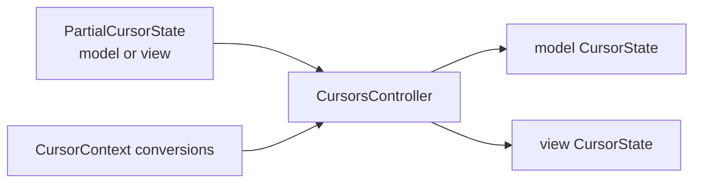

# viewer/common/cursor

Backend-neutral single-cursor state for the readonly viewer.

The cursor retains both model and projected-view coordinates. Callers supply
one side through `PartialCursorState`; `CursorsController` validates it and
derives the other side through `CursorContext`.



## Cursor values

`SingleCursorState` holds the anchor range, anchor kind, active position, and
leftover visible-column residues. `selection`, `has_selection`, and `moved`
derive the oriented `viewer/common/core.Selection`.

```mbt check
///|
fn collapsed(position : @base_common.Position) -> @cursor.SingleCursorState {
  @cursor.SingleCursorState(position, position, @cursor.Simple, position)
}

///|
test "moved either extends the anchor or starts a new caret" {
  let start = collapsed(@base_common.Position(2, 1))
  let extended = start.moved(true, @base_common.Position(4, 7))
  let restarted = start.moved(false, @base_common.Position(4, 7))
  debug_inspect(
    (
      (extended.has_selection(), extended.selection()),
      (restarted.has_selection(), restarted.selection()),
    ),
    content=(
      #|(
      #|  (
      #|    true,
      #|    {
      #|      selection_start: { line_number: 2, column: 1 },
      #|      position: { line_number: 4, column: 7 },
      #|    },
      #|  ),
      #|  (
      #|    false,
      #|    {
      #|      selection_start: { line_number: 4, column: 7 },
      #|      position: { line_number: 4, column: 7 },
      #|    },
      #|  ),
      #|)
    ),
  )
}
```

Word and line anchors remain ranges while dragging, so extending past an
anchor keeps the entire original anchor covered.

```mbt check
///|
test "a word anchor retains its shape" {
  let state = @cursor.SingleCursorState(
    Position(2, 5),
    Position(2, 10),
    Word,
    Position(2, 10),
  )
  debug_inspect(
    (
      state.moved(true, Position(4, 1)).selection(),
      state.moved(true, Position(1, 1)).selection(),
    ),
    content=(
      #|(
      #|  {
      #|    selection_start: { line_number: 2, column: 5 },
      #|    position: { line_number: 4, column: 1 },
      #|  },
      #|  {
      #|    selection_start: { line_number: 2, column: 10 },
      #|    position: { line_number: 1, column: 1 },
      #|  },
      #|)
    ),
  )
}
```

## Controller transitions

```mbt check
///|
fn identity_context() -> @cursor.CursorContext {
  CursorContext(
    view_to_model=position => position,
    view_range_to_model=range => range,
    model_to_view=position => position,
  )
}

///|
fn controller_for(
  text : String,
) -> (@cursor.CursorsController, @model.TextModel) raise {
  let model = @model.TextModel(
    @base_common.Uri::parse("file:///cursor-doc.mbt"),
    "cursor-doc.mbt",
    "moonbit",
    1,
    "rev-1",
    text,
  )
  (CursorsController(model, identity_context()), model)
}

///|
fn set_selection(
  controller : @cursor.CursorsController,
  selection : @core.Selection,
) -> @cursor.CursorStateChange? {
  controller.set_cursor_state(
    Some(@cursor.CursorState::from_model_selection(selection)),
  )
}

///|
test "an identical transition produces no second change" {
  let (controller, model) = controller_for("fn main {\n  println(1)\n}\n")
  let selection = @core.Selection(Position(2, 3), Position(2, 3))
  let first = set_selection(controller, selection)
  let repeat = set_selection(controller, selection)
  debug_inspect(
    (first is Some(_), repeat is Some(_), controller.get_model_selection()),
    content=(
      #|(
      #|  true,
      #|  false,
      #|  {
      #|    selection_start: { line_number: 2, column: 3 },
      #|    position: { line_number: 2, column: 3 },
      #|  },
      #|)
    ),
  )
  model.dispose()
}
```

Positions are validated against the model. A caller cannot park the caret past
the final line or line end.

```mbt check
///|
test "out-of-range positions are clamped" {
  let (controller, model) = controller_for("ab\ncd\n")
  set_selection(controller, @core.Selection(Position(99, 99), Position(99, 99)))
  |> ignore
  debug_inspect(
    controller.get_model_selection(),
    content=(
      #|{
      #|  selection_start: { line_number: 3, column: 1 },
      #|  position: { line_number: 3, column: 1 },
      #|}
    ),
  )
  model.dispose()
}
```

`CursorStateChange` carries both model versions, selection snapshots, source,
reason, and whether the transition should emit an outgoing event. An exact
paired-state/version no-op returns `None`.

## Boundaries and checks

The package depends on `base/common`, `viewer/common/editor_api`,
`viewer/common/core`, and `viewer/common/model`; it has no view-model, DOM, or
FFI dependency. Implementation carriers remain abstract outside the package.

```sh
moon test --target all viewer/common/cursor
```
