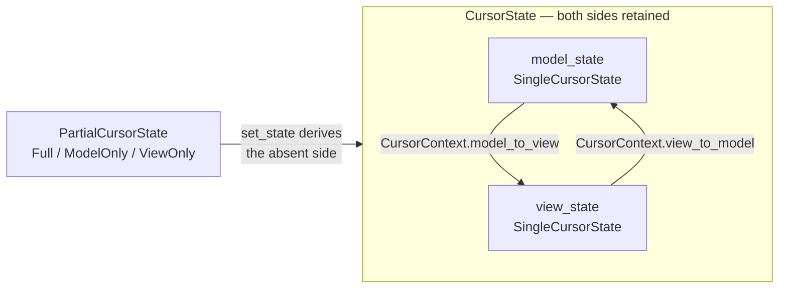
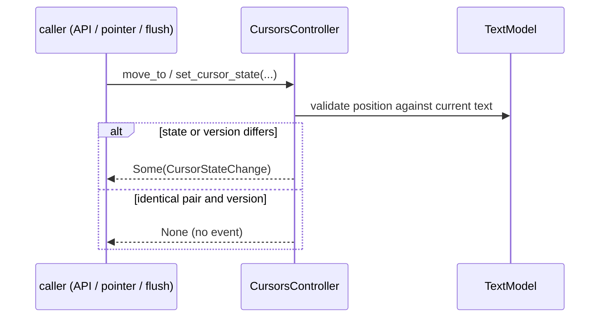

# viewer/common/cursor

Backend-neutral single-cursor state for the readonly viewer.

The hard part is not "where is the caret". It is that the caret exists in *two*
coordinate spaces at once — the model's, and the projected view's after wrapping
and folding — and both have to stay consistent through every move, every model
flush, and every re-projection.



## The cursor value

`SingleCursorState` holds an anchor range, `SelectionStartKind`, and active
1-based UTF-16 position plus anchor/active leftover-visible-column residues;
`selection`, `has_selection`, and `moved` derive the oriented
`viewer/common/core.Selection` without losing Word/Line anchor shape.

A collapsed state is a caret: anchor and position coincide.

```mbt check
///|
test "a collapsed state has no selection" {
  let state = @cursor.SingleCursorState::collapsed(Position(3, 5))
  debug_inspect(
    (state.has_selection(), state.selection(), state.selection_start_kind),
    content=(
      #|(
      #|  false,
      #|  {
      #|    selection_start: { line_number: 3, column: 5 },
      #|    position: { line_number: 3, column: 5 },
      #|  },
      #|  Simple,
      #|)
    ),
  )
}
```

`moved` produces the next state. Its first argument is "keep the anchor" —
`true` extends the existing selection, `false` collapses to a fresh caret. This
is the difference between a plain click and a shift-click.

```mbt check
///|
test "moved either extends from the anchor or restarts" {
  let start = @cursor.SingleCursorState::collapsed(Position(2, 1))
  let extended = start.moved(true, Position(4, 7))
  let restarted = start.moved(false, Position(4, 7))
  debug_inspect(
    (
      (extended.has_selection(), extended.selection()),
      (restarted.has_selection(), restarted.selection()),
    ),
    content=(
      #|(
      #|  (
      #|    true,
      #|    {
      #|      selection_start: { line_number: 2, column: 1 },
      #|      position: { line_number: 4, column: 7 },
      #|    },
      #|  ),
      #|  (
      #|    false,
      #|    {
      #|      selection_start: { line_number: 4, column: 7 },
      #|      position: { line_number: 4, column: 7 },
      #|    },
      #|  ),
      #|)
    ),
  )
}
```

The anchor is a *range*, not a point, which is what preserves a double-click
word or triple-click line selection while the pointer keeps dragging. Extending
past the anchor keeps the whole anchor range covered.

```mbt check
///|
test "a Word or Line anchor keeps its shape while dragging" {
  let word_anchor = @cursor.SingleCursorState(
    Position(2, 5),
    Position(2, 10),
    Word,
    Position(2, 10),
  )
  let dragged_right = word_anchor.moved(true, Position(4, 1))
  let dragged_left = word_anchor.moved(true, Position(1, 1))
  debug_inspect(
    (
      word_anchor.selection_start_kind,
      dragged_right.selection(),
      dragged_left.selection(),
    ),
    content=(
      #|(
      #|  Word,
      #|  {
      #|    selection_start: { line_number: 2, column: 5 },
      #|    position: { line_number: 4, column: 1 },
      #|  },
      #|  {
      #|    selection_start: { line_number: 2, column: 10 },
      #|    position: { line_number: 1, column: 1 },
      #|  },
      #|)
    ),
  )
}
```

`leftover_visible_columns` is the residue that makes vertical movement
"remember" a desired column across short lines. It rides along with the state
rather than living in a separate sticky-column variable.

```mbt check
///|
test "the leftover visible column travels with the state" {
  let state = @cursor.SingleCursorState::collapsed(Position(1, 1)).moved(
    false,
    Position(2, 3),
    leftover_visible_columns=6,
  )
  debug_inspect(
    (state.position, state.leftover_visible_columns),
    content=(
      #|({ line_number: 2, column: 3 }, 6)
    ),
  )
}
```

## The two sides

`CursorContext` stores only the three typed model/view conversion closures the
cursor consumes; it does not retain a runtime converter trait object.

`CursorState` retains a full model/view pair. `PartialCursorState` has exact
full, model-only, and view-only shapes; the two partial constructors retain
`None` on the absent side, and selection constructors build a collapsed
`Simple` anchor in source order.

```mbt check
///|
test "partial states retain None on the absent side" {
  let state = @cursor.SingleCursorState::collapsed(Position(1, 1))
  let model_only = @cursor.CursorState::from_model_state(state)
  let view_only = @cursor.CursorState::from_view_state(state)
  debug_inspect(
    (
      (model_only.model_state() is Some(_), model_only.view_state() is Some(_)),
      (view_only.model_state() is Some(_), view_only.view_state() is Some(_)),
    ),
    content=(
      #|((true, false), (false, true))
    ),
  )
}
```

`Cursor` consumes nullable model/view sides through one `set_state` entry: both
absent is a no-op, model derives view, and view derives model while retaining
the authoritative projected position.

The example below uses an identity projection so the derivation is visible
without a real view model; a wrapping projection would make the two sides
differ.

```mbt check
///|
/// An identity projection: model and view coordinates coincide.
fn identity_context() -> @cursor.CursorContext {
  CursorContext(
    view_to_model=position => position,
    view_range_to_model=range => range,
    model_to_view=position => position,
  )
}

///|
test "setting one side derives the other" {
  let cursor = @cursor.Cursor()
  cursor.set_model_state(
    identity_context(),
    @cursor.SingleCursorState::collapsed(Position(5, 2)),
  )
  debug_inspect(
    (cursor.model_state.position, cursor.view_state.position),
    content=(
      #|({ line_number: 5, column: 2 }, { line_number: 5, column: 2 })
    ),
  )
}
```

## The controller

`CursorsController` owns the model, conversion context, one cursor, the known
internal model version, validation, and the shared `set_cursor_state`
transition snapshot used by API, pointer, keyboard, and content-flush
callers.



A changed transition returns `CursorStateChange?`; an exact paired-state/version
no-op returns `None`. That `None` is what keeps a redundant `set_model` or a
repeated click from emitting a spurious selection event.

```mbt check
///|
fn controller_for(text : String) -> @cursor.CursorsController raise {
  let model = @model.TextModel(
    @base_common.Uri::parse("file:///cursor-doc.mbt"),
    "cursor-doc.mbt",
    "moonbit",
    1,
    "rev-1",
    text,
  )
  CursorsController(model, identity_context())
}

///|
test "an identical transition produces no change" {
  let controller = controller_for("fn main {\n  println(1)\n}\n")
  let first = controller.move_to(Position(2, 3), false)
  let repeat = controller.move_to(Position(2, 3), false)
  debug_inspect(
    (
      first.map(change => (change.reason, change.selections)),
      repeat is Some(_),
      controller.get_model_selection(),
    ),
    content=(
      #|(
      #|  Some(
      #|    (
      #|      NotSet,
      #|      [
      #|        {
      #|          selection_start: { line_number: 2, column: 3 },
      #|          position: { line_number: 2, column: 3 },
      #|        },
      #|      ],
      #|    ),
      #|  ),
      #|  false,
      #|  {
      #|    selection_start: { line_number: 2, column: 3 },
      #|    position: { line_number: 2, column: 3 },
      #|  },
      #|)
    ),
  )
}
```

Positions are validated against the model, so a caller cannot park the caret
past the end of a line or beyond the last line.

```mbt check
///|
test "out-of-range positions are clamped into the document" {
  let controller = controller_for("ab\ncd\n")
  controller.move_to(Position(99, 99), false) |> ignore
  debug_inspect(
    controller.get_model_selection(),
    content=(
      #|{
      #|  selection_start: { line_number: 3, column: 1 },
      #|  position: { line_number: 3, column: 1 },
      #|}
    ),
  )
}
```

Selecting is the same entry with the anchor kept, so the controller has one
transition path rather than a separate "extend" code path.

```mbt check
///|
test "move_to_select extends from the existing anchor" {
  let controller = controller_for("alpha\nbeta\ngamma\n")
  @cursor.move_to(controller, Position(1, 2))
  @cursor.move_to_select(controller, Position(3, 4))
  let selection = controller.get_model_selection()
  debug_inspect(
    (selection.direction(), selection.start(), selection.end()),
    content=(
      #|(LTR, { line_number: 1, column: 2 }, { line_number: 3, column: 4 })
    ),
  )
}
```

A content flush always resets to `(1,1)` with source `model`, reason
`ContentFlush`, old version `0`, and no old selections. Nothing is preserved,
because after a whole-text replacement the previous position has no meaning.

The controller does **not** subscribe to the model itself. Its owner — the view
model — receives the internal content-change event and forwards it, so the
reset is an explicit `on_model_content_changed` call rather than a hidden
side effect of `set_value`.

```mbt check
///|
test "a forwarded content flush resets to the document start" {
  let controller = controller_for("alpha\nbeta\n")
  @cursor.move_to(controller, Position(2, 3))
  let before = controller.get_model_selection().position

  // Stand in for the view model: forward the internal event to the controller.
  let flushes : Array[@model.InternalModelContentChangeEvent] = []
  let subscription = controller.model.register_view_model(
    event => flushes.push(event),
    _ => (),
  )
  controller.model.set_value("completely different text\n")

  // Until the owner forwards it, the caret is untouched.
  let unforwarded = controller.get_model_selection().position
  let change = flushes.map(event => controller.on_model_content_changed(event))
  subscription.dispose()
  debug_inspect(
    (
      before,
      unforwarded,
      controller.get_model_selection().position,
      change.map(c => c.map(v => (v.reason, v.source, v.old_model_version_id))),
    ),
    content=(
      #|(
      #|  { line_number: 2, column: 3 },
      #|  { line_number: 2, column: 3 },
      #|  { line_number: 1, column: 1 },
      #|  [Some((ContentFlush, "model", 0))],
      #|)
    ),
  )
}
```

`viewer/common/editor_api.CursorChangeReason` is the canonical public reason;
paired `CursorState` and `CursorStateChange` retain cursor-owned transition
state consumed by `viewer/common/view_model`. Free
`move_to`/`move_to_select` remain the low-level pointer command subset;
source-shaped Left/Right/Up/Down/Page/Home/End and Word/Line continuation live
in the view-model package where projected-line facts are available.

## Deliberate reductions

There is one selection only. Editable marker recovery, edit-operation tracking,
multi-cursor limits, and simultaneous supplied model+view cross-validation are
deferred. Mapping changes reproject from the model side; live view-driven moves
are normalized by `viewer/common/view_model` before this package validates the
derived model side. The one-cursor `normalize` member therefore takes the
source's primary-only early return before allocating or sorting. Atomic
soft-tab movement, full grapheme-cluster stepping/visible-column arithmetic,
and visual RTL arrow swapping are outside this package's current cursor
contract; current horizontal stepping is surrogate-pair safe and otherwise
code-point based.

## Boundaries and checks

Upstream sources are `cursorCommon.ts`, `cursorContext.ts`, `oneCursor.ts`,
`cursor.ts`/`cursorCollection.ts`, and the selection part of `coreCommands.ts`.

The package depends on `base/common`, `viewer/common/editor_api`,
`viewer/common/core`, and `viewer/common/model`; it has no view-model, DOM, or
FFI dependency. See `pkg.generated.mbti` for the complete API.

```sh
moon test --target all viewer/common/cursor
```
