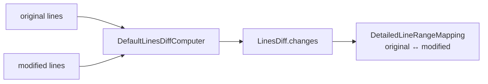

# viewer/common/diff

Line-diff contracts and the default computer used by quick diff.

This DOM-free package turns two arrays of lines into detailed half-open line
range mappings. Quick diff consumes those mappings to place gutter
decorations; the algorithm does not know about models, decorations, or the DOM.



## Computing a diff

```mbt check
///|
let line_options : @diff.LinesDiffComputerOptions = {
  ignore_trim_whitespace: false,
  max_computation_time_ms: 1000,
  compute_moves: false,
}

///|
test "an edited line maps one original range onto one modified range" {
  let result = @diff.get_default().compute_diff(
    ["fn main {", "  println(1)", "}"],
    ["fn main {", "  println(2)", "}"],
    line_options,
  )
  debug_inspect(
    result.changes.map(change => (change.original, change.modified)),
    content=(
      #|[
      #|  (
      #|    { start_line_number: 2, end_line_number_exclusive: 3 },
      #|    { start_line_number: 2, end_line_number_exclusive: 3 },
      #|  ),
      #|]
    ),
  )
}
```

An insertion has an empty original range; a deletion has an empty modified
range. Identical inputs produce no changes.

```mbt check
///|
test "insertions and identical inputs keep half-open range semantics" {
  let inserted = @diff.get_default().compute_diff(
    ["a", "c"],
    ["a", "b", "c"],
    line_options,
  )
  let identical = @diff.get_default().compute_diff(
    ["a", "b"],
    ["a", "b"],
    line_options,
  )
  debug_inspect(
    (
      inserted.changes.map(change => {
        (change.original.is_empty(), change.original, change.modified)
      }),
      identical.changes.length(),
    ),
    content=(
      #|(
      #|  [
      #|    (
      #|      true,
      #|      { start_line_number: 2, end_line_number_exclusive: 2 },
      #|      { start_line_number: 2, end_line_number_exclusive: 3 },
      #|    ),
      #|  ],
      #|  0,
      #|)
    ),
  )
}
```

## Whitespace policy

`ignore_trim_whitespace` decides whether re-indentation is a change.

```mbt check
///|
test "ignore_trim_whitespace can ignore re-indentation" {
  let original = ["fn main {", "println(1)", "}"]
  let modified = ["fn main {", "  println(1)", "}"]
  let strict = @diff.get_default().compute_diff(
    original, modified, line_options,
  )
  let lenient = @diff.get_default().compute_diff(original, modified, {
    ignore_trim_whitespace: true,
    max_computation_time_ms: 1000,
    compute_moves: false,
  })
  debug_inspect(
    (strict.changes.length(), lenient.changes.length()),
    content=(
      #|(1, 0)
    ),
  )
}
```

## Boundaries and checks

The mapping shapes follow `vs/editor/common/diff/`. Computation delegates to
`moonbit-community/piediff`; `max_computation_time_ms` preserves the bounded
work contract callers depend on. Internal mapping helpers and constructors are
not part of the package interface.

```sh
moon test --target js viewer/common/diff
```
