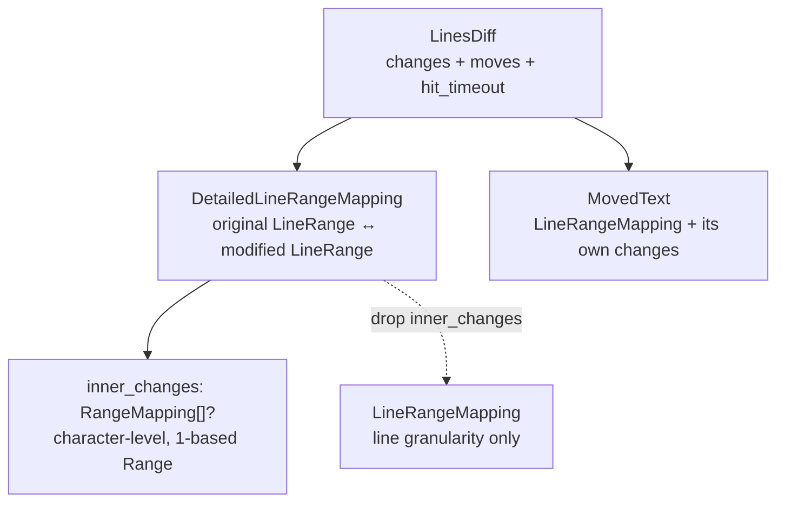

# viewer/common/diff

Line-diff contracts and the default computer used by quick diff.

This is the only package in `viewer/common/**` that runs a real algorithm rather
than holding state: it turns two arrays of lines into a set of mappings. Quick
diff consumes those mappings to place gutter decorations; nothing here knows
about gutters, decorations, or the DOM.

## The mapping vocabulary



Every mapping is a *pair* of ranges — one in the original, one in the modified —
because a diff hunk is a correspondence, not a location. Line ranges are the
half-open `@base_common.LineRange`; the character-level `inner_changes` use
1-based `Range`.

## Computing a diff

```mbt check
///|
/// The option set used by every example on this page.
let line_options : @diff.LinesDiffComputerOptions = {
  ignore_trim_whitespace: false,
  max_computation_time_ms: 1000,
  compute_moves: false,
}

///|
test "an edited line maps one original range onto one modified range" {
  let result = @diff.get_default().compute_diff(
    ["fn main {", "  println(1)", "}"],
    ["fn main {", "  println(2)", "}"],
    line_options,
  )
  debug_inspect(
    (
      result.hit_timeout,
      result.changes.map(change => change.to_string()),
      result.moves.length(),
    ),
    content=(
      #|(false, ["{[2,3)->[2,3)}"], 0)
    ),
  )
}
```

An insertion produces an *empty* original range: start equals
end-exclusive, so the hunk has nowhere to point in the original text.

```mbt check
///|
test "an insertion has an empty original range" {
  let result = @diff.get_default().compute_diff(
    ["a", "c"],
    ["a", "b", "c"],
    line_options,
  )
  debug_inspect(
    result.changes.map(change => {
      (change.original.is_empty(), change.original, change.modified)
    }),
    content=(
      #|[
      #|  (
      #|    true,
      #|    { start_line_number: 2, end_line_number_exclusive: 2 },
      #|    { start_line_number: 2, end_line_number_exclusive: 3 },
      #|  ),
      #|]
    ),
  )
}
```

Symmetrically, a deletion has an empty *modified* range. `flip` exchanges the
two sides, which is how a caller reuses one computation for both directions.

```mbt check
///|
test "a deletion is the flip of an insertion" {
  let result = @diff.get_default().compute_diff(
    ["a", "b", "c"],
    ["a", "c"],
    line_options,
  )
  debug_inspect(
    result.changes.map(change => (change.to_string(), change.flip().to_string())),
    content=(
      #|[("{[2,3)->[2,2)}", "{[2,2)->[2,3)}")]
    ),
  )
}
```

Identical inputs produce no changes at all — quick diff relies on this to avoid
decorating an unmodified file.

```mbt check
///|
test "identical input produces no hunks" {
  let lines = ["one", "two", "three"]
  let result = @diff.get_default().compute_diff(lines, lines, line_options)
  debug_inspect(
    (result.changes.length(), result.moves.length(), result.hit_timeout),
    content=(
      #|(0, 0, false)
    ),
  )
}
```

## Whitespace policy

`ignore_trim_whitespace` decides whether a re-indentation is a change. It is an
option rather than a default because a quick-diff gutter and a review view want
opposite answers.

```mbt check
///|
test "ignore_trim_whitespace decides whether re-indentation is a change" {
  let original = ["fn main {", "println(1)", "}"]
  let modified = ["fn main {", "  println(1)", "}"]
  let strict = @diff.get_default().compute_diff(original, modified, {
    ignore_trim_whitespace: false,
    max_computation_time_ms: 1000,
    compute_moves: false,
  })
  let lenient = @diff.get_default().compute_diff(original, modified, {
    ignore_trim_whitespace: true,
    max_computation_time_ms: 1000,
    compute_moves: false,
  })
  debug_inspect(
    (strict.changes.length(), lenient.changes.length()),
    content=(
      #|(1, 0)
    ),
  )
}
```

## Inverting a mapping set

`LineRangeMapping::inverse` returns the *unchanged* regions between hunks, given
the two document lengths. Callers that need to walk matched territory use it
instead of recomputing a diff.

```mbt check
///|
test "inverse yields the unchanged regions between hunks" {
  let changed = [@diff.LineRangeMapping(LineRange(2, 3), LineRange(2, 3))]
  debug_inspect(
    @diff.LineRangeMapping::inverse(changed, 4, 4).map(m => m.to_string()),
    content=(
      #|["{[1,2)->[1,2)}", "{[3,5)->[3,5)}"]
    ),
  )
}
```

`join` merges two adjacent mappings into their covering mapping, and
`changed_line_count` reports the modified-side line span.

```mbt check
///|
test "join covers two mappings and changed_line_count measures the modified side" {
  let first = @diff.LineRangeMapping(LineRange(1, 2), LineRange(1, 3))
  let second = @diff.LineRangeMapping(LineRange(4, 5), LineRange(5, 6))
  debug_inspect(
    (
      first.join(second).to_string(),
      first.changed_line_count(),
      second.changed_line_count(),
    ),
    content=(
      #|("{[1,5)->[1,6)}", 2, 1)
    ),
  )
}
```

## Boundaries and checks

The mapping shapes follow `vs/editor/common/diff/`. The computation itself is
delegated to `moonbit-community/piediff` rather than reimplementing Monaco's
`defaultLinesDiffComputer`; `hit_timeout` and `max_computation_time_ms` preserve
the bounded-work contract callers depend on.

This package may depend only on `base/common` and `piediff`. It must not import
model, view-model, contribution, DOM, or host packages — quick diff's baseline
state lives in `internal/viewer/contrib/quick_diff/common`, and its host handle
in `viewer/common/quick_diff_api`. The complete API is `pkg.generated.mbti`.

```sh
moon test --target js viewer/common/diff
```
