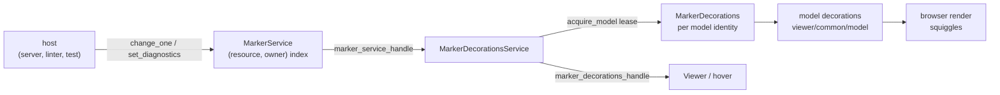
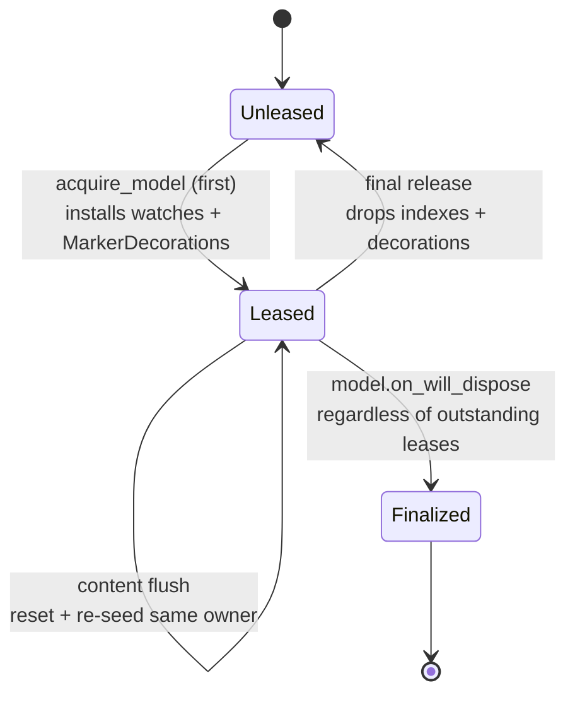

# viewer/common/markers

Backend-neutral diagnostic storage and marker-to-decoration projection.

Two services sit in series. `MarkerService` is a pure store keyed by owner and
resource; `MarkerDecorationsService` turns the markers for a *live model* into
model decorations and keeps them tracked as the model changes.



## Values

`Marker`/`MarkerData` carry Monaco-shaped severity, tags, owner, resource, and
range metadata. `from_diagnostic`/`to_diagnostic` bridge `language.Diagnostic`,
which is how a host that speaks the `language` vocabulary reaches this store
without depending on Monaco's numeric severities.

```mbt check
///|
test "severity and tag bridge language.Diagnostic in both directions" {
  let severities : Array[@language.DiagnosticSeverity] = [
    Error,
    Warning,
    Info,
    Hint,
  ]
  debug_inspect(
    severities.map(severity => {
      let marker_severity = @markers.MarkerSeverity::from_diagnostic_severity(
        severity,
      )
      (
        marker_severity.label(),
        marker_severity.value(),
        marker_severity.to_diagnostic_severity() == severity,
      )
    }),
    content=(
      #|[
      #|  ("Error", 8, true),
      #|  ("Warning", 4, true),
      #|  ("Info", 2, true),
      #|  ("", 1, true),
      #|]
    ),
  )
}
```

`Hint` deliberately has an empty label: Monaco renders hints without a severity
word, so a caller that prints `label()` must handle the empty string rather than
assume every severity names itself.

```mbt check
///|
test "a diagnostic round-trips through Marker" {
  let uri = @base_common.Uri::parse("file:///src/main.mbt")
  let diagnostic : @language.Diagnostic = {
    range: Range(3, 1, 3, 9),
    severity: Warning,
    message: "unused binding",
    tags: Some([Unnecessary]),
  }
  let marker = @markers.Marker::from_diagnostic("moon-check", uri, diagnostic)
  debug_inspect(
    (
      marker.range(),
      marker.has_tag(Unnecessary),
      marker.has_tag(Deprecated),
      marker.to_diagnostic() == diagnostic,
    ),
    content=(
      #|(
      #|  {
      #|    start_line_number: 3,
      #|    start_column: 1,
      #|    end_line_number: 3,
      #|    end_column: 9,
      #|  },
      #|  true,
      #|  false,
      #|  true,
      #|)
    ),
  )
}
```

`MarkerData::to_marker` returns an option because a data value can be
un-promotable, so validation happens once at the boundary rather than at every
read.

```mbt check
///|
test "MarkerData validates when it is promoted to a Marker" {
  let uri = @base_common.Uri::parse("file:///src/main.mbt")
  let ok = @markers.MarkerData(
    severity=Error,
    message="boom",
    start_line_number=1,
    start_column=1,
    end_line_number=1,
    end_column=5,
  ).to_marker("owner", uri)
  let empty_message = @markers.MarkerData(
    severity=Error,
    message="",
    start_line_number=1,
    start_column=1,
    end_line_number=1,
    end_column=5,
  ).to_marker("owner", uri)
  debug_inspect(
    (ok is Some(_), empty_message is Some(_)),
    content=(
      #|(true, false)
    ),
  )
}
```

## The store

`MarkerService` indexes values in both `(resource, owner)` directions. It exposes
`change_one`/`change_all`, `set_diagnostics`, filtered `read`, removal, resource
filters, per-severity statistics, and merged change events.

Owners are independent: replacing one owner's markers for a resource leaves
another owner's markers for the same resource untouched. That is what lets a
type checker and a linter publish into the same file without racing.

```mbt check
///|
test "owners are independent for the same resource" {
  let service = @markers.MarkerService()
  let uri = @base_common.Uri::parse("file:///src/main.mbt")
  service.change_one("typecheck", uri, [
    MarkerData(
      severity=Error,
      message="type error",
      start_line_number=1,
      start_column=1,
      end_line_number=1,
      end_column=2,
    ),
  ])
  service.change_one("lint", uri, [
    MarkerData(
      severity=Warning,
      message="style",
      start_line_number=2,
      start_column=1,
      end_line_number=2,
      end_column=2,
    ),
  ])
  // Replacing one owner's set does not disturb the other.
  service.change_one("lint", uri, [])
  debug_inspect(
    (
      service.markers_for_resource(uri).map(m => m.to_diagnostic().message),
      service.read(MarkerReadOptions(owner="typecheck")).length(),
      service.read(MarkerReadOptions(owner="lint")).length(),
    ),
    content=(
      #|(["type error"], 1, 0)
    ),
  )
}
```

`read` filters by owner, resource, a severity bitmask, and a `take` limit, so a
caller asks the store for exactly the slice it will render.

```mbt check
///|
test "read filters by severity mask and take limit" {
  let service = @markers.MarkerService()
  let uri = @base_common.Uri::parse("file:///src/main.mbt")
  service.change_one("owner", uri, [
    MarkerData(
      severity=Error,
      message="e1",
      start_line_number=1,
      start_column=1,
      end_line_number=1,
      end_column=2,
    ),
    MarkerData(
      severity=Warning,
      message="w1",
      start_line_number=2,
      start_column=1,
      end_line_number=2,
      end_column=2,
    ),
    MarkerData(
      severity=Warning,
      message="w2",
      start_line_number=3,
      start_column=1,
      end_line_number=3,
      end_column=2,
    ),
  ])
  let errors_only = @markers.MarkerSeverity::Error.value()
  debug_inspect(
    (
      service.read(MarkerReadOptions(severities=errors_only)).length(),
      service.read(MarkerReadOptions(take=2)).length(),
      (
        service.statistics().errors,
        service.statistics().warnings,
        service.statistics().infos,
      ),
    ),
    content=(
      #|(1, 2, (1, 2, 0))
    ),
  )
}
```

Change events are merged. Its `MicrotaskEmitter` flushes inline unless the
caller supplies a scheduler, so a test observes one event per mutation while a
browser host batches a burst into one.

```mbt check
///|
test "an injected scheduler batches a burst of changes into one event" {
  let pending : Array[() -> Unit] = []
  let service = @markers.MarkerService(schedule=run => pending.push(run))
  let first = @base_common.Uri::parse("file:///a.mbt")
  let second = @base_common.Uri::parse("file:///b.mbt")
  let batches = []
  service.on_did_change_markers(uris => batches.push(uris.length())) |> ignore
  let one_error = message => {
    [
      @markers.MarkerData(
        severity=Error,
        message~,
        start_line_number=1,
        start_column=1,
        end_line_number=1,
        end_column=2,
      ),
    ]
  }
  service.change_one("owner", first, one_error("a"))
  service.change_one("owner", second, one_error("b"))
  let scheduled = pending.length()
  for run in pending {
    run()
  }
  debug_inspect(
    (scheduled, batches),
    content=(
      #|(1, [2])
    ),
  )
}
```

`MarkerService::marker_service_handle` borrows exactly the change, read, and
remove capabilities needed to construct a decoration adapter. The caller
retains and disposes the concrete store.

## Decorations and model leases

`MarkerDecorationsService::acquire_model` returns an independently idempotent
lease keyed by `TextModel.identity()`. The first lease owns one content watch,
one model-dispose watch, and one `MarkerDecorations`; reacquisition only
increments a refcount.



Final ordinary release removes both identity indexes and decorations but never
removes host-owned diagnostics — the store outlives any particular view of it.

```mbt check
///|
fn marker_model(text : String) -> @model.TextModel raise {
  TextModel(
    @base_common.Uri::parse("file:///markers-doc.mbt"),
    "markers-doc.mbt",
    "moonbit",
    1,
    "rev-1",
    text,
  )
}

///|
test "releasing every lease keeps the host's diagnostics" {
  let store = @markers.MarkerService()
  let decorations = @markers.MarkerDecorationsService(
    store.marker_service_handle(),
  )
  let model = marker_model("let x = 1\nlet y = 2\n")
  store.change_one("owner", model.uri, [
    MarkerData(
      severity=Error,
      message="boom",
      start_line_number=1,
      start_column=1,
      end_line_number=1,
      end_column=4,
    ),
  ])
  let first = decorations.acquire_model(model)
  let second = decorations.acquire_model(model)
  let while_leased = decorations.get_live_markers_for_model(model).length()
  first.dispose()
  let after_one_release = decorations.get_live_markers_for_model(model).length()
  second.dispose()
  debug_inspect(
    (
      while_leased,
      after_one_release,
      decorations.get_live_markers_for_model(model).length(),
      // the store is untouched by lease lifetime
      store.markers_for_resource(model.uri).length(),
    ),
    content=(
      #|(1, 1, 0, 1)
    ),
  )
}
```

`get_live_markers_for_model(model)` is the model-specific hover boundary.
`get_live_resolved_marker_decorations_for_model(model)` returns the same live
marker occurrences together with their tracked ranges and
`create_decoration_option` result. Browser presentations use that resolved
form to reuse the Code decoration severity/tag/range policy without creating
another marker store or synthetic model decoration.

Suppressions are temporary and scoped to a URI range, which is how a widget
hides the squiggle it is currently explaining without mutating the store.

```mbt check
///|
test "a suppression hides an occurrence until it is disposed" {
  let store = @markers.MarkerService()
  let decorations = @markers.MarkerDecorationsService(
    store.marker_service_handle(),
  )
  let model = marker_model("let x = 1\nlet y = 2\n")
  store.change_one("owner", model.uri, [
    MarkerData(
      severity=Error,
      message="boom",
      start_line_number=1,
      start_column=1,
      end_line_number=1,
      end_column=4,
    ),
  ])
  let lease = decorations.acquire_model(model)
  let before = decorations.get_live_markers_for_model(model).length()
  let suppression = decorations.add_marker_suppression(
    model.uri,
    Range(1, 1, 1, 4),
  )
  let during = decorations.get_live_markers_for_model(model).length()
  suppression.dispose()
  let after = decorations.get_live_markers_for_model(model).length()
  lease.dispose()
  debug_inspect(
    (before, during, after),
    content=(
      #|(1, 0, 1)
    ),
  )
}
```

Distinct live models may share a URI. A secondary acquisition-ordered
`URI -> Array[identity]` index fans marker changes to every identity.
`get_marker(uri, id)` scans that order (model decoration ids carry an identity
prefix), while `get_live_markers(uri)` returns the ordered union.

A real `model.on_will_dispose` event finalizes the active identity regardless
of outstanding leases. Only that path may clear markers for `inmemory`,
`internal`, or `vscode` resources, and only after the URI's final live identity
is gone. Ordinary lease release and service disposal preserve `MarkerService`.

`MarkerDecorationsService::dispose` blocks marker and outward-event ingress
first, then releases every model watch and decoration owner, and clears its
indexes last. The injected marker-store handle is borrowed. The paired
`on_model_added`/`on_model_removed` methods remain compatibility shims; new
owners retain the disposable returned by `acquire_model`.

Each live owner converts up to the first 500 markers for its resource into
model decorations and applies the URI's temporary range suppressions.
Structurally equal recreated markers are paired one occurrence at a time, so
duplicate diagnostics preserve their exact multiplicity across updates.

## Decoration policy

`create_decoration_range`/`create_decoration_option` preserve Monaco's empty,
full-line, hint, severity, and tag branches. An empty marker range is widened so
a zero-width diagnostic is still visible.

```mbt check
///|
test "an empty marker range is widened to something visible" {
  let model = marker_model("let x = 1\n")
  let uri = model.uri
  let collapsed = @markers.Marker::from_diagnostic("owner", uri, {
    range: Range(1, 5, 1, 5),
    severity: Error,
    message: "here",
    tags: None,
  })
  let spanning = @markers.Marker::from_diagnostic("owner", uri, {
    range: Range(1, 1, 1, 4),
    severity: Error,
    message: "here",
    tags: None,
  })
  debug_inspect(
    (
      @markers.create_decoration_range(model, collapsed),
      @markers.create_decoration_range(model, spanning),
    ),
    content=(
      #|(
      #|  {
      #|    start_line_number: 1,
      #|    start_column: 5,
      #|    end_line_number: 1,
      #|    end_column: 6,
      #|  },
      #|  {
      #|    start_line_number: 1,
      #|    start_column: 1,
      #|    end_line_number: 1,
      #|    end_column: 4,
      #|  },
      #|)
    ),
  )
}
```

Squiggly/theme helpers produce the data URI and CSS presentation inputs; the DOM
itself lives in browser/view code.

```mbt check
///|
test "the squiggle is a generated data URI, not a bundled asset" {
  let uri = @markers.squiggly_svg_data_uri("#ff0000")
  debug_inspect(
    (uri.has_prefix("data:image/svg+xml"), uri.contains("ff0000")),
    content=(
      #|(false, true)
    ),
  )
}
```

## Boundaries and checks

The upstream split is `vs/platform/markers/common/{markers,markerService}.ts` and
`vs/editor/common/services/markerDecorationsService.ts`, with the squiggle theme
mapping from `codeEditorWidget.ts`.

This package depends on `base/common`, `language`, and `viewer/common/model` only;
it has no DOM/FFI/root-viewer dependency. See `pkg.generated.mbti`.

```sh
moon test --target js viewer/common/markers
```
