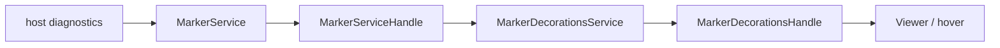

# viewer/common/markers

Backend-neutral diagnostic storage and marker-to-decoration projection.

`MarkerService` stores diagnostics by owner and resource.
`MarkerDecorationsService` projects those diagnostics onto a live `TextModel`;
the Viewer consumes only its borrowed `MarkerDecorationsHandle`.



## Publishing diagnostics

Hosts normally publish the shared `language.Diagnostic` shape. Owners are
independent, so replacing one owner's diagnostics does not disturb another's.

```mbt check
///|
test "diagnostic owners are independent" {
  let service = @markers.MarkerService()
  let uri = @base_common.Uri::parse("file:///src/main.mbt")
  service.set_diagnostics("typecheck", uri, [
    {
      range: Range(1, 1, 1, 5),
      severity: Error,
      message: "type error",
      tags: None,
    },
  ])
  service.set_diagnostics("lint", uri, [
    {
      range: Range(2, 1, 2, 5),
      severity: Warning,
      message: "style",
      tags: None,
    },
  ])
  service.remove_owner_resource("lint", uri)
  debug_inspect(
    service.diagnostics_for_resource(uri).map(d => d.message),
    content=(
      #|["type error"]
    ),
  )
}
```

`change_one` accepts the lower-level `MarkerData` constructor when the host
already has marker-shaped data.

```mbt check
///|
test "marker data is validated at the store boundary" {
  let service = @markers.MarkerService()
  let uri = @base_common.Uri::parse("file:///src/main.mbt")
  service.change_one("owner", uri, [
    MarkerData(
      severity=Error,
      message="boom",
      start_line_number=1,
      start_column=1,
      end_line_number=1,
      end_column=5,
    ),
  ])
  debug_inspect(
    service.diagnostics_for_resource(uri).map(d => (d.severity, d.message)),
    content=(
      #|[(Error, "boom")]
    ),
  )
}
```

## Decoration capability

The concrete decoration service owns watches and model-decoration ids. The
handle exposes only model leases, exact-model live occurrences, resolved
decoration options, and a change subscription.

```mbt check
///|
test "a model lease exposes live markers without owning the store" {
  let store = @markers.MarkerService()
  let decorations = @markers.MarkerDecorationsService(
    store.marker_service_handle(),
  )
  let model = @model.TextModel(
    @base_common.Uri::parse("file:///markers-doc.mbt"),
    "markers-doc.mbt",
    "moonbit",
    1,
    "rev-1",
    "let x = 1\n",
  )
  store.set_diagnostics("owner", model.uri, [
    { range: Range(1, 1, 1, 4), severity: Error, message: "boom", tags: None },
  ])
  let handle = decorations.marker_decorations_handle()
  let lease = handle.acquire_model(model)
  let live = handle.get_live_markers_for_model(model)
  debug_inspect(
    live.map(entry => {
      let (_, marker) = entry
      marker.message
    }),
    content=(
      #|["boom"]
    ),
  )
  lease.dispose()
  decorations.dispose()
  model.dispose()
}
```

The historical paired `on_model_added` / `on_model_removed` compatibility
entry points remain isolated in `exports.mbt`; new owners retain the
disposable returned by the handle's `acquire_model`.

## Theme output

`squiggly_theme_css` is the browser-neutral CSS/data-URI rendering seam. The
DOM itself remains in browser/view code.

```mbt check
///|
test "theme colors produce marker CSS" {
  let css = @markers.squiggly_theme_css({
    error: Some("#ff0000"),
    warning: None,
    info: None,
    hint: None,
  })
  assert_true(css.contains("%23ff0000"))
}
```

## Boundaries and checks

This package depends on `base/common`, `language`, and
`viewer/common/model`; it has no DOM, FFI, root-Viewer, or host dependency.
See `pkg.generated.mbti` for the exact capability floor.

```sh
moon test --target js viewer/common/markers
```
