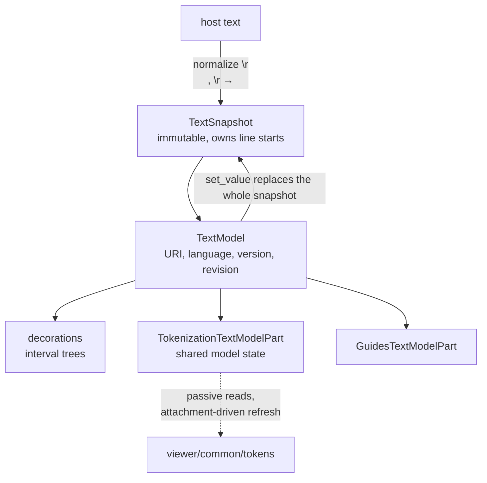

# viewer/common/model

Immutable text snapshots, readonly editor models, guides, and mutable model
decorations. This is the viewer's reduced `vs/editor/common/model` boundary.



## Text and identity

`TextSnapshot` normalizes every input `\r\n` pair, lone `\r`, or `\n` to one
`\n` before storage, then derives line starts from that normalized text.
U+FEFF is ordinary content, U+2028/U+2029 are not line breaks, and every
other UTF-16 unit (including lone surrogates) is retained exactly once.
`get_value`, lengths, ranges, offsets, positions, provider boundaries, and
content events therefore all use one coherent UTF-16 coordinate system.

```mbt check
///|
fn doc(text : String) -> @model.TextModel raise {
  TextModel(
    @base_common.Uri::parse("file:///model-doc.mbt"),
    "model-doc.mbt",
    "moonbit",
    1,
    "rev-1",
    text,
  )
}

///|
test "every line terminator normalizes to a single \\n" {
  let model = doc("a\r\nb\rc\nd")
  debug_inspect(
    (model.get_line_count(), model.get_lines_content(), model.get_value()),
    content=(
      #|(4, ["a", "b", "c", "d"], "a\nb\nc\nd")
    ),
  )
}
```

Snapshots and models store one normalized LF representation. There is no
TextDefined/CRLF read preference, BOM-preservation switch, or cached builder
metadata that can disagree with the text.

`TextSnapshot` owns offset/position conversion, which is the bridge between the
1-based `Position` space and the 0-based offset space that `base/common`
deliberately leaves unimplemented.

```mbt check
///|
test "offsets and positions convert through the snapshot" {
  let model = doc("let x = 1\nlet y = 2\n")
  debug_inspect(
    (
      model.get_offset_at(Position(2, 1)),
      model.get_position_at(10),
      model.get_position_at(0),
      // out-of-range input is clamped rather than raising
      model.get_position_at(9999),
    ),
    content=(
      #|(
      #|  10,
      #|  { line_number: 2, column: 1 },
      #|  { line_number: 1, column: 1 },
      #|  { line_number: 3, column: 1 },
      #|)
    ),
  )
}
```

`TextModel` adds URI, display name, language id, caller-owned host version,
revision, lifecycle, and a directly owned `TokenizationTextModelPart`. Ranges
are generally clamped where Monaco throws, and the snapshot remains readable
after `TextModel::dispose`.

```mbt check
///|
test "reads are clamped, and the text survives disposal" {
  let model = doc("ab\ncd\n")
  let clamped = model.get_value_in_range(Range(1, 1, 99, 99))
  model.dispose()
  debug_inspect(
    (clamped, model.is_disposed(), model.get_value()),
    content=(
      #|("ab\ncd\n", true, "ab\ncd\n")
    ),
  )
}
```

Model-scoped async freshness uses physical `TextModel` identity plus the
internal `get_version_id()` counter. URI, host version, revision, and
decoration IDs are metadata and cannot substitute for that authority — two
models can share a URI, and a host version is whatever the host says it is.

```mbt check
///|
test "identity and version id are the freshness authority, not the URI" {
  let first = doc("one\n")
  let second = doc("two\n")
  let version_before = first.get_version_id()
  first.set_value("one changed\n")
  debug_inspect(
    (
      first.uri == second.uri,
      first.identity() == second.identity(),
      version_before,
      first.get_version_id(),
    ),
    content=(
      #|(true, false, 1, 2)
    ),
  )
}
```

`set_value` normalizes and replaces the complete snapshot in the same model,
increments the internal version once, destroys old decorations, and fires
the content-flush event using the old normalized range/length and new
normalized text/EOL. There is no incremental edit/undo/redo, EOL mutation or
preference or IME.

## Words

Word lookup delegates to the current snapshot. `get_word_at_position` returns
`None` when the position is not inside a word.

```mbt check
///|
test "word_at returns the word containing the position" {
  let model = doc("let value = 1\n")
  debug_inspect(
    (
      model.get_word_at_position(Position(1, 6)),
      model.get_word_at_position(Position(1, 4)),
    ),
    content=(
      #|(
      #|  Some({ word: "value", start_column: 5, end_column: 10 }),
      #|  Some({ word: "let", start_column: 1, end_column: 4 }),
      #|)
    ),
  )
}
```

## Mutable model-side state

`delta_decorations`/`change_decorations` and the range-query APIs store regular,
overview-ruler, and injected-text decorations in augmented interval trees.
Decoration, token, and dispose events are part of the public model surface.

`delta_decorations` is a *replace* operation: it takes the ids to retire and the
new decorations to add, and returns the new ids. Passing `[]` for the old ids is
a pure insert; passing `[]` for the new ones is a pure delete.

```mbt check
///|
test "delta_decorations replaces one id set with another" {
  let model = doc("alpha\nbeta\ngamma\n")
  let options = @model.ModelDecorationOptions("doc-example")
  let ids = model.delta_decorations([], [
    { range: Range(1, 1, 1, 6), options },
    { range: Range(3, 1, 3, 6), options },
  ])
  let in_line_one = model.get_line_decorations(1).length()
  let after = model.delta_decorations(ids, [])
  debug_inspect(
    (
      ids.length(),
      in_line_one,
      after,
      model.get_decorations_in_range(model.get_full_model_range()).length(),
    ),
    content=(
      #|(2, 1, [], 0)
    ),
  )
}
```

A content flush destroys decorations, which is why a caller must not cache
decoration ids across a `set_value`.

```mbt check
///|
test "set_value destroys existing decorations" {
  let model = doc("alpha\nbeta\n")
  let ids = model.delta_decorations([], [
    { range: Range(1, 1, 1, 6), options: ModelDecorationOptions("doc-example") },
  ])
  let before = model.get_decoration_range(ids[0]) is Some(_)
  model.set_value("replaced\n")
  debug_inspect(
    (before, model.get_decoration_range(ids[0])),
    content=(
      #|(true, None)
    ),
  )
}
```

Decorations are *tracked*: a query reports the decoration's current range, and
`stickiness` decides how it behaves at its edges.

```mbt check
///|
test "queries report the tracked range, filtered by the queried span" {
  let model = doc("alpha\nbeta\ngamma\n")
  let options = @model.ModelDecorationOptions("doc-example")
  model.delta_decorations([], [{ range: Range(2, 1, 2, 5), options }]) |> ignore
  debug_inspect(
    (
      model.get_decorations_in_range(Range(1, 1, 1, 6)).length(),
      model.get_decorations_in_range(Range(2, 1, 2, 5)).length(),
      model.get_decorations_in_range(Range(1, 1, 3, 6)).length(),
    ),
    content=(
      #|(0, 1, 1)
    ),
  )
}
```

`GuidesTextModelPart` computes indentation guides over a snapshot. Token stores,
state queues, backends, attached-view aggregation, and scheduling are
package-private implementations in this package.
`RangePriorityQueueImpl` has one canonical definition here. The tokenizer
backend tracks invalid end states, prioritizes attached visible ranges,
yields between bounded slices, and makes stale scheduled generations inert
after detach or disposal. Token lengths/offsets remain raw UTF-16 code-unit
values, and theme encoding maps syntax tags directly to packed metadata.

## Attachment and listeners

Internal `on_before_attached`/`on_before_detached` calls maintain exact
attached-view handles and select the first available scheduler for an aggregate
attached epoch; final detach cancels that epoch before the scheduler is cleared.
The model-owned `on_did_change_attached` event fires after tokenization observes
only the aggregate `0 -> 1` and `1 -> 0` transitions and is released with the
model.

Attachment is an internal count, and only its edges are interesting: two views
on one model do not schedule tokenization twice.

Model listener ownership includes the token part's external token listeners
alongside the model's will-dispose, decoration, attached, and content
emitters. View models register the two ordered content callbacks and own the
returned disposable handle; the model runs every structural callback before
any outgoing callback without storing trait objects. Options, line-height,
and token-derived font-decoration lanes remain N-A and have no placeholder
emitters. Unexpected tokenizer failures are reported immediately through the
package's host-neutral `println` seam, disable that support for the current
reset, and leave the model live for a later reset.

## Monaco map and boundary

Use the pinned `vscode/src/vs/editor/common/model/textModel.ts`,
`common/model/textModelTokens.ts`, `common/model/tokens/{tokenizationTextModelPart,
abstractSyntaxTokenBackend,tokenizerSyntaxTokenBackend,annotations}.ts`,
`common/model.ts` (`IReadonlyTextBuffer`),
`model/pieceTreeTextBuffer/pieceTreeBase.ts` (`StringBuffer`/line starts),
`model/intervalTree.ts`, and `model/guidesTextModelPart.ts`. The piece tree above
its immutable leaf and all edit machinery are deliberately N-A. See
`docs/references/monaco.md` for the current source-to-file map and the completed
execution plan for the frozen parity ledger.

The tokenization-specific public slice is deliberately small: default color and
lexer-token encoding helpers, attached-view demand, model token events,
scheduler construction, passive line-token reads, and passive token counts.
Stores, queues, backends, lifecycle helpers, and model-state access stay
private; `pkg.generated.mbti` is the exhaustive package API.

Production dependencies are `base/common`, `syntax`, `viewer/common/services`,
and `viewer/common/tokens`. The package must not import language providers,
view/view-model, DOM, workspace, server, or host effects. Run:

```sh
moon test --target js viewer/common/model
moon test --target native viewer/common/model
moon test --target js viewer/common/view_model
moon test --target native viewer/common/view_model
```
