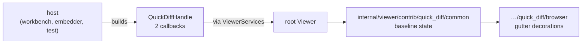

# Quick-diff host API

This multi-target package owns the opaque baseline-content capability accepted
by `ViewerServices`.

## Why the handle exists

The Viewer needs one thing from a host to render quick diff: the *baseline*
text a resource is being compared against. It must not need a concrete
contribution type to ask for it, because `viewer/common/**` may not import
`internal/viewer/**`.



`QuickDiffHandle(...)` requires exactly a resource lookup and a change
subscription. The handle borrows its captured backing and has no disposal
authority.

```mbt check
///|
test "the handle forwards a lookup and a change subscription" {
  let baselines = { "file:///a.mbt": "let x = 1\n" }
  let listeners : Array[(@base_common.Uri) -> Unit] = []
  let handle = @quick_diff_api.QuickDiffHandle(
    get_original_content=uri => baselines.get(uri.to_string()),
    on_did_change_original=listener => {
      listeners.push(listener)
      @base_common.Disposable::from(() => listeners.clear())
    },
  )
  let known = @base_common.Uri::parse("file:///a.mbt")
  let unknown = @base_common.Uri::parse("file:///missing.mbt")
  let notified = []
  let subscription = handle.on_did_change_original(uri => {
    notified.push(uri.to_string())
  })
  for listener in listeners {
    listener(known)
  }
  subscription.dispose()
  debug_inspect(
    (
      handle.get_original_content(known),
      handle.get_original_content(unknown),
      notified,
    ),
    content=(
      #|(Some("let x = 1\n"), None, ["file:///a.mbt"])
    ),
  )
}
```

A resource with no baseline returns `None` rather than an empty string, so
"unknown to source control" stays distinguishable from "tracked and empty" —
the first must not decorate, the second must decorate every line as added.

```mbt check
///|
test "None and Some(\"\") are different answers" {
  let handle = @quick_diff_api.QuickDiffHandle(
    get_original_content=uri => {
      if uri.path == "/tracked-empty" {
        Some("")
      } else {
        None
      }
    },
    on_did_change_original=_ => @base_common.Disposable::from(() => ()),
  )
  debug_inspect(
    (
      handle.get_original_content(
        @base_common.Uri::parse("file:///tracked-empty"),
      ),
      handle.get_original_content(@base_common.Uri::parse("file:///untracked")),
    ),
    content=(
      #|(Some(""), None)
    ),
  )
}
```

## Boundaries

Concrete baseline state and diff adapters remain under
`internal/viewer/contrib/quick_diff/**`. Keeping the callback contract here
lets an external host supply quick diff through an allowed
`viewer/common/**` import without exposing contribution implementation types
through the root facade.

The handle has no disposal authority: disposing the `Disposable` returned by
`on_did_change_original` retires that one subscription, and the host retains the
backing store's lifetime.

See `pkg.generated.mbti` for the exact signatures.

```sh
moon test --target js viewer/common/quick_diff_api
```
