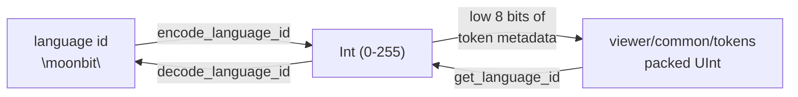

# viewer/common/services

The common-layer language-id codec used by binary token metadata.

A packed token metadata word has only **eight bits** for the language, so a
language cannot be carried as a string next to every token. This package is the
one place that turns a language name into that small integer and back.



`LanguageIdCodec` assigns stable integer ids and decodes them back to strings.
Fresh codecs are seeded with `null`, `plaintext`, `moonbit`, `javascript`,
`typescript`, and `json`.

Its `Debug` representation is the ordered language array: an array index is the
numeric id for the language at that index. The redundant reverse map and next-id
counter are intentionally omitted.

```mbt check
///|
test "codec Debug output is the numeric-id table" {
  let codec = @services.LanguageIdCodec()
  codec.register("rust") |> ignore
  debug_inspect(
    codec,
    content=(
      #|[
      #|  "null",
      #|  "plaintext",
      #|  "moonbit",
      #|  "javascript",
      #|  "typescript",
      #|  "json",
      #|  "rust",
      #|]
    ),
  )
}
```

```mbt check
///|
test "a fresh codec is seeded with the built-in languages" {
  let codec = @services.LanguageIdCodec()
  debug_inspect(
    ["null", "plaintext", "moonbit", "javascript", "typescript", "json"].map(name => {
      (name, codec.encode_language_id(name))
    }),
    content=(
      #|[
      #|  ("null", 0),
      #|  ("plaintext", 1),
      #|  ("moonbit", 2),
      #|  ("javascript", 3),
      #|  ("typescript", 4),
      #|  ("json", 5),
      #|]
    ),
  )
}
```

`encode_language_id` returns `0` for an unregistered language, while `register`
allocates it. `0` is therefore both "no language" and "unknown language" — an
encode result of `0` is not proof that the caller asked for `null`.

```mbt check
///|
test "unregistered encodes to 0 until register allocates an id" {
  let codec = @services.LanguageIdCodec()
  let before = codec.encode_language_id("rust")
  let allocated = codec.register("rust")
  let after = codec.encode_language_id("rust")
  // Registering twice is idempotent: the id is stable.
  let again = codec.register("rust")
  debug_inspect(
    (before, allocated, after, again),
    content=(
      #|(0, 6, 6, 6)
    ),
  )
}
```

Invalid numeric ids decode as `null`, so a corrupted or stale metadata word
degrades to the default language instead of aborting a render.

```mbt check
///|
test "out-of-range ids decode to null rather than failing" {
  let codec = @services.LanguageIdCodec()
  debug_inspect(
    (
      codec.decode_language_id(0),
      codec.decode_language_id(2),
      codec.decode_language_id(999),
      codec.decode_language_id(-1),
    ),
    content=(
      #|("null", "moonbit", "null", "null")
    ),
  )
}
```

`language_id_codec` is process-wide so every model interprets the low eight
language-id bits of Monaco's token metadata consistently. Isolated codecs remain
available for tests — including the examples above, which allocate their own so
they never mutate the shared value.

```mbt check
///|
test "separate codecs allocate independently" {
  let first = @services.LanguageIdCodec()
  let second = @services.LanguageIdCodec()
  let in_first = first.register("elm")
  debug_inspect(
    (in_first, second.encode_language_id("elm")),
    content=(
      #|(6, 0)
    ),
  )
}
```

## Boundaries and checks

This is the `ILanguageIdCodec` slice of
`vs/editor/common/services/languagesRegistry.ts`. The package is a dependency leaf
with no model, token, syntax, DOM, or host imports. See `pkg.generated.mbti`; its
behavior is also covered by the token and model-token suites.

```sh
moon test --target js viewer/common/services
```
