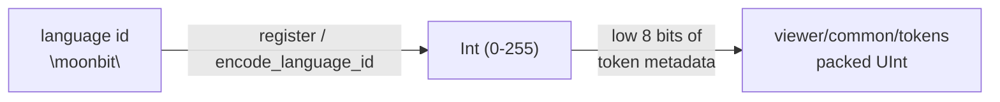

# viewer/common/services

The common-layer language-id codec used by binary token metadata.

A packed token metadata word has only eight bits for the language, so a
language cannot be carried as a string next to every token. This package owns
the one process-wide codec that assigns stable numeric ids.



`language_id_codec` starts with `null`, `plaintext`, `moonbit`, `javascript`,
`typescript`, and `json`. `encode_language_id` returns `0` for an unregistered
language; `register` allocates a stable id and is idempotent.

```mbt check
///|
test "the process codec contains the built-in language ids" {
  let codec = @services.language_id_codec
  debug_inspect(
    ["null", "plaintext", "moonbit", "javascript", "typescript", "json"].map(name => {
      (name, codec.encode_language_id(name))
    }),
    content=(
      #|[
      #|  ("null", 0),
      #|  ("plaintext", 1),
      #|  ("moonbit", 2),
      #|  ("javascript", 3),
      #|  ("typescript", 4),
      #|  ("json", 5),
      #|]
    ),
  )
}
```

Hosts register language ids through the shared value before producing token
metadata:

```mbt nocheck
///|
let rust_id = @services.language_id_codec.register("rust")
```

The concrete codec representation, isolated constructors, and reverse lookup
are package implementation details. The abstract type keeps a public `Debug`
implementation for diagnostics without exposing its storage.

## Boundaries and checks

This is the reduced `ILanguageIdCodec` slice of
`vs/editor/common/services/languagesRegistry.ts`. The package is a dependency
leaf with no model, token, syntax, DOM, or host imports. See
`pkg.generated.mbti`; its behavior is also covered by token and model-token
suites.

```sh
moon test --target js viewer/common/services
```
