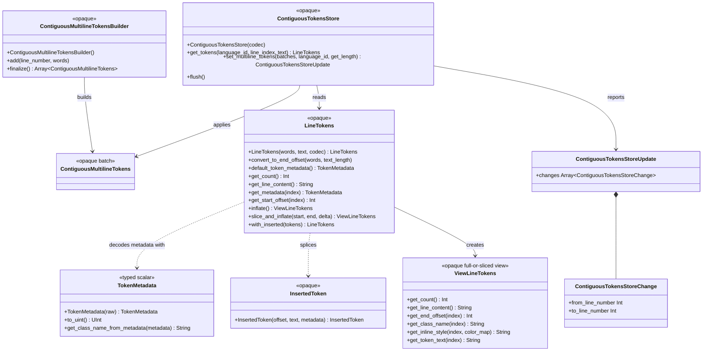

# viewer/common/tokens

Binary token values and the contiguous syntactic store shared by model
tokenization, view-line projection, tokenized Markdown, and HTML rendering.

A rendered line can carry hundreds of tokens, and a document can carry hundreds
of thousands of lines. Nothing here allocates a struct per token: one token is
two `UInt` words in a flat array, and every read is an index computation.

## Public boundary

The public callable surface is consumer-driven. Every public value or operation
in `pkg.generated.mbti` has a non-test cross-package caller. Representation
details, full-versus-sliced variants, metadata decoders used only inside this
package, and conformance-only helpers are private. `TokenMetadata(UInt)` remains
the deliberate scalar-construction boundary introduced by the typed-metadata
port. `LineTokens` deliberately
retains `derive(Debug)` for diagnostics even though production code does not
invoke it. No future-only export is currently reserved; if one is deliberately
staged later, it belongs in `exports.mbt` until a production caller lands.



The namespaces and concrete full/slice distinction used by Monaco are not
public MoonBit representation contracts. Callers receive opaque values and use
only the operations they need.

## Packed metadata

One metadata word uses Monaco's 32-bit layout:

```text
bbbb bbbb ffff ffff fFFF FBTT LLLL LLLL
```

`L` is the language id, `T` the standard token type, `B` the balanced-bracket
bit, `F` the font style, `f` the foreground id, and `b` the background id.
Metadata is `UInt` because the background occupies the high byte.

The model theme packer consumes the public language, token-type, font-style,
foreground, and background offsets plus the standard token-type and default
color constants. Rendering consumes the public class-name decoder.

```mbt check
///|
test "a production-shaped metadata word resolves to its token class" {
  let metadata = (2U << @tokens.METADATA_LANGUAGEID_OFFSET) |
    (
      @tokens.STANDARD_TOKEN_TYPE_COMMENT.reinterpret_as_uint() <<
      @tokens.METADATA_TOKEN_TYPE_OFFSET
    ) |
    (
      @tokens.FONT_STYLE_NONE.reinterpret_as_uint() <<
      @tokens.METADATA_FONT_STYLE_OFFSET
    ) |
    (7U << @tokens.METADATA_FOREGROUND_OFFSET) |
    (
      @tokens.COLOR_ID_DEFAULT_BACKGROUND.reinterpret_as_uint() <<
      @tokens.METADATA_BACKGROUND_OFFSET
    )
  inspect(
    @tokens.TokenMetadata(metadata).get_class_name_from_metadata(),
    content="mtk7",
  )
}
```

## Line tokens and views

`LineTokens` combines one UTF-16 line with an interleaved word array:

```text
[end_0, metadata_0, end_1, metadata_1, ...]
```

Ends are exclusive. Token zero starts at offset zero; every later token starts
at the preceding end. A complete nonempty line therefore ends with its UTF-16
length. Some tokenizers emit start offsets instead, so
`convert_to_end_offset` shifts the starts in place before construction.

```mbt check
///|
test "line tokens expose their consumer-facing full view" {
  let codec = @services.LanguageIdCodec()
  let keyword = 3U << @tokens.METADATA_FOREGROUND_OFFSET
  let plain = 1U << @tokens.METADATA_FOREGROUND_OFFSET
  let line = @tokens.LineTokens(
    [3U, keyword, 4U, plain, 5U, keyword],
    "let x",
    codec,
  )
  assert_true(Repr(line).to_string().contains("tokens_count: 3"))
  let view = line.inflate()
  debug_inspect(
    (
      line.get_count(),
      line.get_line_content(),
      (0)
      .until(view.get_count())
      .map(i => {
        (
          line.get_start_offset(i),
          view.get_end_offset(i),
          view.get_token_text(i),
          view.get_class_name(i),
        )
      })
      .collect(),
    ),
    content=(
      #|(
      #|  3,
      #|  "let x",
      #|  [(0, 3, "let", "mtk3"), (3, 4, " ", "mtk1"), (4, 5, "x", "mtk3")],
      #|)
    ),
  )
}
```

`slice_and_inflate` is the wrapping seam. It retains the source words while
presenting segment-local end offsets. `delta` accounts for a continuation
line's synthetic indent.

```mbt check
///|
test "a sliced view exposes segment-local offsets" {
  let codec = @services.LanguageIdCodec()
  let line = @tokens.LineTokens([5U, 1U, 6U, 0U, 11U, 2U], "hello world", codec)
  let view = line.slice_and_inflate(6, 11, 2)
  debug_inspect(
    (view.get_line_content(), view.get_end_offset(0), view.get_token_text(0)),
    content=(
      #|("world", 7, "world")
    ),
  )
}
```

`with_inserted` is how view-model inline text joins a copied line without
changing model source.

```mbt check
///|
test "injected text splices a new token" {
  let codec = @services.LanguageIdCodec()
  let line = @tokens.LineTokens([5U, 1U], "value", codec)
  let with_hint = line.with_inserted([
    InsertedToken(5, " : Int", TokenMetadata(3U)),
  ])
  let view = with_hint.inflate()
  debug_inspect(
    (
      line.get_line_content(),
      with_hint.get_line_content(),
      (0).until(view.get_count()).map(i => view.get_token_text(i)).collect(),
    ),
    content=(
      #|("value", "value : Int", ["value", " : Int"])
    ),
  )
}
```

## Per-model store

`ContiguousMultilineTokensBuilder` groups adjacent one-based line results into
opaque batches. `ContiguousTokensStore` applies those batches to its per-model
cache and reports inclusive changed ranges. Reads are passive: an absent line
returns one default token and never invokes a lexer.

```mbt check
///|
test "contiguous batches apply and report changed lines" {
  let codec = @services.LanguageIdCodec()
  let builder = @tokens.ContiguousMultilineTokensBuilder()
  builder.add(1, [4U, 1U])
  builder.add(2, [4U, 2U])
  let batches = builder.finalize()
  let store = @tokens.ContiguousTokensStore(codec)
  let update = store.set_multiline_tokens(batches, "moonbit", _ => 4)
  debug_inspect(
    (
      batches.length(),
      update.changes.map(change => {
        (change.from_line_number, change.to_line_number)
      }),
      store.get_tokens("moonbit", 0, "abcd").get_metadata(0).to_uint(),
    ),
    content=(
      #|(1, [(1, 2)], 1)
    ),
  )
}
```

`flush` discards every stored line. The next read again produces the default
top-level-language token.

```mbt check
///|
test "flush restores passive fallback reads" {
  let codec = @services.LanguageIdCodec()
  let builder = @tokens.ContiguousMultilineTokensBuilder()
  builder.add(1, [4U, 1U])
  let store = @tokens.ContiguousTokensStore(codec)
  store.set_multiline_tokens(builder.finalize(), "moonbit", _ => 4) |> ignore
  let before = store.get_tokens("moonbit", 0, "abcd").get_metadata(0)
  store.flush()
  let after = store.get_tokens("moonbit", 0, "abcd").get_metadata(0)
  assert_true(before != after)
}
```

## UTF-16 boundary

All token offsets and slices are raw UTF-16 code-unit offsets. A sliced view may
retain a lone surrogate or either half of a valid pair, matching Monaco's
string semantics.

```mbt check
///|
test "a slice may split a surrogate pair" {
  let codec = @services.LanguageIdCodec()
  let line = @tokens.LineTokens([2U, 1U, 3U, 2U], "😀x", codec)
  let split = line.slice_and_inflate(1, 3, 0)
  debug_inspect(
    (line.get_line_content().length(), split.get_line_content().length()),
    content=(
      #|(3, 2)
    ),
  )
}
```

## Boundaries and checks

The behavior port is scoped to
`vs/editor/common/tokens/{lineTokens,contiguousTokensStore,
contiguousMultilineTokens,contiguousMultilineTokensBuilder}.ts` and
`vs/editor/common/encodedTokenAttributes.ts`. Typed-array versus `ArrayBuffer`
identity, worker serialization, incremental token edits, the `TokenArray`
family, and sparse semantic merging remain outside the readonly in-process
boundary.

This package may depend only on `base/common` and `viewer/common/services`; it
must not import model, view-model, syntax, DOM, or host packages. The generated
interface is the exact supported surface.

```sh
moon test --target js viewer/common/tokens
```
