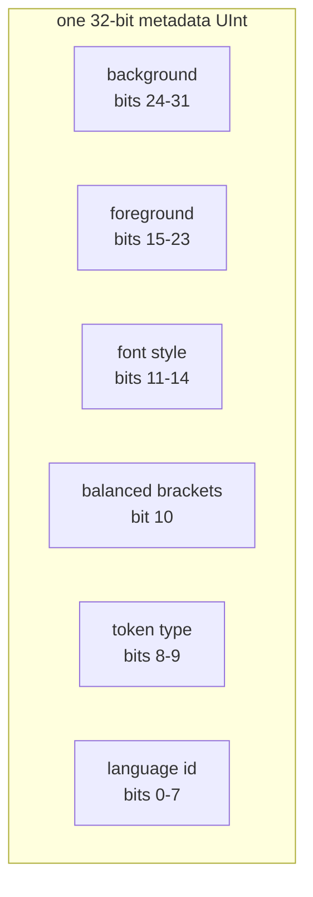
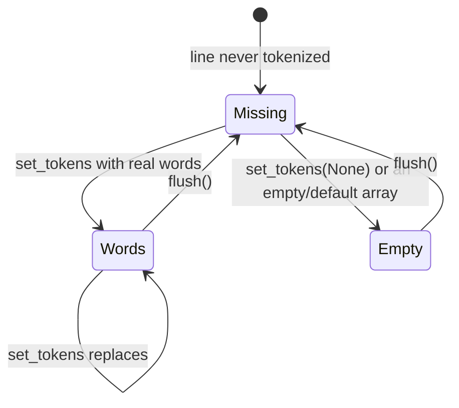

# viewer/common/tokens

Binary token values and the contiguous syntactic store shared by model
tokenization and view-line rendering.

A rendered line can carry hundreds of tokens, and a document can carry hundreds
of thousands of lines. Nothing here allocates a struct per token: a token is two
`UInt` words in a flat array, and every read is an index computation.

## The packed metadata word



`encoded_token_attributes.mbt` defines the 32-bit language, standard-token-type,
balanced-bracket, font-style, foreground, and background layout plus
`TokenMetadata` decoders. Metadata is `UInt` because the background occupies the
high byte — a signed `Int` would make a fully saturated background negative.

The offsets are public, so a caller can compose a word and read it back with the
same constants the renderer uses.

```mbt check
///|
test "a metadata word round-trips through the published offsets" {
  let metadata = (2U << @tokens.METADATA_LANGUAGEID_OFFSET) |
    (
      @tokens.STANDARD_TOKEN_TYPE_COMMENT.reinterpret_as_uint() <<
      @tokens.METADATA_TOKEN_TYPE_OFFSET
    ) |
    (
      (@tokens.FONT_STYLE_ITALIC | @tokens.FONT_STYLE_BOLD).reinterpret_as_uint() <<
      @tokens.METADATA_FONT_STYLE_OFFSET
    ) |
    (7U << @tokens.METADATA_FOREGROUND_OFFSET) |
    (200U << @tokens.METADATA_BACKGROUND_OFFSET)
  debug_inspect(
    (
      @tokens.TokenMetadata::get_language_id(metadata),
      @tokens.TokenMetadata::get_token_type(metadata),
      @tokens.TokenMetadata::get_font_style(metadata),
      @tokens.TokenMetadata::get_foreground(metadata),
      @tokens.TokenMetadata::get_background(metadata),
      @tokens.TokenMetadata::contains_balanced_brackets(metadata),
    ),
    content=(
      #|(2, 1, 3, 7, 200, false)
    ),
  )
}
```

`get_presentation_from_metadata` is the decoded form the renderer actually
consumes; the font-style bits become named booleans.

```mbt check
///|
test "presentation decodes the font-style bits into booleans" {
  let styled = (
      (@tokens.FONT_STYLE_ITALIC | @tokens.FONT_STYLE_UNDERLINE).reinterpret_as_uint() <<
      @tokens.METADATA_FONT_STYLE_OFFSET
    ) |
    (5U << @tokens.METADATA_FOREGROUND_OFFSET)
  let presentation = @tokens.TokenMetadata::get_presentation_from_metadata(
    styled,
  )
  debug_inspect(
    (
      presentation.foreground,
      presentation.italic,
      presentation.bold,
      presentation.underline,
      presentation.strikethrough,
      @tokens.TokenMetadata::get_class_name_from_metadata(styled),
    ),
    content=(
      #|(5, true, false, true, false, "mtk5 mtki mtku")
    ),
  )
}
```

## LineTokens

`LineTokens` combines one line of UTF-16 text with a flat `Array[UInt]`. The
array alternates between an exclusive end offset and the packed metadata for
the token ending there:

```text
[end₀, metadata₀, end₁, metadata₁, ...]
```

Starts are implicit. Token 0 starts at offset 0; every later token starts at
the previous token's end. Offsets count UTF-16 code units, not Unicode scalar
values or displayed columns. End offsets are exclusive, so an offset on a
boundary between two tokens belongs to the following token.

For the five-code-unit line `let x`, this is the physical layout:

| Pair | UTF-16 range | Text | Meaning |
| --- | ---: | --- | --- |
| `3, keyword` | `[0, 3)` | `let` | first token ends before the space |
| `4, default` | `[3, 4)` | ` ` | second token is the space |
| `5, identifier` | `[4, 5)` | `x` | final end equals the line length |

The complete word array is therefore `[3, keyword, 4, default, 5,
identifier]`. Keeping starts implicit saves one word per token while retaining
binary search over the monotonically increasing end offsets. A well-formed raw
array has an even number of words and, for a complete line with at least one
token, its final end offset equals the text length.

`LineTokens` provides token lookup, text/class/style reads, zero-copy slicing
for wrapped lines, and `with_inserted` for injected text.

`create_from_text_and_metadata` is the readable constructor — it derives the end
offsets from the token texts. `Debug` exposes the resulting flat encoding,
cached token count, text, and codec table, which makes token fixtures readable
without adding a second inspection format.

```mbt check
///|
test "LineTokens Debug shows the physical encoding" {
  let codec = @services.LanguageIdCodec()
  let keyword = (
      codec.encode_language_id("moonbit").reinterpret_as_uint() <<
      @tokens.METADATA_LANGUAGEID_OFFSET
    ) |
    (
      @tokens.FONT_STYLE_BOLD.reinterpret_as_uint() <<
      @tokens.METADATA_FONT_STYLE_OFFSET
    ) |
    (7U << @tokens.METADATA_FOREGROUND_OFFSET)
  let line = @tokens.LineTokens::create_from_text_and_metadata(
    [
      ("let", keyword),
      (" ", @tokens.LineTokens::default_token_metadata()),
      ("x", 0U),
    ],
    codec,
  )
  debug_inspect(
    line,
    content=(
      #|{
      #|  tokens: [3, 233474, 4, 33587200, 5, 0],
      #|  tokens_count: 3,
      #|  text: "let x",
      #|  language_id_codec: ["null", "plaintext", "moonbit", "javascript", "typescript", "json"],
      #|}
    ),
  )
}
```

The direct `LineTokens(words, text, codec)` constructor expects end offsets.
Some tokenizers naturally produce start offsets instead. For words laid out as
`[start₀, metadata₀, start₁, metadata₁, ...]`,
`convert_to_end_offset(words, text.length())` shifts each next start into the
previous end slot and writes the line length into the final end slot:

```mbt check
///|
test "start offsets can be converted to LineTokens end offsets" {
  let words = [0U, 11U, 3U, 22U, 4U, 33U]
  @tokens.LineTokens::convert_to_end_offset(words, 5)
  debug_inspect(words, content="[3, 11, 4, 22, 5, 33]")
}
```

```mbt check
///|
test "tokens are addressed by index, and offsets are exclusive ends" {
  let codec = @services.LanguageIdCodec()
  let line = @tokens.LineTokens::create_from_text_and_metadata(
    [("let", 1U), (" ", 0U), ("x", 2U)],
    codec,
  )
  debug_inspect(
    (
      line.get_count(),
      line.get_line_content(),
      line.get_text_length(),
      (0)
      .until(line.get_count())
      .map(i => {
        (
          line.get_token_text(i),
          line.get_start_offset(i),
          line.get_end_offset(i),
        )
      })
      .collect(),
    ),
    content=(
      #|(3, "let x", 5, [("let", 0, 3), (" ", 3, 4), ("x", 4, 5)])
    ),
  )
}
```

`find_token_index_at_offset` is the hot lookup: it is a binary search over the
flat array, not a scan.

```mbt check
///|
test "offset lookup maps a column into a token index" {
  let codec = @services.LanguageIdCodec()
  let line = @tokens.LineTokens::create_from_text_and_metadata(
    [("let", 1U), (" ", 0U), ("x", 2U)],
    codec,
  )
  debug_inspect(
    [0, 2, 3, 4, 99].map(offset => line.find_token_index_at_offset(offset)),
    content=(
      #|[0, 0, 1, 2, 2]
    ),
  )
}
```

Slicing is what wrapped lines need: one model line becomes several view lines,
and each view line must present its own sub-range of the same token array
without copying it.

```mbt check
///|
test "slicing produces a view over the same underlying tokens" {
  let codec = @services.LanguageIdCodec()
  let line = @tokens.LineTokens::create_from_text_and_metadata(
    [("hello", 1U), (" ", 0U), ("world", 2U)],
    codec,
  )
  let sliced = line.slice_zero_copy(OffsetRange(6, 11))
  debug_inspect(
    (
      sliced.get_count(),
      sliced.get_line_content(),
      (0).until(sliced.get_count()).map(i => sliced.get_token_text(i)).collect(),
    ),
    content=(
      #|(1, "world", ["world"])
    ),
  )
}
```

`with_inserted` is how injected text (the view-model's inline insertions) joins a
line's token stream without the model ever containing that text.

```mbt check
///|
test "injected text splices new tokens into a copy" {
  let codec = @services.LanguageIdCodec()
  let line = @tokens.LineTokens::create_from_text_and_metadata(
    [("value", 1U)],
    codec,
  )
  let with_hint = line.with_inserted([InsertedToken(5, " : Int", 3U)])
  debug_inspect(
    (
      line.get_line_content(),
      with_hint.get_line_content(),
      (0)
      .until(with_hint.get_count())
      .map(i => with_hint.get_token_text(i))
      .collect(),
    ),
    content=(
      #|("value", "value : Int", ["value", " : Int"])
    ),
  )
}
```

`ViewLineTokens` is the closed full-or-sliced view consumed by renderers, so a
renderer never needs to know whether it was handed a whole line or a fragment.

## The per-model store

`ContiguousMultilineTokens` and its builder collect adjacent encoded line results
without serialization or edit transforms. `ContiguousTokensStore` owns the
per-model syntactic cache with distinct `Missing`, `Empty`, and encoded-word
states.



Reads are passive: a missing/empty line returns one default token and
never invokes a lexer. That is the property that keeps rendering off the
tokenizer's critical path.

```mbt check
///|
test "an untokenized line reads back as one default token" {
  let store = @tokens.ContiguousTokensStore(LanguageIdCodec())
  let missing = store.get_tokens("moonbit", 0, "let x = 1")
  debug_inspect(
    (
      store.has_tokens(),
      missing.get_count(),
      missing.get_token_text(0),
      missing.get_end_offset(0),
    ),
    content=(
      #|(false, 1, "let x = 1", 9)
    ),
  )
}
```

`set_tokens` returns whether the line actually changed, but only when the caller
asks for the equality check — the unchecked lane always reports `false`.

```mbt check
///|
test "set_tokens reports change only when equality is checked" {
  let store = @tokens.ContiguousTokensStore(LanguageIdCodec())
  let words = [3U, 1U, 4U, 0U]
  debug_inspect(
    (
      store.set_tokens("moonbit", 0, 4, Some(words), true),
      // same words again: no change
      store.set_tokens("moonbit", 0, 4, Some(words), true),
      // unchecked lane never reports a change
      store.set_tokens("moonbit", 0, 4, Some([3U, 2U, 4U, 0U]), false),
      store.has_tokens(),
    ),
    content=(
      #|(true, false, false, true)
    ),
  )
}
```

`flush` returns every line to `Missing`, which is what a whole-document reset
does.

```mbt check
///|
test "flush returns the store to its untokenized state" {
  let store = @tokens.ContiguousTokensStore(LanguageIdCodec())
  store.set_tokens("moonbit", 0, 4, Some([4U, 1U]), true) |> ignore
  let before = store.get_tokens("moonbit", 0, "abcd").get_metadata(0)
  store.flush()
  let after = store.get_tokens("moonbit", 0, "abcd").get_metadata(0)
  debug_inspect(
    (store.has_tokens(), before == after),
    content=(
      #|(false, false)
    ),
  )
}
```

The builder accumulates adjacent line results and coalesces them into runs, so a
sweep over a viewport produces a few `ContiguousMultilineTokens` rather than one
per line.

```mbt check
///|
test "the builder coalesces adjacent lines and splits at gaps" {
  let builder = @tokens.ContiguousMultilineTokensBuilder()
  builder.add(1, [4U, 1U])
  builder.add(2, [4U, 1U])
  // a gap at line 3 starts a new run
  builder.add(7, [4U, 1U])
  debug_inspect(
    builder
    .finalize()
    .map(run => (run.start_line_number(), run.end_line_number())),
    content=(
      #|[(1, 2), (7, 7)]
    ),
  )
}
```

Store batches accept only a top-level language id and a live line-length closure.
This package never imports `viewer/common/model`; scheduling, carried tokenizer
state, and acquisition remain with that higher package. Sparse semantic
provider/application behavior is not implemented here.

## UTF-16 boundaries

All token offsets and content slices are raw UTF-16 code-unit offsets. Slices may
retain lone surrogates or either half of a valid pair, matching Monaco strings.

```mbt check
///|
test "a slice may split a surrogate pair, matching Monaco strings" {
  let codec = @services.LanguageIdCodec()
  let line = @tokens.LineTokens::create_from_text_and_metadata(
    [("😀", 1U), ("x", 2U)],
    codec,
  )
  // The emoji is two UTF-16 units, so offset 1 is inside it.
  let split = line.slice_zero_copy(OffsetRange(1, 3))
  debug_inspect(
    (line.get_text_length(), split.get_line_content().length()),
    content=(
      #|(3, 2)
    ),
  )
}
```

## Boundaries and checks

Upstream sources are `vs/editor/common/tokens/{lineTokens,
contiguousTokensStore,contiguousMultilineTokens,
contiguousMultilineTokensBuilder}.ts` and
`vs/editor/common/encodedTokenAttributes.ts`. The reduced `ViewLineTokens` omits
Monaco's concrete-type `equals`/codec accessor, and the unported `TokenArray` family
keeps `getTokensInRange` out of scope. Typed-array versus `ArrayBuffer` identity,
worker serialization, incremental token edits, and sparse semantic merging are
outside the readonly in-process boundary.

This package may depend only on `base/common` and `viewer/common/services`; it must
not import model, view-model, syntax, DOM, or host packages. See
`pkg.generated.mbti`.

```sh
moon test --target js viewer/common/tokens
```
