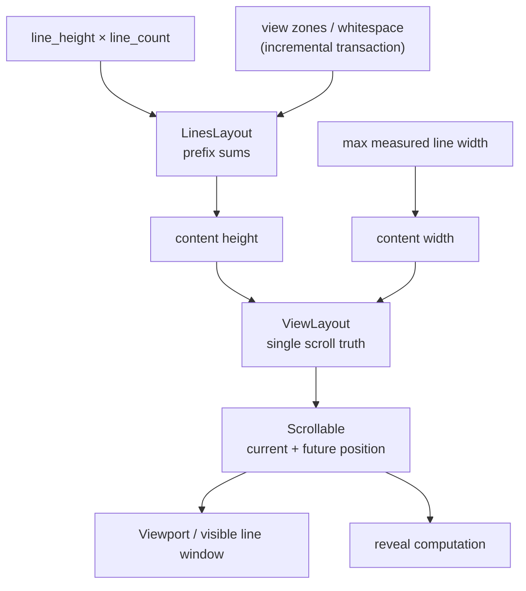

# viewer/common/view_layout

DOM-free scrolling, line/whitespace layout, view zones, and view-line rendering.

Everything about *where things are* — the scroll position, which lines fall in
the viewport, how tall a view zone makes the document, where a reveal should
scroll to — is computed here, with no DOM and no `requestAnimationFrame`.
Animation scheduling and the clock are injected, which is what makes this
package testable on the native target.



## The vertical map

`LinesLayout`, prefix-sum computers, and whitespace accessors map line/view-zone
heights to vertical offsets. With no whitespace, the map is just
`line_height × (n - 1)`.

```mbt check
///|
fn layout(line_count : Int) -> @view_layout.ViewLayout {
  ViewLayout(line_height=20, line_count~)
}

///|
test "vertical offsets are the prefix sum of line heights" {
  let view = layout(10)
  debug_inspect(
    (
      view.get_content_height(),
      view.get_vertical_offset_for_line_number(1),
      view.get_vertical_offset_for_line_number(3),
      view.get_line_height_for_line_number(3),
    ),
    content=(
      #|(200, 0, 40, 20)
    ),
  )
}
```

The current viewer assumes one uniform view-line height; variable line heights
are outside the readonly contract.

## Scrolling and the viewport

`ScrollState` retains raw and validated positions; `Scrollable` owns current
and future positions plus the cubic smooth-animation state machine.
`EditorScrollable` normalizes editor content dimensions, while
`ScrollbarState` contains pure slider geometry and provides a field-for-field
clone for gesture snapshots. `ViewLayout` is the viewer's single scroll truth.

A scroll position is validated against the content, so a caller cannot scroll
past the end or to a negative offset.

```mbt check
///|
test "scroll positions are clamped to the scrollable content" {
  let view = layout(100)
  view.set_viewport_size(width=400.0, height=200.0) |> ignore
  view.scroll_to(scroll_top=50.0) |> ignore
  let inside = view.get_current_scroll_top()
  view.scroll_to(scroll_top=-10.0) |> ignore
  let negative = view.get_current_scroll_top()
  view.scroll_to(scroll_top=999999.0) |> ignore
  let past_end = view.get_current_scroll_top()
  debug_inspect(
    (inside, negative, past_end, view.get_scroll_height()),
    content=(
      #|(50, 0, 1800, 2000)
    ),
  )
}
```

The viewport is derived, not stored separately: it is the scroll position plus
the measured dimensions, and the visible line window follows from the vertical
map.

```mbt check
///|
test "the visible line window follows from scroll top and height" {
  let view = layout(100)
  view.set_viewport_size(width=400.0, height=200.0) |> ignore
  view.scroll_to(scroll_top=0.0) |> ignore
  let at_top = view.completely_visible_line_range()
  view.scroll_to(scroll_top=210.0) |> ignore
  let scrolled = view.completely_visible_line_range()
  debug_inspect(
    (at_top, scrolled, view.get_current_viewport().top),
    content=(
      #|((1, 10), (12, 20), 210)
    ),
  )
}
```

`ViewLayout` retains the maximum measured rendered-line width, derives content
width, and feeds horizontal-scrollbar visibility back into the bottom content
extent. `set_max_line_width` publishes the width transition before recomputing
the horizontal-scrollbar contribution to content height. Listeners observe those
two source-ordered events; the method's local `ScrollChange?` compatibility
return merges them into one complete old-to-new transition.

```mbt check
///|
test "a wider measured line grows the content width" {
  let view = layout(10)
  view.set_viewport_size(width=400.0, height=200.0) |> ignore
  let narrow = view.get_content_width()
  view.set_max_line_width(1200.0) |> ignore
  debug_inspect(
    (narrow, view.get_content_width()),
    content=(
      #|(0, 1214)
    ),
  )
}
```

## Whitespace and view zones

ViewZones use only the incremental whitespace transaction and generated-ID
APIs; the former reduced whole-array adapter and zone indexes are gone. Adding
whitespace after a line pushes every later line down.

```mbt check
///|
test "whitespace inserted after a line shifts the lines below it" {
  let view = layout(10)
  let before = view.get_vertical_offset_for_line_number(5)
  let changed = view.change_whitespace(accessor => {
    accessor.insert_whitespace(3, 0, 60, 0) |> ignore
  })
  debug_inspect(
    (
      changed,
      before,
      view.get_vertical_offset_for_line_number(5),
      view.get_content_height(),
    ),
    content=(
      #|(true, 80, 140, 260)
    ),
  )
}
```

Removing it restores the map exactly, so a zone's lifetime cannot leak height.

```mbt check
///|
test "removing whitespace restores the previous vertical map" {
  let view = layout(10)
  let baseline = view.get_content_height()
  let id = Ref("")
  view.change_whitespace(accessor => {
    id.val = accessor.insert_whitespace(3, 0, 60, 0)
  })
  |> ignore
  let with_zone = view.get_content_height()
  view.change_whitespace(accessor => accessor.remove_whitespace(id.val))
  |> ignore
  debug_inspect(
    (baseline, with_zone, view.get_content_height()),
    content=(
      #|(200, 260, 200)
    ),
  )
}
```

Whitespace height and minimum-width inputs stay `Double` until the accessor
applies exact JavaScript `ToInt32`, including signed zero, non-finite values,
and 32-bit wrap. Retained leaf heights remain `Int`, while prefix sums, total
heights, line-height products, and public vertical offsets use `Double` like
JavaScript Number; multiple valid Int32 heights therefore never re-enter 32-bit
arithmetic. Source-owned downstream `|0` coercion points in searches and
viewport entry remain explicit. Pending operations commit in cleanup even when a
raising callback exits the transaction.

## Reveal

Reveal answers "what scroll top makes this line range visible", and the answer
depends on *how* you want it revealed. Vertical reveal math composes against the
future viewport, while measured horizontal reveal uses the current viewport like
`ViewLines`; both accept the source/minimal contract and omit their ordinary
padding for minimal cursor reveals.

```mbt check
///|
test "reveal type decides where a line lands in the viewport" {
  let view = layout(100)
  view.set_viewport_size(width=400.0, height=200.0) |> ignore
  view.scroll_to(scroll_top=0.0) |> ignore
  debug_inspect(
    (
      view.compute_scroll_top_to_reveal_range(50, 50, Simple),
      view.compute_scroll_top_to_reveal_range(50, 50, Center),
      view.compute_scroll_top_to_reveal_range(50, 50, Top),
    ),
    content=(
      #|(820, 890, 980)
    ),
  )
}
```

## Geometry reductions

Geometry configuration is deliberately reduced to typed setters and fixed
readonly-product arms: line padding is zero, horizontal scrollbar visibility
is `Auto`, `scrollBeyondLastLine` and horizontal-scrollbar-height ignoring are
false, and there is no minimap or overlay-widget minimum-width owner.
`.view-line-content` measurement already contains the fixed 16px CSS right
padding, replacing the unavailable `scrollBeyondLastColumn * halfwidth`
option before `ViewLayout` adds the vertical-scrollbar and whitespace-minimum
candidates. Wrapped width is the measured maximum because the only source
threshold adjustment belongs to the absent right-side minimap.

## Rendering a view line

`render_view_line*` converts `RenderLineInput` into escaped HTML plus
`CharacterMapping`/`DomPosition`, preserving the source-to-DOM mapping used by
hit testing and selections. The input retains Monaco's normalized
render-space width/glyph identity rather than the raw middot candidates. This
package also owns decoration normalization and current-line-highlight
decisions. Renderer output retains Monaco's two foreign-element bits as the
closed `None`/`Before`/`After`/`BeforeAndAfter` states so lines decorated on
both sides preserve both geometry facts.

## Boundaries and checks

`ViewportData`, `ViewLineRenderingData`, and ID-based
`ViewWhitespaceViewportData` live here as dependency-bottom data. Their
model-dependent factory is
`view_model.viewport_data_from_view_model`, keeping the dependency one-way.

The Monaco map is the pinned `src/vs/editor/common/viewLayout/{viewLayout,
linesLayout,viewLinesViewportData,viewLineRenderer}.ts`,
`src/vs/base/common/scrollable.ts`, and the base browser scrollbar state.

This package depends only on `base/common` and the value-only
`viewer/common/editor_api`, declares no FFI, and must not import view-model,
root viewer, browser, server, transport, workspace, or host packages. See
`pkg.generated.mbti`.

```sh
moon test --target js viewer/common/view_layout
```
