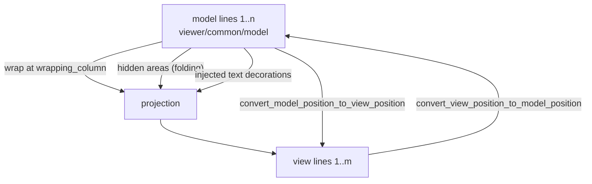

# viewer/common/view_model

Injected text, wrapping/folding projection, model/view conversion, and concrete
inline/model decoration resolution.

The model has *model lines*. The screen shows *view lines*. They are not the
same sequence: one model line can wrap into several view lines, a folded region
can hide model lines entirely, and injected text can add content the model does
not contain. This package owns that projection and the conversion in both
directions.



## Building a projection

`ViewModelLinesFromProjectedModel` is the projection itself; `ViewModel` is the
live owner that keeps it in sync with the model and publishes outgoing events.

A wide wrapping column means no wrapping, so view lines and model lines
correspond one-to-one — the degenerate case worth seeing first.

```mbt check
///|
fn projection_model(text : String) -> @model.TextModel raise {
  TextModel(
    @base_common.Uri::parse("file:///view-model-doc.mbt"),
    "view-model-doc.mbt",
    "moonbit",
    1,
    "rev-1",
    text,
  )
}

///|
fn projection(
  text : String,
  wrapping_column~ : Int,
) -> @view_model.ViewModelLinesFromProjectedModel raise {
  ViewModelLinesFromProjectedModel(
    projection_model(text),
    font_info=@config.FontInfo::default(),
    tab_size=4,
    wrapping_column~,
    wrapping_indent=None,
  )
}

///|
test "with no wrapping, view lines and model lines coincide" {
  let lines = projection("alpha\nbeta\ngamma\n", wrapping_column=200)
  debug_inspect(
    (
      lines.get_view_line_count(),
      lines.get_view_line_content(2),
      lines.model_line_number_of_view_line(2),
      lines.convert_view_position_to_model_position(2, 1),
    ),
    content=(
      #|(4, "beta", 2, { line_number: 2, column: 1 })
    ),
  )
}
```

Narrow the wrapping column and one model line becomes several view lines. The
conversion is what keeps a caret, a selection, or a decoration pointing at the
right characters afterwards.

```mbt check
///|
test "wrapping splits one model line into several view lines" {
  let lines = projection(
    "aaaa bbbb cccc dddd eeee\nshort\n",
    wrapping_column=10,
  )
  debug_inspect(
    (
      lines.get_view_line_count(),
      (1)
      .until(lines.get_view_line_count() + 1)
      .map(view_line => {
        (
          view_line,
          lines.get_view_line_content(view_line),
          lines.model_line_number_of_view_line(view_line),
        )
      })
      .collect(),
    ),
    content=(
      #|(
      #|  5,
      #|  [
      #|    (1, "aaaa bbbb ", 1),
      #|    (2, "cccc dddd ", 1),
      #|    (3, "eeee", 1),
      #|    (4, "short", 2),
      #|    (5, "", 3),
      #|  ],
      #|)
    ),
  )
}
```

Conversion round-trips: a model position maps to a view position and back.

```mbt check
///|
test "model and view positions convert in both directions" {
  let lines = projection("aaaa bbbb cccc dddd eeee\n", wrapping_column=10)
  let view = lines.convert_model_position_to_view_position(1, 18)
  debug_inspect(
    (
      view,
      lines.convert_view_position_to_model_position(
        view.line_number,
        view.column,
      ),
    ),
    content=(
      #|({ line_number: 2, column: 8 }, { line_number: 1, column: 18 })
    ),
  )
}
```

## Hidden areas

Folding is expressed as *hidden areas* — model ranges the projection omits.
Nothing is deleted from the model; the view simply stops producing lines for
them, and `model_position_is_visible` reports the difference.

```mbt check
///|
test "a hidden area removes view lines without touching the model" {
  let lines = projection("one\ntwo\nthree\nfour\n", wrapping_column=200)
  let before = lines.get_view_line_count()
  let changed = lines.set_hidden_areas([Range(2, 1, 3, 6)])
  debug_inspect(
    (
      before,
      changed,
      lines.get_view_line_count(),
      lines.get_view_line_content(2),
      (
        lines.model_position_is_visible(1),
        lines.model_position_is_visible(2),
        lines.model_position_is_visible(4),
      ),
      lines.get_hidden_areas(),
    ),
    content=(
      #|(
      #|  5,
      #|  true,
      #|  3,
      #|  "four",
      #|  (true, false, true),
      #|  [
      #|    {
      #|      start_line_number: 2,
      #|      start_column: 1,
      #|      end_line_number: 3,
      #|      end_column: 1,
      #|    },
      #|  ],
      #|)
    ),
  )
}
```

Setting the same hidden areas again reports `false`, which is what lets the
folding contribution re-publish its state without forcing a re-render.

```mbt check
///|
test "re-setting identical hidden areas is not a change" {
  let lines = projection("one\ntwo\nthree\n", wrapping_column=200)
  let first = lines.set_hidden_areas([Range(2, 1, 2, 4)])
  let again = lines.set_hidden_areas([Range(2, 1, 2, 4)])
  debug_inspect(
    (first, again),
    content=(
      #|(true, false)
    ),
  )
}
```

## Live view models

`ViewModel` wraps a model and keeps the projection current. It exposes the line
reads the renderer needs and a `CoordinatesConverter` for callers that only want
the conversion.

```mbt check
///|
test "a live ViewModel exposes line reads and a converter" {
  let model = projection_model("alpha\nbeta\ngamma\n")
  let view_model = @view_model.ViewModel(model)
  debug_inspect(
    (
      view_model.line_count(),
      view_model.get_line_content(2),
      view_model.get_line_max_column(2),
      view_model.language_id(),
      view_model.model_position_is_visible(Position(2, 1)),
    ),
    content=(
      #|(4, "beta", 5, "moonbit", true)
    ),
  )
}
```

`to_model_visible_ranges` splits a view range into the model ranges it actually
covers, which is how a selection that spans a folded region becomes the correct
set of model ranges rather than one range straddling hidden text.

```mbt check
///|
test "a view range maps to the model ranges it really covers" {
  let model = projection_model("one\ntwo\nthree\nfour\n")
  let view_model = @view_model.ViewModel(model)
  debug_inspect(
    view_model.to_model_visible_ranges(Range(1, 1, 4, 5)),
    content=(
      #|[
      #|  {
      #|    start_line_number: 1,
      #|    start_column: 1,
      #|    end_line_number: 4,
      #|    end_column: 5,
      #|  },
      #|]
    ),
  )
}
```

`validate_model_position` clamps into the current document, so a stale position
from an earlier generation cannot escape into layout math.

```mbt check
///|
test "positions are validated against the current model" {
  let view_model = @view_model.ViewModel(projection_model("ab\ncd\n"))
  debug_inspect(
    (
      view_model.validate_model_position(Position(1, 1)),
      view_model.validate_model_position(Position(99, 99)),
    ),
    content=(
      #|({ line_number: 1, column: 1 }, { line_number: 3, column: 1 })
    ),
  )
}
```

## Injected text

Injected text is content the *view* shows and the model does not contain — an
inline type hint, for instance. It arrives as a model decoration, and the
projection splices it into the projected line.

`get_injected_text_at` answers whether a view position lands inside injected
text, which is what stops a caret from being placed in text that has no model
counterpart.

```mbt check
///|
test "a plain document has no injected text anywhere" {
  let view_model = @view_model.ViewModel(projection_model("let x = 1\n"))
  debug_inspect(
    (
      view_model.get_injected_text_at(Position(1, 5)),
      view_model.injected_text_index_at(Position(1, 5)),
    ),
    content=(
      #|(None, -1)
    ),
  )
}
```

## Boundaries and checks

`CoordinatesConverter`, `ModelLineProjection`, `ProjectedTextLine`, and
`MonospaceLineBreaksComputerFactory` are the projection's own vocabulary;
`ViewLineData` is what a renderer consumes. Cursor *movement* commands
(`CursorMoveDirection`, `SimpleMoveArguments`) live here rather than in
`viewer/common/cursor` because they need projected-line facts.

The package depends on `base/common`, `viewer/common/{model,cursor,core,config,
editor_api,view_layout,tokens}`; it stays DOM-free and multi-target. The
complete API is `pkg.generated.mbti`.

```sh
moon test --target js viewer/common/view_model
moon test --target native viewer/common/view_model
```
